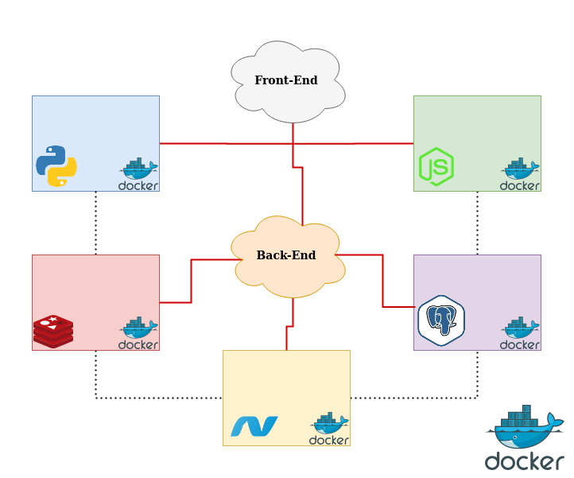
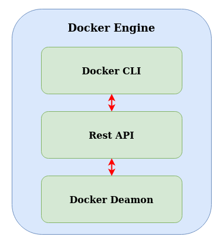
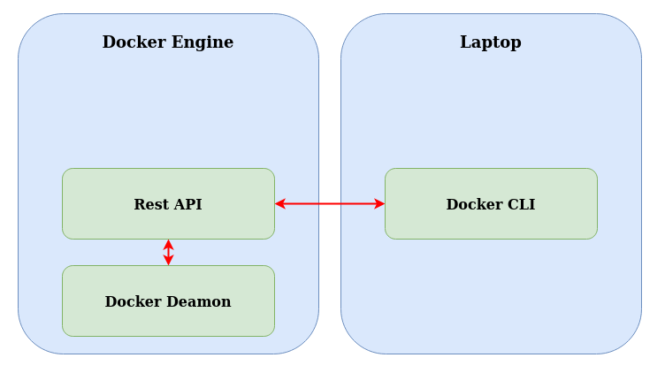
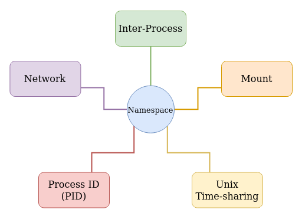
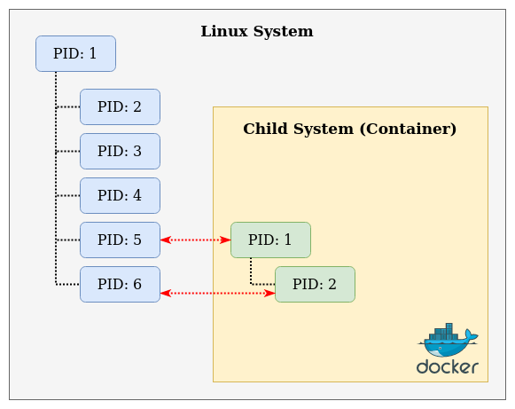
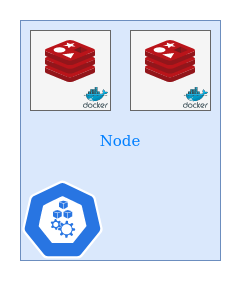
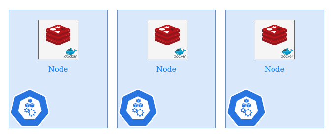
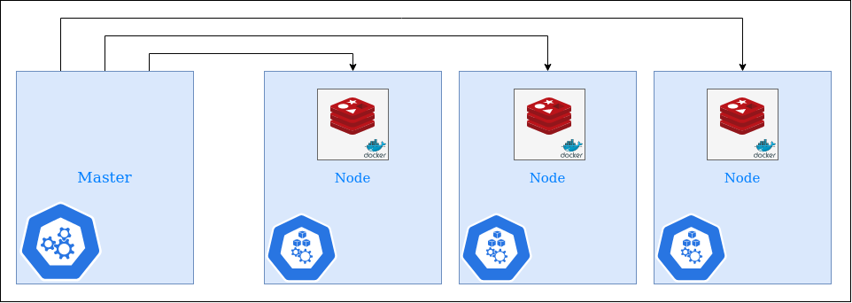
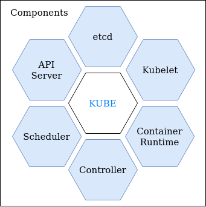

# Docker Essentials

- [Docker Essentials](#docker-essentials)
  - [Part 01 (Introduction)](#part-01-introduction)
  - [Part 02 (Docker Overview)](#part-02-docker-overview)
    - [Chapter 1 (Docker on Linux)](#chapter-1-docker-on-linux)
    - [Chapter 2 (Docker on Windows)](#chapter-2-docker-on-windows)
    - [Chapter 3 (Docker on Mac)](#chapter-3-docker-on-mac)
  - [Part 03 (Commands)](#part-03-commands)
  - [Part 04 (Run)](#part-04-run)
  - [Part 05 (Environment Variables)](#part-05-environment-variables)
  - [Part 06 (Docker Image)](#part-06-docker-image)
    - [Chapter 1 (Create an Image Using Commit)](#chapter-1-create-an-image-using-commit)
    - [Chapter 2 (Create an Image Using Dockerfile)](#chapter-2-create-an-image-using-dockerfile)
    - [Chapter 3 (Transfer Image to an Offline Server)](#chapter-3-transfer-image-to-an-offline-server)
  - [Part 07 (CMD vs ENTRYPOINT)](#part-07-cmd-vs-entrypoint)
  - [Part 08 (Networking)](#part-08-networking)
    - [Chapter 1 (Creating Network Between Containers Using Links)](#chapter-1-creating-network-between-containers-using-links)
    - [Chapter 2 (Creating Network Between Containers Using Networks)](#chapter-2-creating-network-between-containers-using-networks)
  - [Part 09 (Storage)](#part-09-storage)
  - [Part 10 (Compose)](#part-10-compose)
    - [Chapter 1 (Docker-Compose Introduction Using an Example)](#chapter-1-docker-compose-introduction-using-an-example)
    - [Chapter 2 (Docker-Compose Management Commands)](#chapter-2-docker-compose-management-commands)
    - [Chapter 3 (Docker-Compose Scale Up)](#chapter-3-docker-compose-scale-up)
  - [Part 11 (Registry)](#part-11-registry)
  - [Part 12 (Engine)](#part-12-engine)
  - [Part 13 (Docker Orchestration)](#part-13-docker-orchestration)
    - [Chapter 1 (Docker Swarm)](#chapter-1-docker-swarm)
    - [Chapter 2 (Kubernetes)](#chapter-2-kubernetes)
  - [Part 14 (Terminology)](#part-14-terminology)
  - [Part 15 (References)](#part-15-references)

---
## Part 01 (Introduction)

> You can check [Docker's Roadmap](https://github.com/docker/roadmap/projects/1).

Why do you need Docker?
- You don't need to worry about Compatibility/Dependency
- Short Setup Time/Dependency
- You can easily work with different Dev./Test/Prod. environments
- Lower computation overhead compare to the traditional virtualization methods

What can it do?
- Containerize Applications
- Run each service with its own dependencies in separate containers

What are containers?
- Containers are completely isolated environments. They can have their own processes for services, network interface, mounts just like VMs, except they all share the same OS kernel.
- Containers are not introduced with Docker. They existed for more than 10 years. For instance, LXC, LXD, LXCFS, etc.
- Docker utilizes [LXC containers](https://en.wikipedia.org/wiki/LXC).

With docker you'll be able to run each component in a separate container with its own dependencies and its own libraries. All on same VM/OS but within separate env./container. -> build docker configuration once

Public Docker Repository = [DockerHub](https://hub.docker.com)

How is it done?
- `$ docker run IMAGE_NAME`
- You can run images as many instances as you want. (For load balancing, backup or alternative, ...)

Container vs Image:
- Containers are running instances of images that are isolated and have their env. and sets of processes.
- Images (Package + Template + Plan) -> It is used to create one or more containers

---
## Part 02 (Docker Overview)
Docker Editions:
- Community (Free)
  - Linux
  - Mac
  - Windows
  - Cloud (AWS, AZURE, ...)
- Enterprise -> Certified and Supported container platform
  - Enterprise Add-ons: Image Management + Image Security + ...

### Chapter 1 (Docker on Linux)
1. Go to [Docker Documentation](https://docs.docker.com) and click on [Get Docker](https://docs.docker.com/install/)
2. From sidebar menu select your OS/Distribution (_In my case, I use Ubuntu 18.04_)
3. Make sure to uninstall older versions:
   - If you want to keep configuration file of older version:
      ```bash
      sudo apt remove docker docker-engine docker.io containerd runc
      ```
   - If you want to delete everything from your system:
      ```bash
      sudo apt purge docker docker-engine docker.io containerd runc
      ```
4. Scroll down to _Install using the convenience script_
    ```bash
    curl -fsSL https://get.docker.com -o get-docker.sh
    sudo sh get-docker.sh
    sudo docker version
    ```
5. If you would like to use Docker as a non-root user, you should now consider adding your user to the “docker” group with: `$ sudo usermod -aG docker $USER`

### Chapter 2 (Docker on Windows)

 - You won't be able to run Windows-based containers on Docker host with Linux on it. For that, you'll require a docker on a Windows Server.
 - Because they don't have a same kernel.
 - Here's a little trick that Windows do to run a Linux-based container in Docker:
    - When you install Docker on Windows and run a Linux container on Windows, you're not running a Linux container on Windows. Windows runs a Linux container on a Linux virtual machine (VM) under the hood. So it's Linux container on a Linux virtual machine on Windows.

We can use Docker on Windows with these 2 options to run a Linux container on a Windows host:
1. Docker on Windows using Docker Toolbox (Original support for docker on Windows)
   - System Requirement:
     - 64-bit operating system
     - Windows 7 or Higher
     - Enable Virtualization
   - Docker Toolbox:
     - Oracle VirtualBox
     - Docker Engine
     - Docker Machine
     - Docker Compose
     - Kitematic GUI -> (It's a user interface)
2. Docker Desktop for Windows
   - It uses _Hyper-V_ instead of _Virtualbox_
   - It only works on these system, because they support _Hyper-V_ by default:
     - Windows 10 Professional Edition
     - Windows 10 Enterprise Edition
     - Windows Server 2016
     - Nano Server
- VirtualBox and Hyper-V cannot coexist on the same Windows host. So if you started with docker toolbox with VirtualBox and if you plan to migrate to Hyper-V, remember you cannot have both solutions at the same time. There is a migration guide available on Docker documentation page on [how to migrate from VirtualBox to Hyper-V](https://docs.docker.com/docker-for-windows/docker-toolbox/).
- When you install Docker desktop for Windows, the default option is to work with Linux containers. But if you would like to run Windows containers then you must **explicitly** configure docker for Windows to switch to using Windows containers.
- Microsoft announced Windows Server 2016 support Windows containers for the first time. You can now packaged applications, Windows applications into Windows docker containers and run them on Windows docker host using docker desktop for windows. Now you can create Windows-based images and run Windows containers on a Windows server just like how you would run Linux containers on a Linux system.
- Unlike in Linux there are two types of containers in Windows:
  1. Windows Server container which works exactly like Linux containers where the OS kernel is shared with the underlying operating system to allow better security boundary between containers and to a lot of kernels with different versions and configurations to coexist.
  2. The Hyper-V Isolation: With Hyper-V isolation each container is run within a highly optimized virtual machine guaranteeing complete kernel isolation between the containers and the underlying host. While in the Linux world you had a number of base images for a Linux system such as Ubuntu, Debian, Fedora, Alpine, etc. if you remember, that is what you specify at the beginning of the dockerfile. In the Windows world we have two options (Base Images):
     1. Windows Server Core
     2. Nano Server
- Nano Server is a headless deployment option for Windows Server which runs at a fraction of size of the full operating system. (Like Alpine image in Linux)
- Windows Server Core is not as light weight as you might expect it to be.

### Chapter 3 (Docker on Mac)
1. Docker on Mac using Docker Toolbox (Original support for docker on Mac)
   - It's a docker on a Linux VM created using VirtualBox on Mac as with Windows, it has nothing to do with Mac applications or Mac based images or Mac containers. It purely runs Linux containers on MacOS.
   - System Requirements:
     - macOS 10.8 "Mountain Lion" or newer
   - Docker Toolbox:
     - Oracle VirtualBox
     - Docker Engine
     - Docker Machine
     - Docker Compose
     - Kitematic GUI -> (It's a user interface)
2. Docker Desktop for Mac
   - It uses _HyperKit_ instead of _Virtualbox_
   - It will still automatically create a Linux system underneath and it's created on HyperKit.
   - It only works on these system:
     - macOS Sierra 10.12 or newer
     - Mac Hardware 2010 model or newer
- Remember, that all of this is to be able to run Linux container on Mac.
- Up to this point, there are no Mac-based images or containers.

---
## Part 03 (Commands)
- Run = Start a container or run a container from an image. If the image is not present on the host, it will go to _dockerhub_ and pull the image down. (Only the first time) Container will run in fg (foreground) or technically in _attach mode_.
  ```
  docker run SERVICE
  ```
- List of containers with basic information. If you want to see the list of all containers (available, stopped and exited) use `-a`
  ```
  docker ps
  docker ps -a
  ```
- Stop a container using container ID or NAME
  ```
  docker stop ID/NAME
  ```
- Remove a container using ID or NAME only for stopped or exited containers
  ```
  docker rm ID/NAME
  ```
- Remove a container using ID or Name automatically when it exits
  ```bash
  docker run --rm ID/NAME
  ```
- List of images and their sizes
  ```
  docker images
  ```
- Watching the latest log verbose which is generated by the running container
  ```
  docker logs --follow NAME

  docker run --name test --rm -d busybox sh -c "while true; do $(echo date); sleep 1; done"
  docker logs -f --until=5s test
  ```

- Remove an image. You must ensure that no containers are running off of that image before attempting to remove the image. You must stop and delete all dependant containers to be able to delete an image.
  ```
  docker rmi NAME
  ```
  - Pull/Download an image when it couldn't find one locally. It only pulls an image without running it.
  ```
  docker pull NAME
  ```
  **Unlike VMs, containers are not meant to host an OS (operating system). Containers are meant to run a specific task or process such as to host an instance of a web server or an application server or a database or simply to carry some kind of computation or analysis tasks, once the task is complete, the container exits. The container only lives as long as the process inside it is alive.**
  - Append a command (Execute a command when we run the container)
  ```
  docker run SERVICE COMMAND
  docker run ubuntu sleep 5
  ```
- Remove all stopped containers:
  ```bash
  docker container prune
  ```
- Execute a command (for a running container)
  ```
  docker exec NAME/ID COMMAND
  ```
- Run a container (Attach and Detach) -> Detach means don't show output of command and work in bg (background) using `-d`. Using attach command will bring your output to fg (foreground)
  ```
  docker run -d SERVICE
  docker attach NAME/ID
  ```

---
## Part 04 (Run)
- Run with specific version/tag. Default tag will be latest version
  ```
  docker run SERVICE:TAG
  docker run redis:4.0
  ```
- Run with STDIN (Standard Input). Docker container doesn't listen to STDIN even though you are attached to its console. If we want to run a container on interactive mode, we should use `-i` (interactive). However, we can't see the application's prompt on the terminal because we haven't attached to the container's terminal. To solve this, we should use `-t` (terminal).
  ```
  docker run -it SERVICE:TAG
  ```
- Remove Container After Usage. Sometimes, it’s useful just to start a container to poke around, and then discard it afterward. The following will start a new container, drop into a shell, and then destroy the container after you exit.
  ```
  docker run --rm -it SERVICE:TAG
  ```
- Port Mapping / Port Publishing. Every docker container gets an IP assigned by default. Docker container IP is 172.17.1.2:3000 and Docker host IP is 192.168.1.25 so, you can map their port like below. You can even run multiple instances of your application and map them to different ports on the Docker host or you can run your application on a single port and map them to a different port. Remember, you cannot map to the same port on the Docker host more than once.
  ```
  docker run -p USER_PORT:CONTAINER_PORT SERVICE
  docker run -p 80:3000 redis
  docker run -p 443:3001 redis
  docker run -p 8080:3001 redis
  ```
- Volume Mapping. The docker container has its own isolated filesystem and any changes to any files happen within the container. Sometimes we need a persistent data, so we need o map a directory outside the container on the docker host to a directory inside the container. We use `-v` (Volume) option. `DIR_HOST` is a directory outside docker host which docker mount it inside docker host which we call it `DIR_CONTAINER`.
  1. Host Volumes
      ```
      docker run -v DIR_HOST:DIR_CONTAINER SERVICE
      docker run -v /opt/sql/data:/var/lib/mysql mysql
      ```
  2. Anonymous Volumes: The host directory will automatically created by Docker at `/var/lib/docker/volumes/random-hash/_data`
      ```
      docker run -v DIR_CONTAINER SERVICE
      docker run -v /var/lib/mysql mysql
      ```
  3. Named Volumes: This is the upgraded version of Anonymous Volumes, which we named a volume on our host machine. In this format, you can assign single data for multiple instances of a container to share the same data. **(Recommended, even in docker-compose)**
      ```
      docker run -v NAME:DIR_CONTAINER SERVICE
      docker run -v customer_mysql:/var/lib/mysql mysql
      ```
- Inspect Container. If you would like to see additional details about a specific container use inspect command. It will give you more information than `docker ps` command. This command will give you all details of a container in a JSON format.
  ```
  docker inspect NAME/ID
  ```
  - Container Logs. See logs of a container runs in the background (detached mode).
  ```
  docker logs NAME/ID
  ```
- Container Live Statistics. Launches a terminal window which refreshes itself with live data from the container, indicating 3 main runtime metrics, such as CPU usage, memory and Network I/O consumption
  ```bash
  docker stats CONTAINER
  ```
  The built-in Docker allows you to provide multiple names/ids and display their stats within a single window if you have more than one running.
  ```bash
  docker ps -q | xargs docker stats
  ```


---
## Part 05 (Environment Variables)
- An environment variable is a variable whose value is set outside the program, typically through a functionality built into the operating system or microservice. An environment variable is made up of a name/value pair, and any number may be created and available for reference at a point in time.
- Assignments:
  - OS
    - Unix (Terminal): `export VARIABLE=value`
    - Windows (Command Prompt or cmd): `SET VARIABLE=value`
  - Programming Languages
    - Python3: `var = os.environ.get('VARIABLE') = value`
    - C++: `DATATYPE VARIABLE=value; putenv(VARIABLE);`

```
docker run -e VARIABLE=value NAME/ID
```
- To deploy multiple containers with different Environment Variable, you should run docker command multiple times and set different Environment Variables each time.
- If you want to find the list of environment variables set on a running container, you should use `docker inspect NAME/ID` and look for `ENV` under `Config` section.

---
## Part 06 (Docker Image)

### Chapter 1 (Create an Image Using Commit)

Let’s start running an interactive shell in a ubuntu container:

```bash
docker container run -ti ubuntu bash
```
To customize things a little bit, we will install a package called [figlet](figlet.org) in this container.

```bash
apt-get update
apt-get install -y figlet
figlet "hello docker"
```

You should see the words “hello docker” printed out in large ASCII characters on the screen.


Now let us pretend this new figlet application is quite useful, and you want to share it with the rest of your team. You could tell them to do exactly what you did above and install figlet into their container, which is simple enough in this example. But if this was a real-world application where you had just installed several packages and run through many configuration steps, the process could get cumbersome and become entirely error-prone. Instead, it would be easier to create an image you can share with your team.

To start, we need to get the ID of this container using this command:
```bash
docker container ls -a
```

Now, to create an image, we need to “commit” this container. Commit creates an image locally on the system running the Docker engine. Run the following command, using the container ID you retrieved, to commit the container and create an image out of it.

```bash
docker container commit CONTAINER_ID
```
Once it has committed, we can see the newly created image in the list of available images.

### Chapter 2 (Create an Image Using Dockerfile)

Create an image:
1. Create a `Dockerfile`. Sample of Dockerfile (OS: Ubuntu & Update and Install dependencies & Install python dependencies & Copy source code to /opt/ folder & Run the webserver using flask):
```
FROM Ubuntu

RUN apt update
RUN apt full-upgrade -y
RUN apt install python3,python3-pip -y

RUN pip install flask
RUN pip install flask-mysql

COPY . /opt/source-code

ENTRYPOINT FLASK_APP=/opt/source-code/app.py flask run
```
2. Create an image locally on system
```
docker build Dockerfile -t NAME
```
3. Make it available on the public DockerHub registry
```
docker push NAME
```
- **Dockerfile**
  - Format: `INSTRUCTION argument`
  - Every instruction is in UPPERCASE format in an instruction -> `FROM, RUN, COPY, ...`
  - Everything in front of an instruction is an argument to that instruction.
  - `FROM`: First line of dockerfile defines what the base OS should be for this container or another image that was created before which is based on an OS. It's mandatory command for dockerfile.
  - `RUN`: Instructs docker to run a particular command on those based images.
  - `COPY`: Copy whatever you need inside the docker image
  - `ENTRYPOINT`: Allows us to specify a command that will be run when the image is running as a container.
- Layered Architecture
  - When docker builds images it builds these in a layered architecture. Each line of instruction creates a new layer in the docker image with just the changes from the previous layer. You can see size of packages with this command:
  ```
  docker history NAME
  ```
  - When you run the command below, you can see the various steps involved and the result of each task. All the layers build are cast so the layered architecture helps you restart docker build from that particular step in case it fails or if you were to add new steps in the build process, you wouldn't have to start all over again.
  ```
  docker build .
  ```
  - All the layers are build cached by docker. So if you wanted to add another step to dockerfile or there was a failure in a step, you can rebuild it. If you add a step to dockerfile, only layers above the updated layer need to rebuild.
  ```
  docker build Dockerfile -t NAME
  ```
- **Dockerignore**
  - Sometimes we need to exclude some files and folders before building our container to avoid unnecessarily sending large or sensitive files or directories to the daemon. So we make a file as `.dockerignore`
  - Think of it as a `.gitignore` file for better understanding.
  - Syntax:
    1. Lines starting with `#` will be considered as a comment.
    2. You can use wildcards with `*`
    3. You can use `?` like wildcards but for only a single character.
    4. Lines starting with `!` can be used to make exceptions to exclusions. But it must come after that specific ignore files.
- What can you containerize?
  - Databases
  - Development tools
  - Operating Systems
  - All of the applications
    - Browsers
    - Utility (Curl, ...)
    - Spotify
    - Skype
  - EVERYTHING :)

A wise man once said:

> Give a sysadmin an image and their app will be up-to-date for a day, give a sysadmin a Dockerfile and their app will always be up-to-date.

Hence, creating images for the complex applications is preferred to use Dockerfiles rather than committing into local volume and manipulating the result.


### Chapter 3 (Transfer Image to an Offline Server)

You can easily export a docker image into the raw tar format.

1. ```docker save SERVICE:TAG > ARBITRARY_NAME.tar```
2. Move the .tar file to the offline machine which have docker runtime.
3. ```docker import ARBITRARY_NAME.tar```
4. You can see the result in ```docker image ls```

But let's have a deeper look inside by decompressing the tar file. Based on the number of layers that your docker image has, you'll see them with their representative digest string.
More importantly, there are two files called _manifest.json_ and _repositories_, which indicate the parent docker image, Repo tags, and the layer precedence.

---
## Part 07 (CMD vs ENTRYPOINT)

Who defines what process runs within the container? If you look at the Dockerfile for popular Docker images like NGINX, you will see an instruction called CMD, which stands for Command that defines the program that will run within the container. When it starts for the NGINX image, it is the `CMD["nginx"]` command, and for the MySQL image, it is the `CMD["mysqld"]` command.

We need to tell Docker to look for a process explicitly; otherwise, the Docker exits. So, this is why we need to keep our Docker up and running with `CMD`.

The old way to run a command when we start a Docker was something like, `docker run ubuntu [COMMAND]` and after the command finished, the Docker exits. This is a good way, but we need a permanent solution to do this. So we need a solution to overrides the default command specified within the image.

We can add the command(s) to our dockerfile in 2 formats:
  1. Shell form: `CMD command parameter`
  2. JSON form: `CMD ["command", "parameter"]`
- When you specify in a JSON array format, the first element in the array should be executable.

This was a good solution, but we hardcoded our command and its parameter, and it isn't a promising solution for us. Here it comes `ENTRYPOINT` which can solve this problem.

We can use `ENTRYPOINT ["COMMAND"]` instead of `CMD COMMAND PARAMETER` in dockerfile so that we can run this `docker run SERVICE PARAMETER` instead of `docker run SERVICE COMMAND PARAMETER`.

Now, what if we don't give a parameter when we use `ENTRYPOINT`?! We need to add a default value whenever we don't want to provide the program specific value. We do this with both `ENTRYPOINT` and `CMD`. To use both of them, there's only one condition. You have to write these commands only in **JSON format**. For example:

```
FROM Ubuntu
.
.
.
ENTRYPOINT ["sleep"]
CMD ["5"]
```

You can even modify the `ENTRYPOINT` during runtime using this command:
```bash
docker run --entrypoint NEW_COMMAND SERVICE PARAMETER
```

---
## Part 08 (Networking)

When you install Docker, it creates 3 networks by default:
1. **Bridge**: is the default network that a container attached to it.
```bash
docker run SERVICE
docker run ubuntu
```
2. **None**:
```bash
docker run SERVICE --network=none
docker run ubuntu --network=none
```
3. **Host**:
```bash
docker run SERVICE --network=host
docker run ubuntu --network=host
```


Let's dig into these three networks:

- **Bridge** is a private internal network created by Docker on the host. All containers attached to this network by default, and they get an internal IP address usually in the range of **172.17.0.0/16**. The Docker itself gets 172.17.0.1 as the default gateway of other containers, and its name is `Docker0`. The containers can access each other using internal IP if required. To access any of these containers from the outside world, map the ports of these containers to ports on the Docker host as we have seen before [HERE](#part-04-run). Another way to access the containers externally is to associate the container to the **HOST** network. This takes out any network isolation between the Docker host and the Docker container. It means when you want to run a web server on port 5000 in a web app container, it is automatically accessible on the same port externally without requiring any port mapping as the web container uses the host's network. This would also mean that unlike before, you will now not be able to run multiple web containers on the same host on the same port as the ports are now common to all containers in the host network. With the **None** network, the containers are not attached to any network and don't have any access to the external network or other containers. They run in an isolated network.
- What if we wish to isolate the containers within the Docker host. For example, the first two web containers on internal network 172 and the second two containers on a different internal network like 10. by default, Docker only creates one internal bridge network. We could create our own internal network using this command:

```bash
docker network create --driver bridge --subnet IP/SUBNET NETWORK_NAME
docker network create --driver bridge --subnet 10.0.0.0/24 test_network

docker network
docker network ls
```

So how do we see the network settings, the IP addresses, Mac Addresses, etc. assigned to an existing container?
```bash
docker inspect NAME/ID
```


**Embedded DNS:**

- Containers can reach each other using their names. But is it a good way for containers to communicate with their IP addresses? Well, NO. because there is no guarantee for their IP addresses to be the same after the system reboots. The right way to do it is to use the container name. All containers in a Docker host can resolve each other with the name of the container. Docker has a built-in DNS server that helps the containers to resolve each other using the container name.
- The built-in DNS server IP address is **127.0.0.11**
- You can modify it here: `/etc/resolv.conf`

**Some advanced concept:**<br>
So how does Docker implement networking? What's the technology behind it? Like how the containers isolated within the host?<br>
Docker uses network namespaces that create a separate namespace for each container. It then uses virtual Ethernetpairs to connect containers together.

### Chapter 1 (Creating Network Between Containers Using Links)

> Note: Using links like what I'm going to tell you is going to be deprecated, and the support may be removed in the future by the Docker support team. This is because, as we will see in some time, advanced and newer concepts in Docker Swarm and networking, support better ways of achieving what we are going to do here with links. But I'm going to tell you about it so that you can understand the concept of it.

Link is a command line option which can be used to link containers together.

What this is, in fact doing is it creates an entry into the `/etc/hosts` file on the container and assigns an internal IP to it.

The key aspect when creating a link is the name of the container. Let's start with running a Redis server container:

```bash
docker run -d --name MY-REDIS-DB REDIS 
```
To connect to a source container, you use the `--link` option when launching a new container.<br>The container name refers to the source container we defined in the previous step while the alias defines the friendly name of the host.

For example, we bring up a _redis_ container, which linked to our _my-redis-db_ container. We've defined the alias as _my-redis-client-app_.

```bash
docker run -it --link MY-REDIS-DB:REDIS --name MY-REDIS-CLIENT-APP redis sh
```

After doing so, we can launch a _redis CLI_ service in the _my-redis-client-app_ container by calling our _my-redis-db_'s hostname:

```bash
redis-cli -h MY-REDIS-DB
```
and now you can start using the Redis-DB from another container.

When a link created, Docker will do two things:

1. Docker will set some environment variables based on the link to the container. These environment variables give you a way to reference information such as Ports and IP addresses via known names.<br> You can output all the environment variables with the env command. For example:<br>
```bash
docker run -it --link REDIS-DB:REDIS --name MY-REDIS-CLIENT-APP redis env
```

2. Secondly, Docker will update the HOSTS file of the container with an entry for our source container with three names,<br> _the original_, _the alias_, and the _hash-id_. You can output the containers host entry using cat /etc/hosts <br>
```bash
docker run -it --link REDIS-DB:REDIS --name MY-REDIS-CLIENT-APP redis cat /etc/hosts
``` 

### Chapter 2 (Creating Network Between Containers Using Networks)

The first step is to create a network using the CLI. This network will allow us to attach multiple containers that will be able to discover each other.
```bash
docker network create NETWORK_NAME
docker network create BACKEND-NETWORK
```
When we launch new containers, we can use the `--net` attribute to assign which network they should connect.
```bash
docker run -d --name=CONTAINER_NAME --net=NETWORK_NAME SERVICE:[TAG]
docker run -d --name=my-redis-container --net=BACKEND-NETWORK redis
```
Unlike using links, Docker network behaves like traditional networks where nodes can be attached/detached.
The first thing you'll notice is that Docker no longer assigns environment variables or updates the hosts file of containers. see [here](#chapter-1-creating-network-between-containers-using-links).

Instead, the way containers can communicate via an **Embedded DNS Server** in Docker.

```bash
docker run --net=BACKEND-NETWORK alpine cat /etc/resolv.conf
```
When containers attempt to access other containers via a well-known name, such as _my-redis-container_, the DNS server will return the IP address of the correct Container.

Docker supports multiple networks and containers attached to more than one network at a time. For instance:

```bash
docker network create FRONTEND-NETWORK
```
Using the connect command, it is possible to attach existing containers to the network.
```bash
docker network connect FRONTEND-NETWORK REDIS
docker run -d -p 3000:3000 --net=FRONTEND-NETWORK CENTOS/NODEJS-4-CENTOS7
```
We just created a separate network with a _Node.js_ application that communicates with our existing _Redis_ instance which you can test it using `curl localhost:3000`

---
## Part 09 (Storage)
> This part (Storage) is an advanced topic. You can skip it if you want to learn the basics.

We're going to talk about Docker storage drivers and file systems. We're going to see where and how Docker stores data and how it manages file systems of the container.

Let's start with how Docker stores data on the local file system. When you install Docker on a system, it creates this folder structure:


<!--  -->

You have multiple folders/directories under `/var/lib/docker/` called aufs, containers, image, and volume, etc. This is where Docker stores all its data by default. By data, I mean files related to images and containers running on the Docker host. For example, all files related to containers are stored under the containers folder, and the files related to images are stored under the image folder. Any volumes created by the Docker containers are created under the volumes folder.

Let's understand where Docker stores its files, and in what format?<br>
First, we need to understand Dockers layered architecture. Let's review [Layered Architecture](#chapter-2-create-an-image-using-dockerfile). So, I'm going to explain this part with an example, let's say we have two dockerfile and we want to build two docker container based on them. Both of them have the same OS, specific updates, dependencies, and some programs to install for initialization. But the rest of the lines in dockerfile are different. When Docker finishes the first container, it won't build the same layers from the second dockerfile; instead, it uses those layers from the cache to save space and time. Once the build completes, you cannot modify the contents of these layers, and so they are read-only, and you can only modify them by initiating a new build.

When you run a container based on an image using the Docker run command, Docker creates a container based off of these layers and creates a new writable layer on top of the image layer. The writable layer is used to store data created by the container, such as log files written by the applications, any temporary files generated by the container, or just any file modified by the user on that container. The life of this layer, though, is only as long as the container is alive. When the container destroyed this layer, and all of the changes stored in it will be destroyed. Remember that the same image layer is shared by all containers created using this image.

If I were to log in to the newly created container and create a new file called `temp.txt` it would create that file in the container layer, which is read and write. We just said that the files in the image layer are read-only, meaning you cannot edit anything in those layers. Let's take an example of our application code since we developed our code into the image. The code is part of the image layer and is read-only. After running a container, what if I wish to modify the source code to say test a change.


<!--  -->

Remember, the same image layer may be shared between multiple containers created from this image, so does it mean that I cannot modify this file inside the container?<br>
No, I can still modify this file, but before I save the modified file Docker automatically creates a copy of the file in the read/write layer, and I will then be modifying a different version of the file in the read-write layer. All future modifications will be done on this copy of the file in the read-write. This is called **copy-on-write** mechanism. The image layer being read-only means that the files in these layers will not be modified in the image itself, so the image will remain the same all the time until you rebuild the image using the Docker build command.

What happens when we get rid of the container?<br>
All of the data stored in the container layer also gets deleted. The change we made to the `app.py` and the new `temp.txt` file we created, we'll also get removed.

So what if we wish to persist this data?<br>
For example, if we were working with our database, and we would like to preserve the data created by the container, we could add a persistent volume to the container. To do this, first, create a volume using the `docker volume create` command, so when I run the `docker volume create data_volume` command, it creates a folder called `data_volume` under the `/var/lib/docker/volumes/` directory. Then when I run the Docker container using the `docker run` command, I could mount this volume inside the Docker containers read-write layer using the `-v` option like this:

```bash
docker run -v FOLDER_NAME:SERVICE_LOCATION IMAGE_NAME
docker run -v data_volume:/var/lib/mysql mysql
```

This will create a new container and mount the data volume we created into `/var/lib/mysql` folder inside the container. So all data are written by the database is, in fact, stored on the volume created on the Docker host. Even if the container is destroyed, the data is still active.<br>
Now, what if you didn't run the `docker volume create` command to create the volume before the `docker run command`?<br>
For example, if I run the `docker run command` to create a new instance of MySQL container with the volume `data_volume2` which I have not created yet, Docker will automatically create a volume named `data_volume2` and mounted to the container. You should be able to see all these volumes if you list the contents of the `/var/lib/docker/volumes` folder. This is called **volume mounting**. As we are mounting a volume created by Docker under the `/var/lib/docker/volumes` folder, but what if we had our data already at another location?<br>
For example, let's say we have some external storage on the Docker host at `/data`, and we would like to store database data on that volume and not in the default `/var/lib/docker/volumes` folder?<br>
In that case, we would run a container using the command `docker run -v`, but in this case, we will provide the complete path to the folder we would like to mount. That is `/data/mysql`, and so it will create a container and mount the folder to the container. This is called **bind mounting**.<br>
So there are two types of mounts:
1. **Volume mounting**
2. **Bind mounting**

Volume-mount mounts a volume from the volumes directory, and bind-mount mounts a directory from any location on the Docker host.<br>
One final point note before I finish this part, using the `-v` is an old style. The new way is to use `--mount` option. The `--mount` is the preferred way as it is more verbose, so you have to specify each parameter in a `key=value` format. For example, the previous command can be written with the `--mount` option as this using the type source and target options. The type, in this case, is bind. The source is the location on my host, and the target is the location on my container.

```bash
docker run --mount type=bind,source=/data/mysql,target=/var/lib/mysql mysql
```

<!--  -->

So, who is responsible for doing all these operations?<br>
Maintaining the layered architecture, creating a writable layer moving files across layers to enable copy and write, etc. it's the storage drivers, so Docker uses storage drivers to enable layered architecture. Some of the common storage drivers are:
- AUFS
- ZFS
- BTRFS
- Device Mapper
- Overlay
- Overlay2

The selection of the storage driver depends on the underlying OS being used. For example, in Ubuntu, the default storage driver is **AUFS**, whereas this storage driver is not available on other operating systems like Fedora or CentOS. In that case, device-mapper may be a better option. Docker will choose the best storage driver available automatically based on the operating system. The different storage drivers also provide different performance and stability characteristics. So you may want to choose one that fits the needs of your application and your organization. If you would like to read more on any of these storage drivers, read this document about [select a storage driver](https://docs.docker.com/storage/storagedriver/select-storage-driver/).


---
## Part 10 (Compose)
> In this section, we're going to work with YAML file (.yml or .yaml extension). It's essential to understand YAML before start reading this part.

If we needed to setup a complex application running multiple services, a better way to it is to use Docker Compose. With Docker compose, we could create a configuration file in YAML format called **`docker-compose.yml`** and put together the different services and the options specific to this to running them in this file. Then we could simply run `docker-compose up` command to bring up the entire application stack. This is easier to implement run and maintain as all changes always stored in the Docker compose configuration file. However, this is all only applicable to running containers on a single Docker host.

Let's look at a better example. I'm going to use the same application that everyone uses to demonstrate Docker. It's a comprehensive yet straightforward application developed by Docker to explain the various features available in running an application stack on Docker. So let's first get familiarized with the app.

### Chapter 1 (Docker-Compose Introduction Using an Example)

This is a sample voting application that provides an interface for a user to vote and another interface to show the results. The application consists of various components such as the voting app which is a web application developed in **Python** to provide the user with an interface to choose between two options a cat and a dog. When you make a selection, the vote is stored in **Redis** (In this case, servers as a database in memory). This vote is then processed by the worker which is an application written in **.NET**. The worker application takes the new vote and updates the persistent database which is a **PostgreSQL** that merely has a table with several votes for each category cats and dogs. In this case, it increments the number of votes for cats as our vote for cats. Finally the result of the vote is displayed in a web interface which is another web application developed in **Node.js**. This resulting application reads the count of votes from the PostgreSQL database and displays it to the user. So that is the architecture and dataflow of this simple voting application stack. As you can see, this application is built with a combination of different services, different development tools and multiple different development platforms such as Python, Node.js, etc. This sample application will be used to showcase how easy it is to setup an entire application stack consisting of diverse components in Docker.


Some points if we want to run these services with `docker run` command:
- There are no links between containers, and obviously, they can't think for themselves to guess how they should get, process, and send data.
- You can review links from [here](#chapter-1-creating-network-between-containers-using-links).
- You can see some details of containers at `/etc/hosts`.

Let's create **docker-compose.yml** for our voting-app from these `docker run` commands:

```bash
docker run -d --name=redis redis
docker run -d --name=db postgres:9.4
docker run -d --name=vote -p 5000:80 --link redis:redis voting-app
docker run -d --name=result -p 5001:80 --link db:db result-app
docker run -d --name=worker --link db:db --link redis:redis worker
```
We start by creating a dictionary of container names. We will use the same we used in the Docker run commands. So we take all the names and create a key with each of them. Then under each item, we specify which image to use. The key is the image, and the value is the name of the image to use. Next, inspect the commands and see what the other options used are. We publish ports. So let's move those ports under the respective containers. So we create a property called ports and lists all the ports that you would like to publish under that. Finally, we are left with links, so whichever container requires a link created properly under it called links and provides an array of links such as Redis or DB.
```yaml
redis:
  image: redis
db:
  image: postgres:9.4
vote:
  image: voting-app
  ports:
    - 5000:80
  links:
    - redis
result:
  image: result-app
  ports:
    - 5001:80
  links:
    - db
worker:
  image: worker
  links:
    - redis
    - db
```
Now that we wrote our docker-compose.yml file, bringing up the stack is simple. From the `docker-compose up` command, you can bring up the entire application stack.

When we looked at the example of the voting application, we assumed that all images are already built. Out of the five different components, two of them Redis and Postgres images we know are already available on Docker hub. There are official images from Redis and Postgres, but the remaining three are our applications. They don't need to be already built and available in a Docker registry. If we would like to instruct Docker compose to run a Docker build instead of trying to pull an image, we can replace the image line with a build line and specify the location of a directory that contains the application code and a Dockerfile with instructions to build the Docker image.
In this example, for the voting app, I have all the application code in a folder named `/vote`, which contains all application code and a Dockerfile. This time when you run the `docker-compose up` command, it will first build the images, give a temporary name for it and then use those images to run containers using the options you specified before. Similarly, use the build option to build the two other services from the respective folders.

```yaml
redis:
  image: redis
db:
  image: postgres:9.4
vote:
  image: ./vote
  ports:
    - 5000:80
  links:
    - redis
result:
  image: ./result
  ports:
    - 5001:80
  links:
    - db
worker:
  image: ./worker
  links:
    - redis
    - db
```

We will now look at different versions of the Docker compose file. This is important because you might see Docker compose files in different formats at different places and wonder why it looks so different. Docker-compose evolved over time and now supports a lot more options than it did in the beginning. For example, this is the trimmed down version of the Docker compose file we used earlier:

```yaml
redis:
  image: redis
db:
  image: postgres:9.4
vote:
  image: voting-app
  ports:
    - 5000:80
  links:
    - redis
```

This is the original version of the Docker-compose file known as version 1. this had several limitations. For example, if you wanted to deploy containers on a different network other than the default Bridge network, there was no way of specifying it in this version of the file. Also, say you have a dependency or start-up order of some kind, for example, your database container must come up first and only then the voting application should be started. There was no way you could specify that in version 1 of the Docker compose file. Support for these came in version 2. with version 2 and up, the format of the file also changed a little bit. You no longer specify your stack information directly, as you did before. It is all encapsulated in a **Services** section, so create a property called services in the root of the file and then move all the services underneath that. You will still use the same `docker-compose up` command to bring up your application stack. But how does Docker-compose know what version of the file you're using?<br>
You're free to use version 1 or version 2, depending on your needs. So how does the Docker compose know what format you are using?<br>
For version 2 and up, you must specify the version of the Docker-compose file you are intending to use by specifying the version at the top of the file. In this case, `version:2`.

```yaml
version: 2
services:
  redis:
    image: redis
  db:
    image: postgres:9.4
  vote:
    image: voting-app
    ports:
      - 5000:80
    depends_on:
      - redis
```

Another difference is with networking. In version 1, Docker-compose attaches all the containers it runs to the default bridged network and then use links to enable communication between the containers as we did before. With version 2, Docker-compose automatically creates a dedicated bridged network for this application and then attaches all containers to that new network. All containers are then able to communicate with each other using each other's service name. So you basically don't need to use links in version 2 of Docker-compose. You can get rid of all the links you mentioned in version 1 when you convert a file from version 1 to version 2, and finally, version 2 also introduces it depends on the feature. If you wish to specify a start-up order, for instance, say the voting web application is dependent on the Redis service, so you need to ensure that Redis container is started first and only then the voting web application must be started. We could add a depends on the property to the voting application and indicate that it is dependent on Redis. Then comes version 3, which is the latest as of today.

```yaml
version: 3
services:
  redis:
    image: redis
  db:
    image: postgres:9.4
  vote:
    image: voting-app
    ports:
      - 5000:80
```

Version 3 is similar to version 2 in the structure, meaning it has a version specification at the top and a Services section under which you put all your services, just like in version2. Make sure to specify the version number as 3 at the top. Version 3 comes with support for Docker swarm, which we will see later on. Some options were removed and added to see details on those you can refer to the [documentation](https://docs.docker.com/compose/compose-file/). We will see version 3 in much detail later when we discuss Docker stacks. Let us talk about networks in Docker-compose. Getting back to our application so far, we have been just deploying all containers on the default bridged network.
Let us say we modify the architecture a little bit to contain the traffic from the different sources. For example, we would like to separate the user-generated traffic from the applications of internal traffic. So we create a front-end network dedicated to traffic from users and a back-end network dedicated to traffic within the application. We then connect the user-facing applications, which are the voting app and the result-app to the front-end network and all the components to an internal back-end network. So back in our Docker compose file note that I have actually stripped out the port section for simplicity sake. They're just not shown here. The first thing we need to do if we were to use networks is to define the networks we are going to use. In our case, we have two networks front end and back end. So, create a new property called networks at the root level adjacent to the services in the Docker compose file and add a map of networks we are planning to use. Then under each service, create a network property and provide a list of networks that service must be attached to. In case of Redis and DB, it's only the back-end network. In case of the front-end applications such as at the voting app and the result-app, they require to be attached to both a front-end and back-end Network. You must also add a section for worker container to be added to the back-end network. I have just omitted that in this slide.



```yaml
version: 2
services:
  redis:
    image: redis
    networks:
      - back-end
  db:
    image: postgres:9.4
    networks:
      - front-end
      - back-end
  vote:
    image: voting-app
    networks:
      - front-end
      - back-end
  result:
    image: result
    networks:
      - front-end
      - back-end
networks:
  front-end:
  back-end:
```

So as the conclusion, much like a dockerfile, we have something called docker-compose to help us out when we spin up many containers.
thus you can think of a dockerfile as automating the process of creating images. And a docker-compose automates the process of creating images.

### Chapter 2 (Docker-Compose Management Commands)

Not only can Docker-Compose manage starting containers, but it also provides a way to manage all the containers using a single command.

- To see the details of the launched containers you can use `docker-compose ps`
- To access all the logs via a single stream you use `docker-compose logs`
- To stop a set of containers you can use the command `docker-compose stop`
- To remove all the containers use the command `docker-compose rm`

### Chapter 3 (Docker-Compose Scale Up)

As Docker-Compose understands how to launch your application containers, it can also be used to scale the number of containers running.

The scale option allows you to specify the service and then the number of instances you want. If the number is greater than the instances already running then, it will launch additional containers. If the number is less, then it will stop the inessential containers.

- Scale Up the number of _web_ containers you previously created by using the command below:
  ```bash
  docker-compose scale CONTAINER_NAME=NUMBER_OF_INSTANCES
  docker-compose scale WEB=3
  ```
- Scale Down using:
  ```bash
  docker-compose scale WEB=1
  ```

---
## Part 11 (Registry)

What is a registry?<br>
It's the central repository of all Docker images.

Let's make things more clear with an example:

```bash
docker run nginx
```
When you say `nginx`, it's actually `nginx/nginx`. The first `nginx` stands for the user or account name. So if you don't provide an account or a repository name, it assumes that it is the same as the given name, which in this case is `nginx`. The usernames are usually your Dockerhub account name, or if it is an organization, then it's the name of the organization. if you were to create your account and create your repositories or images under it, then you would use a similar pattern.<br>
Now, where are these images stored and pulled from?<br>
since we have not specified the location where these images are to be pulled from, it is assumed to be on Dockers default registry Dockerhub. The DNS name for which is `docker.io`. The registry is where all the images are stored, for example, `docker.io/nginx/nginx`. Whenever you create a new image or update an existing image, you push it to the registry, and every time anyone deploys this application, it is pulled from that registry. There are many other popular registries as well; for example, Google's registry is `gcr.io` where a lot of Kubernetes related images are stored. Like the ones used for performing end-to-end tests on the cluster, which located at `gcr.io/kubernetes-e2e-test-images/dnsutils`. These are all publicly accessible images that anyone can download and access. When you have applications built in-house that shouldn't be made available to the public, hosting an internal private registry may be a good solution. Many cloud service providers such as AWS, Azure, GCP provide a private registry by default when you open an account with them. On any of these solutions, a Dockerhub or Google registry or your internal private registry, you may choose to make a repository private so that it can only be accessed using a set of credentials. From Docker's perspective to run a container using an image from a private registry, you first log in to your private registry using the Docker login command.

```bash
docker login PRIVATE-REGISTRY-ADDRESS
```

input your credentials once successful run the application using private registry as part of the image name. like this:

```bash
docker run PRIVATE-REGISTRY-ADDRESS/APPS/INTERNAL-APP
```

Now, if you did not log in to the private registry, it will come back, saying that the image cannot be found. So remember to always log in before pulling or pushing to a private registry. We said that cloud providers like AWS or GCP provide a private registry when you create an account with them. But what if you are running your application on-premise and don't have a private registry. How do you deploy your own private registry within your organization? The Docker registry is another application and is available as a Docker image. The name of the image is **registry**, and it exposes the API on port 5000.

```bash
docker run -d -p 5000:5000 --name registry registry:2
```

Now that you have your custom registry running at port 5000 on this Docker host. how do you push your own image to it?<br>
Use the `docker image tag` command to tag the image with a private registry URL in it.

```bash
docker image tag MY-IMAGE localhost:5000/MY-IMAGE
```

In this case, since it's running on the same Docker host, I can use `localhost:5000`, followed by the image name. I can then push my image to my local private registry using the command `docker push` and the new image name with the Docker registry information in it.

```bash
docker push localhost:5000/MY-IMAGE
```

Now, I can pull my image from anywhere within this network using the localhost if you're on the same host or the IP or domain name of my Docker host.

```bash
docker pull localhost:5000/MY-IMAGE
docker pull IP:5000/MY-IMAGE
```

---
## Part 12 (Engine)
> This part is an advanced topic. You can skip it if you want to learn the basics because we're going to look at Docker's architecture in detail.

We're going to find out about how Docker actually runs an application in isolated containers and how it works.

Docker engine, as we have learned before, is simply referred to as a host with Docker installed on it. When you install Docker on a Linux host, you're actually installing three different components the **Docker daemon**, the **Rest API** server, and the **Docker CLI**.



1. **The Docker daemon** is a background process that manages Docker objects such as images, containers, volumes, and networks.
2. **The Docker REST API server** is the API interface that programs can use to talk to the daemon and provide instructions. You could create your own tools using this REST API.
3. **The Docker CLI** is nothing but the command-line interface that we've been using until now to perform actions such as running a container, stopping containers, destroying images, etc. it uses the REST API to interact with the Docker demon.
- Something to note here is that the Docker CLI need not necessarily be on the same host. It could be on another system like a laptop and can still work with a remote Docker engine. Use the `-H` option on the Docker command and specify the remote Docker engine address and a port, as shown here:



For example, to run a container based on NGINX on a remote Docker host run the command:

```bash
docker -H=IP:PORT run NGINX
```

Now, let's try to understand how exactly our applications containerized in Docker.<br>
Docker uses namespaces to isolate workspace. **Process IDs**, **network**, **inter-process communication**, **mounts**, and **Unix time-sharing systems** are created in their own namespace, thereby providing isolation between containers.



Let's take a look at one of the namespace isolation techniques "process ID namespaces". Whenever a Linux system boots up, it starts with just one process with a process ID of one (PID=1). This is the root process and kicks off all the other processes in the system. By the time the system boots up completely, we have a handful of processors running. This can be seen by running the `ps` command to list all the running processes. The process IDs are unique, and two processes cannot have the same process ID. Now, if we were to create a container that is basically like a child system within the current system, the child system needs to think that it is an independent system on its own. It has its own set of processes originating from a root process with a process ID of one. But we know that there is no hard isolation between the containers and the underlying host. So the processes running inside the container or, in fact, processes running on the underlying host and so two processes cannot have the same process ID of one. This is where namespaces come into play. With process ID namespaces, each process can have multiple process IDs associated with it. For example, when the processes start in the container, it's actually just another set of processes on the base Linux system, and it gets the next available process ID. In this case, 5 and 6. however, they also get another process ID starting with `PID=1` in the container namespace, which is only visible inside the container. So the container thinks that it has its own root process tree and so it is an independent system.



So how does that relate to an actual system? How do you see this on a host?<br>
Let's say I want to run an NGINX server as a container. We know that the NGINX container runs an NGINX service. If we were to list all the services inside the Docker container, we see that the NGINX service was running with a process ID of one. This is the process ID of the service inside of the container namespace. If we list the services on the Docker host, we will see the same service but with a different process ID. That indicates that all processes are running on the same host but separated into their own containers using namespaces. So we learned that the underlying Docker host, as well as the containers, share the same system resources such as CPU and memory.


How much of the resources dedicated to the host and the containers? How does Docker manage and share the resources between the containers?<br>
By default, there is no restriction as to how much of a resource a container can use. And hence a container may end up utilizing all of the resources on the underlying host. But there is a way to restrict the amount of CPU or memory a container can use. Docker uses **cgroups** or control groups to restrict the number of hardware resources allocated to each container. This can be done by providing the `--cpus` option to the `docker run` command providing a value of 0.5 will ensure that the container does not take up more than 50% of the host CPU at any given time. The same goes for memory setting a value of 100m to the `--memory` option limits the amount of memory the container can use to a hundred megabytes. If you want to read more about resource constraints (CPU, Memory, GPU), [read here](https://docs.docker.com/config/containers/resource_constraints/).

```bash
docker run --cpus=0.5 SERVICE
docker run --memory=100m SERVICE
```

---
## Part 13 (Docker Orchestration)

Let's understand what container orchestration is. So far, in this course, we've seen that with Docker, you can run a single instance of the application with a simple `docker run` command. In this case, to run a node.js based application, you're on the `docker run nodejs` command, but that's just one instance of your application on one Docker host. What happens when the number of users increases, and that instance is no longer able to handle the load?<br>
You deploy additional instances of your application by running the `docker run` command multiple times. So, that's something you have to do yourself. You have to keep a close watch on the load and performance of your application and deploy additional instances yourself. And not just that, you have to keep a close watch on the health of these applications. And if a container was to fail, you should be able to detect that and run the `docker run` command again to deploy another instance of that application. What about the health of the Docker host itself? What if the host crashes and is inaccessible? The containers hosted on that host become inaccessible too. So what do you do to solve these issues? You need a dedicated engineer who can sit and monitor the state performance and health of the containers and take necessary actions to remediate the situation. But when you have large applications deployed with tens of thousands of containers, that's not a practical approach. So you can build your scripts, and that helps you tackle these issues to some extent.<br>
Container orchestration is just a solution for that. It is a solution that consists of a set of tools and scripts that can help host containers in a production environment. Typically a container orchestration solution consists of multiple Docker hosts that can host containers that way even if one fails the application is still accessible through the others.

```bash
docker service create --replicas=100 nodejs
```

The container orchestration solution easily allows you to deploy hundreds or thousands of instances of your application with a single command to provide [High Availability or HA](https://en.wikipedia.org/wiki/High_availability). Some orchestration solutions can help you automatically scale up the number of instances when users increase and scale down the number of instances when the demand decreases. Some solutions can even help you in automatically adding additional hosts to support the user load, and not just clustering and scaling the container orchestration solutions also provide support for advanced networking between these containers across different hosts. As well as load balancing user requests across a different house, they also provide support for sharing storage between the hosts as well as support for configuration management and security within the cluster. there are multiple container orchestration solutions available today:
- Docker Swarm from Docker
- Kubernetes from Google
- Mesos from Apache

**Docker Swarm** is easy to set up and get started. It lacks some of the advanced auto-scaling features required for complex production-grade applications.

**Mesos**, on the other hand, is quite difficult to set up and get started. But supports many advanced features.

**Kubernetes**, arguably the most popular of it all, is a bit difficult to set up and get started but provides many options to customize deployments and has support for many different vendors. Kubernetes supports on all public cloud service providers like GCP, Azure, and AWS, and the Kubernetes project is one of the top-ranked projects on Github.

### Chapter 1 (Docker Swarm)

Docker Swarm has many concepts to cover and requires its course, but we try to take a quick look at some of the basic details so you can get a brief idea of what it is. With Docker Swarm, you could now combine multiple Docker machines into a single cluster. Docker Swarm takes care of distributing your services or your application instances into separate hosts for high availability and load balancing across different systems and hardware. To set up a Docker Swarm, you must first have hosts or multiple hosts with Docker installed on them. Then you must designate one host to be the manager or the master or the Swarm manager as it is called and others as slaves or workers. Once you're done with that run, the `docker swarm init` command on the Swarm manager, and that initialize the Swarm manager. The output also provides the command to be run on the workers. So copy the command and run it on the worker nodes to join the manager.

```bash
docker swarm init
docker swarm init --advertise-addr $(hostname -i)

docker swarm join-token manager
docker swarm join-token worker

docker swarm join --token <token> <Internal IP>:<Port>
```

After joining the Swarm, the workers also referred to as **nodes**, and you're now ready to create services and deploy them on the Swarm cluster. So let's get into some more details. As you already know, to run an instance of my webserver, I run the `docker run command` and specify the name of the image I wish to run. This creates a new container instance of my application and serves my webserver. Now that we have learned how to create a Swarm cluster, how do I utilize my cluster to run multiple instances of my webserver? Now one way to do this would be to run the `docker run command` on each worker node, but that's not ideal as I might have to log in to each node and run this command, and there could be hundreds of nodes. I have to set up load balancing myself, a large monitor the state of each instance myself, and if instances were to fail, I'd have to restart them myself. So it's going to be an impossible task. That is where Docker Swarm orchestration consent. Docker Swarm Orchestrator does all of this for us. So far, we've only set up this one cluster, but we haven't seen orchestration in action. The key component of Swarm orchestration is the Docker service.<br>
Docker services are one or more instances of a single application or service that runs across to saw the nodes in the Swarm cluster. For example, in this case, I could create a Docker service to run multiple instances of my webserver application across worker nodes in my Swarm cluster. For this around the `docker service create` command on the manager node and specify my image name there. Which is my web server in this case and use the option replicas to specify the number of instances of my webserver I would like to run across the cluster. Since I specified three replicas and I get three instances of my webserver distributed across the different worker nodes.

```bash
docker service create --replicas=NUMBER SERVICE-NAME
```

To view a list of nodes in the swarm run `docker node ls` from a manager node. Remember, the Docker service command must be run on the manager node and not on the worker node. The `docker service create` command is similar to the `docker run` command in terms of the options passed, such as the `-e` or `--env` for the environment variable. The `-p` for publishing ports, the `--network` option to attach a container to a network, etc. well that's a high-level introduction to Docker Swarm, there's a lot more to know, such as configuring multiple managers, overlay networks, etc.
I make a different course for Docker Swarm in the future.

### Chapter 2 (Kubernetes)

> Let's get into a brief introduction to basic Kubernetes concepts. Kubernetes requires its course, ultimately, on different methods.

With Docker, you were able to run a single instance of an application using the Docker CLI by running the `docker run` command, which is excellent. Running an application has never been so easy before managing with Kubernetes using the **Kubernetes CLI** known as **kube control** or **kubectl**. You can run a thousand instances of the same application with a single command.

```bash
kubectl run --replicas=1000 WEB-SERVER
```

Kubernetes can scale it up to two thousand with another command.

```bash
kubectl scale --replicas=2000 WEB-SERVER
```

Kubernetes can be configured to do this automatically so that instances and the infrastructure itself can scale up and down based on user load. Kubernetes can upgrade these 2000 instances of the application in a rolling upgrade fashion one at a time with a single command.

```bash
kubectl rolling-upgrade WEB-SERVER --image=WEB-SERVER:2
```

If something goes wrong, it can help you rollback these images with a single command.

```bash
kubectl rolling-update WEB-SERVER --rollback
```

Kubernetes can help you test new features of your application by only upgrading a percentage of these instances through A/B testing methods. The Kubernetes open architecture provides support for numerous different network and storage vendors. Any network or storage brand that you can think of has a plugin for Kubernetes. Kubernetes supports a variety of authentication and authorization mechanisms. All major cloud service providers have native support for Kubernetes. So what's the relation between Docker and Kubernetes?<br>
Well, Kubernetes uses Docker host to host applications in the form of Docker containers. Well, it need not be Docker all the time. Kubernetes supports alternatives to Dockers as well, such as **Rocket** or a **Cryo**, but let's take a quick look at the Kubernetes architecture.<br>
a Kubernetes cluster consists of a set of nodes. A node is a machine physical or virtual on which the Kubernetes software a set of tools are installed. A node is a worker machine, and that is where containers will be launched by Kubernetes.



But what if the node on which the application is running fails? Well, obviously, our application goes down. So you need to have more than one node. A cluster is a set of grouped nodes. This way, even if one node fails, you have your application still accessible from the other nodes.



Now we have a cluster, but who is responsible for managing this cluster? Where is the information about the members of the cluster stored? And how are the nodes monitored when a node fails? How do you move the workload of the failed nodes to another worker node?<br>
That's where the master comes in. The master is a note with the Kubernetes control plane components installed. The master watches over the notes are in the cluster and is responsible for the actual orchestration of containers on the worker nodes.



When you install Kubernetes on a system, you're installing the following components an **API server**, and **etcd server**, a **kubelet** service, **container runtime** engine like Docker, and a bunch of **controllers** and the **scheduler**.



- The **API server** acts as the front end for Kubernetes. The users' management devices, command-line interfaces, all talk to the API server to interact with the Kubernetes cluster.
- The **etcd** be a key-value store. The etcd is a distributed, reliable key-value store used by Kubernetes to store all data used to manage the cluster. Think of it this way, when you have multiple nodes and multiple masters in your cluster etcd, stores all that information on all the nodes in the cluster in a distributed manner. Etcd is responsible for implementing locks within the cluster to ensure there are no conflicts between the masters.
- The **scheduler** is responsible for distributing work or containers across multiple nodes. It looks for newly created containers and assigns them to nodes.
- The **controllers** are the brain behind orchestration. They're responsible for noticing and responding when notes containers or endpoints go down. The controllers make decisions to bring up new containers in such cases.
- The **container runtime** is the underlying software that is used to run containers. In our case, it happens to be Docker.
- The **kubelet** is the agent that runs on each node in the cluster. The agent is responsible for making sure that the containers are running on the nodes as expected.

Finally, we also need to learn a little bit about one of the command-line utilities known as the kube command-line tool or the kube control tool or **kubectl** as it is also called. The kube control tool is the Kubernetes CLI, which is used to deploy and manage applications on a Kubernetes cluster to get cluster related information to get the status with the nodes in the cluster and many other things. The `kubectl run APPLICATION` command is used to deploy an application on the cluster. The `kubectl cluster-info` command is used to view information about the cluster, and the `kubectl get nodes` command is used to list all the nodes part of the cluster. so to run hundreds of instances of your application across hundreds of nodes all I need is a single Kubernetes command like this:

```bash
kubectl run MY-APP --image=MY-APP --replicas=500
```

Well that's all we have for now—a quick introduction to Kubernetes and this architecture. You can find a complete course on this repository.

---
## Part 14 (Terminology)

- **Images**: The file system and configuration of our application which used to create containers.
- **Containers**: Running instances of Docker images.
- **Registry**: A server-side application that stores and lets you download Docker images.
- **Docker Hub**: A registry of Docker images.
- **Layers**: A Docker image built up from a series of layers. Each layer represents an instruction in the image’s Dockerfile. Each layer except the last one is read-only.
- **Dockerfile**: A text file that contains all the commands, in order, needed to build a given image.
- **Node**: An instance of the Docker Engine connected to the Swarm. Nodes are either managers or workers. Managers schedules which containers to run where. Workers execute the tasks. By default, Managers are also workers.


---
## Part 15 (References)

1. [Docker Documentation Samples](https://docs.docker.com/samples/)
2. [Play with Docker](https://training.play-with-docker.com/)
