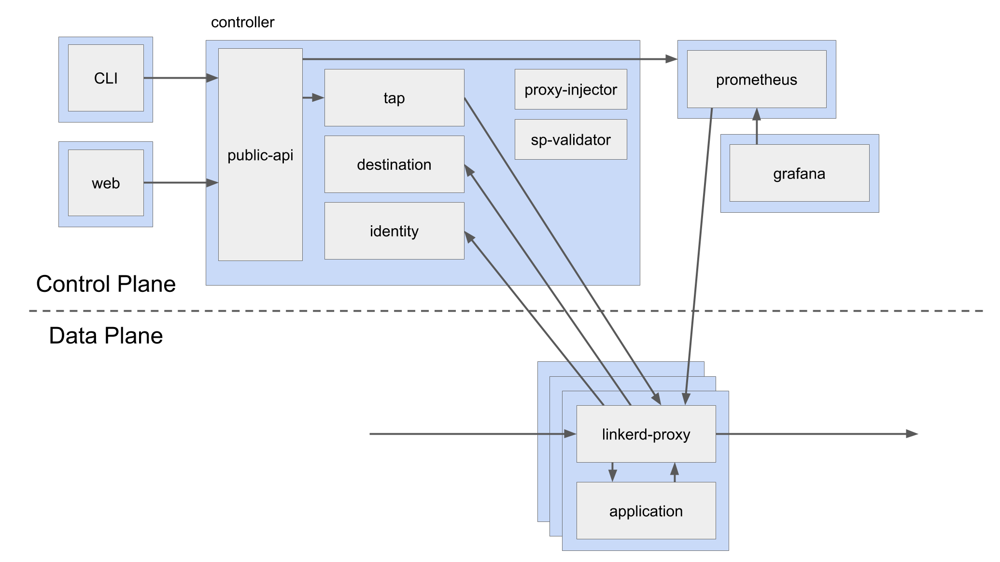
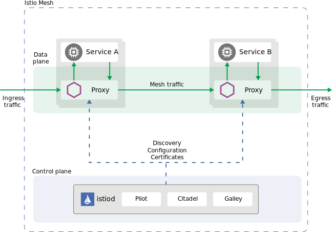
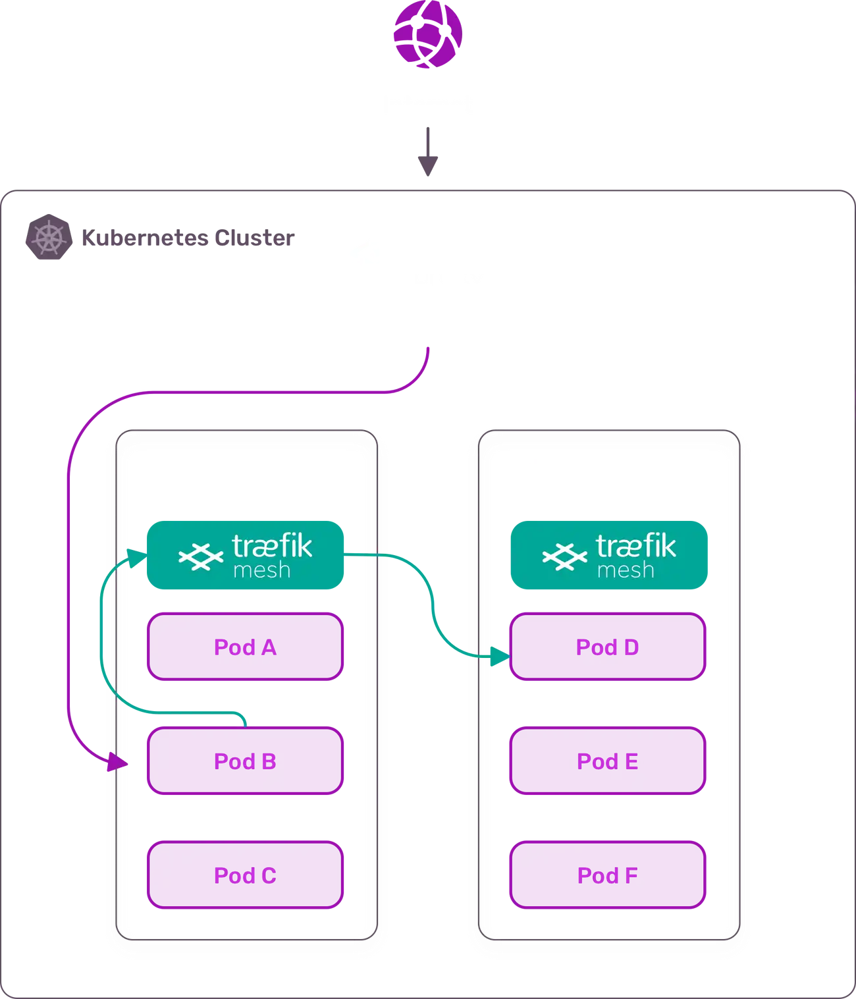
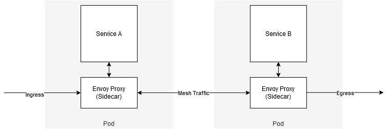

# Service Mesh

> This basic document is just a concept of the service mesh.

## Introduction

A service mesh is a way to control how different parts of an application share data with one another. Unlike other systems for managing this communication, a service mesh is a dedicated infrastructure layer built right into an app. This visible infrastructure layer can document how well (or not) different parts of an app interact, so it becomes easier to optimize communication and avoid downtime as an app grows.

Service Mesh is basically a proxy network with lots of features.

Key Components of a Service Mesh:
- Service Discovery
  - Address
  - Traffic Split
  - Deployment Strategies/Patterns
- Traffic Management
  - Load-balancing
  - Retries
  - Fault Injection (Chaos Engineering)
  - Mutual TLS (mTLS)
  - Cert Management
  - Authentication & Authorization
- Observability
  - Traffic Visualization (Kiali or ...)
  - Distributed Tracing (Jaeger)
  - Metrics (Prometheus & Grafana) & Logging

Service Mesh:
- Proxy
  - Sidecar (EnvoyProxy)
  - Network Proxy
  - Rules & Extensions
- Control-Plane
  - Sidecar
  - Network Proxy
  - Automatic Injection

Service Mesh Cons:
- Complex Configuration
- Sidecar Setup Added
- Envoy Configuration Added

Main Service Meshes:
- Linkerd (Graduated CNCF Project)
  - [Linkerd Official Website](https://linkerd.io/)
  - [Deploying and Upgrading Linkerd using ArgoCD for GitOps](https://linkerd.io/2/tasks/gitops/)
  - Uses SMI (Service Mesh Interface) for traffic spliting.
  - Linkerd Architecture: 
- Istio
  - [Istio Official Website](https://istio.io/)
  - Istio Architecture: 
- Open Service Mesh
  - [OpenServiceMesh Official Website](https://openservicemesh.io/)
  - Open Service Mesh (OSM) is a lightweight and extensible cloud native service mesh. OSM takes a simple approach for users to uniformly manage, secure, and get out-of-the box observability features for highly dynamic microservice environments.
  - Using the CNCF Envoy project, OSM implements Service Mesh Interface (SMI) for securing and managing your microservice applications.
- Service Mesh Interface (SMI)
  - [SMI Official Website](https://smi-spec.io/)
  - [SMI Spec](https://github.com/servicemeshinterface/smi-spec)
  - The whole idea of the service mesh interface is to take the features that you get from a service mesh, and define them in generic ways. So rather than defining Linkerd resources, or Istio resources you define these kind of generic resources.
- Traefik Mesh
  - [Traefik Mesh Official Website](https://traefik.io/traefik-mesh/)
  - Traefik Mesh is a straight-forward, easy to configure, and non-invasive service mesh that allows visibility and management of the traffic flows inside any Kubernetes cluster.
  - Traefik Mesh Architecture: 
  - Traefik Mesh doesn't inject a sidecar container to each pod, it just create a proxy using a daemonset.

> **Kubernetes Service Mesh Comparison: [LINK](https://www.toptal.com/kubernetes/service-mesh-comparison)**

Main Parts of Service Meshes on K8s:
- CLI / Operator -> To Deploy Control-Plane + Inject Proxy + ...
- CRDs (Custom Resource Definition)
- Mutating Webhooks

Useful tools for service mesh:
- [Meshery: The Service Mesh Management Plane](https://meshery.io/)
- [Fortio: Load Test / Stress Test](https://fortio.org/)

What is Envoy?
- [Envoyproxy Official Proxy](https://www.envoyproxy.io/)
- Envoy is a high-performance proxy written by Lyft in C++ language, which mediates all inbound and outbound traffic for all services in the service mesh. It is deployed as a sidecar proxy with the service.
- Envoy Features:
  - Dynamic service discovery
  - Load balancing
  - TLS termination
  - HTTP/2 and gRPC proxies
  - Circuit breakers
  - Health checks
  - Staged rollouts with percentage-based traffic split
  - Fault injection
  - Rich metrics
  - Pluggable extensions model based on WebAssembly that allows for custom policy enforcement and telemetry generation for mesh traffic.
- Envoy Architecture: 
