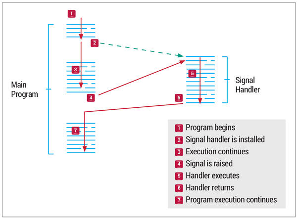

# Shell Scripting

> The minimum knowledge of your Linux and Unix systems should be LPIC 1 to understand shell scripting.

> This note is for SysAdmins or DevOps Engineers, so most of the commands of this course run on RedHat-based distributions (RedHat, CentOS), Debian-based distributions (Debian, Ubuntu), openSUSE, and Oracle Linux.

> I used bash as a default shell for these commands. You may have some different outputs based on your default shell.

- [Shell Scripting](#shell-scripting)
  - [Part 01 (Linux Review)](#part-01-linux-review)
  - [Part 02 (Linux Commands)](#part-02-linux-commands)
  - [Part 03 (Shell Script Basics)](#part-03-shell-script-basics)
  - [Part 04 (Variables)](#part-04-variables)
  - [Part 05 (Special Characters)](#part-05-special-characters)
  - [Part 06 (Strings)](#part-06-strings)
  - [Part 07 (Redirection)](#part-07-redirection)
  - [Part 08 (Mathematics)](#part-08-mathematics)
  - [Part 09 (Conditional Tasks)](#part-09-conditional-tasks)
  - [Part 10 (Repetitive Tasks)](#part-10-repetitive-tasks)
  - [Part 11 (Interactive Scripts)](#part-11-interactive-scripts)
  - [Part 12 (Script Control)](#part-12-script-control)
  - [Part 13 (Functions)](#part-13-functions)
  - [Part 14 (Formatted Printing)](#part-14-formatted-printing)
  - [Part 15 (Colors in Scripts)](#part-15-colors-in-scripts)
  - [Part 16 (Stream Editors)](#part-16-stream-editors)
    - [SED (Stream EDitor)](#sed-stream-editor)
    - [GAWK](#gawk)
  - [Part 17 (Regular Expression or Regex)](#part-17-regular-expression-or-regex)
  - [Part 18 (SysAdmin's Power)](#part-18-sysadmins-power)
  - [Part 19 (References)](#part-19-references)

## Part 01 (Linux Review)

Shell Scripting is an interpreter and cross-platform programming language.

- Find all available shells in your system:
  ```bash
  cat /etc/shells
  ```
- Default shell after login:
  ```bash
  echo $SHELL
  ```
- See all user's default shell:
  ```bash
  cat /etc/passwd
  ```
- Change shell permanently:
  ```bash
  chsh -s SHELL_PATH
  chsh -s /bin/bash
  ```
- Predefined Variables:
  ```bash
  echo $# # Tell you number of command line arguments supplied
  echo $0 # Tell you shell name
  echo $1 # First argument to the script
  echo $2 # Second argument to the script, and so on...
  echo $$ # PID of our shell
  echo $! # PID of the last background process
  echo $- # Current shell status
  echo $? # Exit status of last command:
          # 0: Successful exit
          # 1-255: Error on exit
          # 126: Not executable
          # 127: Command not found
          # 130: Command terminated with ^C or Ctrl+C
          # Exit code more than 255 returns an exit code modulo 256
          # exit 3809 = exit 225
  ```
- See list of processes from other users:
  - Unix-Style:
    ```bash
    ps -ef
    ```
  - BSD-Style:
    ```bash
    ps -aux
    ```
  - Process State:<br>
  

- You can compile shell script to C using `shc` command.
- Revert your shell to the previous shell using `exit`.
- Shell level:
  ```bash
  echo $SHLVL
  ```
- Set execute permission to script:
  ```bash
  chmod PERMISSION SCRIPT_NAME
  chmod u+rx SCRIPT
  chmod 700 SCRIPT
  ```
- Execute a script:
  ```bash
  /PATH/.../SCRIPT # Full path
  ./SCRIPT         # Relative path
  bash SCRIPT      # Shell tells OS to fork me and run the program on that.
  . SCRIPT         # Shell tells OS to don't fork me! And doesn't need permission to run!
  source SCRIPT

  (cat /etc/passwd; sleep 500)   # Current shell execute it
  (cat /etc/passwd; sleep 500) & # This command runs in background
  {cat /etc/passwd; sleep 500; } # This command runs in subshell
  ```
- You can bypass aliased command with these methods:
  - The full path of the command: `/bin/ls`
  - Command substitution: `$(which ls)`
  - The command builtin: `command ls`
  - Using Double quotation: `"ls"`
  - Using single quotation: `'ls'`
  - Using backslash character: `\ls`
- Understand internal (built-in) or external command using `type COMMAND`.
  - If the command is builtin, you see an output like this: `COMMAND is a shell builtin.`
  - If the command isn't builtin, you can see 2 different output based on what you did:
    1. If you run `type COMMAND` before executing COMMAND, you see an output like this: `COMMAND is COMMAND_PATH`
    2. If you run `type COMMAND` after executing COMMAND, you see an output like this: `COMMAND is hashed (COMMAND_PATH)`
  - **Hash** means you just execute an external command, and you can see them by simply run `hash` command.
  - When an external command is executed, shell tells OS to make a fork from the shell and then run your external command in it and then exits. You can see Virtual Memory Statistics using this command: `vmstat -s`
  - Fork Diagram:<br>
    
  - Execute `ls` command diagram:<br>
    

- You can see the Magic Number of a file here: `less /usr/share/magic`
  - Windows executable file's magic number starts with **MZ**
  - Other OS executable file's magic number starts with **ELF**
  - ELF: Executable Library Format
  - You can see magic number of a file using this command: `od -c FILE | less` or `file FILE`
- A script must have at least Read permission and Execute permission. Something like this:
  ```bash
  chmod u+rx SCRIPT
  ```
- It's recommended to put comment(s) at the beginning of the script.
  ```bash
  # Script name: SAMPLE
  # Author: FIRST_NAME LAST_NAME
  # Date of Creation: YYYY-MM-DD
  # Version: MAJOR.MINOR.BUG
  # Last Modified on: YYYY-MM-DD
  # Description: THIS IS A SAMPLE DOCUMENTATION
  echo THIS IS A SAMPLE SCRIPT
  ```
- Shell startup file: (Executed for login shell)
  - `/etc/profile` : System-wide default environment settings.
  - `~/.bash_profile` : User-specific bash environment default settings.
- Initialization Files: (Executed for login and interactive shell)
  - `/etc/bashrc` : System-wide functions and aliases for bash
  - `~/.bashrc` : User-specific initialization files
- **Standard File Descriptor**
  - The Linux system handles every object as a file. This includes the input and output process, which are identified by an object named file descriptor. The file descriptor is a non-negative integer, which uniquely identifies open files in a session. The bash shell reserves the first three file descriptors (0, 1, and 2) for particular purposes shown below:
    - Standard input = STDIN = 0
    - Standard output = STDOUT = 1
    - Standard error = STDERR = 2
  - If you want to generate error messages in your script purposely, you can redirect an individual output line to STDERR. All you need to do is use the output redirection symbol to redirect the output to the STDERR file descriptor. When you redirect to a file descriptor, you must precede the file descriptor number with an ampersand sign or `$`:
    ```bash
    #!/bin/bash
    echo "This is an error message" >&2
    ```
  - This line displays the text wherever the STDERR file descriptor for the script is pointing, instead of the STDOUT. `$ ./script.sh 2>log/error.txt`
- **Create File Descriptor**
  - You assign a file descriptor for output by using the `exec` command. Just as with the standard file descriptors, once you assign an alternative file descriptor to a file location, that redirection stays permanent until you reassign it. Here’s a simple example of using an alternative file descriptor in a script:
    ```bash
    #!/bin/bash
    # using an alternative file descriptor
    exec 3> OUTPUT.txt
    echo "This should display on the monitor"
    echo "and this should be stored in the file" >&3
    echo "Then this should be back on the monitor"
    ```
- **Closing File Descriptor**
  - If you create new input or output file descriptors, the shell automatically closes them when the script exits. There are situations though when you need to manually close a file descriptor before the end of the script. To close a file descriptor, redirect it to the special symbol `&-`
    ```bash
    #!/bin/bash
    exec 3> OUTPUT.txt
    echo "This is a test line of data" >&3
    exec 3>&-
    echo "This won't work" >&3
    # Output: line 5: 3: Bad file descriptor
    # Because we closed file descriptor number 3
    # OUTPUT.txt exists containing the first echo command
    ```
- **Listing Open File Descriptor**
  - The `lsof` command lists all of the open file descriptors on the entire Linux system. This is somewhat of a controversial feature, as it can provide information about the Linux system to non-system-administrators. Because of this, many Linux systems hide this command so that users don’t accidentally stumble across it. It is normally placed under `/usr/sbin` directory: `$ lsof`
  - This includes all of the processes running on background, as well as any user accounts logged in to the system.
  - There are plenty of command line parameters and options available to help filter out the `lsof` output. The most commonly used are `-p`, which allows you to specify a process ID (PID), and `-d` allows you to specify the file descriptor numbers to display.
  - To easily determine the current PID of the process, you can use the special environment variable `$$`, which the shell sets to the current PID. The `-a` option is used to **AND** the results of the other two options, to produce the following:</br>
  `$ lsof -a -p $$ -d 0,1,2`
  - Default `lsof` output:
    |Column|Description|
    |------|-----------|
    |COMMAND|The first 9 characters of the name of the command in the process|
    |PID|The process ID of the process|
    |USER|The login name of the user who owns the process|
    |FD|The file descriptor number and access type (r=read, w=write, u=read/write)|
    |TYPE|The type of file (CHR=Character, BLK=Block, DIR=Directory, REG=Regular File)|
    |DEVICE|The device numbers (major and minor) of the device|
    |SIZE|If available, the size of the file|
    |NODE|The inode number of the local file|
    |NAME|The name of the file|
  - Run this script to understand the chart:
    ```bash
    #!/bin/bash
    touch TESTFILE7
    exec 3> TESTFILE3
    exec 6> TESTFILE6
    exec 7< TESTFILE7
    /usr/sbin/lsof -a -p $$ -d 0,1,2,3,6,7
    ```
  - The file descriptor of STDIN, STDOUT, and STDERR in `lsof` is read/write and shown as `<>`
  - You can see list of your file descriptors with this command:
    ```bash
    PROCESS=`echo $$`
    ls -la /proc/$PROCESS/fd/
    # OR
    ls -la /proc/`echo $$`/fd/
    ```
- For more information on **File Descriptor**, check out [Part 7 (Redirection)](#part-07-redirection).
- Suppressing Command Output
  - There are times when you don’t want to display any output from your script. This often occurs if you’re running a script as a background process.
  - The standard location for the null file on Linux systems is `/dev/null`. Any data you redirect to that location is thrown away and doesn’t appear.
- Shell variables can contain different sizes based on your system. You can see your system's limitations with `xargs --show-limits` command.
- Primary Shells (Check `man bash`):
  1. Primary Shell 1 (`echo $PS1`): The first prompt you see when you open a shell/terminal.
  2. Primary Shell 2 (`echo $PS2`): The prompt when you use inline input redirection.
  3. Primary Shell 3 (`echo $PS3`): The prompt when you use select to create a text menu.
- Signals:
  - Signal is a notification, a message sent by either operating system or some application to our program. Signals are a mechanism for one-way asynchronous notifications. A signal may be sent from the kernel to a process, from a process to another process, or from a process to itself. Signal typically alert a process to some event, such as a segmentation fault, or the user pressing Ctrl-C. Linux kernel implements about 30 signals. Each signal identified by a number, from 1 to 31. Signals don't carry any argument and their names are mostly self explanatory.
    
  - Signals are raised by error conditions, and they are generated by the shell and terminal handlers to cause interrupts and can also be sent from one process to another to pass information or to modify the behavior.
  - Signals can be:
    1. Raised
    2. Caught
    3. Acted Upon
    4. Ignored
    <br></br>
  - If a process receives signals such as `SIGFPE`, `SIGKILL`, etc., the process will be terminated immediately, and a core dump file is created. The core file is an image of the process, and we can use it to debug.
    <br></br>
  - You can see list of all signals (64 Signals) with `kill -l` command. Here's a list of top 31 of them:
    |Name|Signal|Description|Usage|
    |------|----|-----------|-----|
    |SIGHUP|1|Hangup (POSIX)|This signal is sent to a process when its controlling terminal is closed. In modern systems, this signal usually means that the controlling pseudo or virtual terminal has been closed.<br>1. Kill/Stop processes which used in old system connections (Dial-Up) It was originally designed to notify the process of a serial line drop.<br>2. Foreground process when closes (Like top)<br>3. Reload configuration file of background processes like daemon/service|
    |SIGINT|2|Terminal Interrupt (ANSI)|This signal is typically initiated by pressing Ctrl+C, but on some systems, the "delete" character or "break" key can be used.|
    |SIGQUIT|3|Terminal Quit (POSIX)|1. It's like SIGINT or interrupt, but it's for programming errors when a process gets a SIGQUIT, a log file generated in CORE DUMP, which you can see it with `dmesg` command.<br>2. Issued if the user sends a quit signal (Ctrl+D).|
    |SIGILL|4|Illegal Instruction (ANSI)|The SIGILL signal is sent to a process when it attempts to execute an illegal, malformed, unknown, or privileged instruction.|
    |SIGTRAP|5|Trace Trap (POSIX)|The SIGTRAP signal is sent to a process when an exception (or trap) occurs: a condition that a debugger has requested to be informed of – for example, when a particular function is executed, or when a particular variable changes value.|
    |SIGIOT|6|IOT Trap (4.2 BSD)|The SIGABRT and SIGIOT signal is sent to a process to tell it to abort, i.e. to terminate. The signal is usually initiated by the process itself when it calls abort() function of the C Standard Library, but it can be sent to the process from outside like any other signal.|
    |SIGBUS|7|BUS Error (4.2 BSD)|The SIGBUS signal is sent to a process when it causes a bus error. The conditions that lead to the signal being sent are, for example, incorrect memory access alignment or non-existent physical address.|
    |SIGFPE|8|Floating Point Exception (ANSI) |Issued if an illegal mathematical operation is attempted. The SIGFPE signal is sent to a process when it executes an erroneous arithmetic operation, such as division by zero. This may include integer division by zero, and integer overflow in the result of a divide (only INT_MIN/-1, INT64_MIN/-1 and %-1 accessible from C).|
    |SIGKILL|9|Kill (can't be caught or ignored) (POSIX)|It's the strongest kill signal, which causes every process to stop immediately and will not perform any clean-up operations.|
    |SIGUSR1|10|User Defined Signal 1 (POSIX)|The SIGUSR1 and SIGUSR2 signals are sent to a process to indicate user-defined conditions.|
    |SIGSEGV|11|Invalid Memory Segment Access (ANSI)|The SIGSEGV signal is sent to a process when it makes an invalid virtual memory reference, or segmentation fault, i.e. when it performs a segmentation violation.|
    |SIGUSR2|12|User Defined Signal 2 (POSIX)|The SIGUSR1 and SIGUSR2 signals are sent to a process to indicate user-defined conditions.|
    |SIGPIPE|13|Write on a pipe with no reader, Broken pipe (POSIX)|The SIGPIPE signal is sent to a process when it attempts to write to a pipe without a process connected to the other end.|
    |SIGALRM|14|Alarm Clock (POSIX)|Alarm clock signal (used for timers)|
    |SIGTERM|15|Termination (ANSI)|It's the default kill signal. The SIGTERM signal can be intercepted by the process, allowing it to terminate gracefully.|
    |SIGSTKFLT|16|STacK FauLT|The SIGSTKFLT signal is sent to a process when the coprocessor experiences a stack fault (i.e. popping when the stack is empty or pushing when it is full). It is defined by, but not used on Linux, where a x87 coprocessor stack fault will generate SIGFPE instead.|
    |SIGCHLD|17|Child Process has stopped or exited, changed (POSIX)|The SIGCHLD signal is sent to a process when a child process terminates, is interrupted, or resumes after being interrupted. One common usage of the signal is to instruct the operating system to clean up the resources used by a child process after its termination without an explicit call to the wait system call.|
    |SIGCONT|18|Continue Executing, if stopped (POSIX)|Continue a stopped process by Ctrl+Z|
    |SIGSTOP|19|Stop Executing (can't be caught or ignored) (POSIX)|The SIGSTOP signal instructs the operating system to stop a process for later resumption.|
    |SIGTSTP|20|Terminal Stop Signal (POSIX)|Stop a process which caused by Ctrl+Z|
    |SIGTTIN|21|Background Process trying to read, from TTY (POSIX)|The SIGTTIN and SIGTTOU signals are sent to a process when it attempts to read in or write out respectively from the tty while in the background. Typically, these signals are received only by processes under job control; daemons do not have controlling terminals and, therefore, should never receive these signals.|
    |SIGTTOU|22|Background Process trying to write, to TTY (POSIX)|The SIGTTIN and SIGTTOU signals are sent to a process when it attempts to read in or write out respectively from the tty while in the background. Typically, these signals are received only by processes under job control; daemons do not have controlling terminals and, therefore, should never receive these signals.|
    |SIGURG|23|Urgent Condition on socket (4.2 BSD)|The SIGURG signal is sent to a process when a socket has urgent or out-of-band data available to read.|
    |SIGXCPU|24|CPU Limit Exceeded (4.2 BSD)|The SIGXCPU signal is sent to a process when it has used up the CPU for a duration that exceeds a certain predetermined user-settable value. The arrival of a SIGXCPU signal provides the receiving process a chance to quickly save any intermediate results and to exit gracefully, before it is terminated by the operating system using the SIGKILL signal.|
    |SIGXFSZ|25|File Size Limit Exceeded (4.2 BSD)|The SIGXFSZ signal is sent to a process when it grows a file that exceeds the maximum allowed size.|
    |SIGVTALRM|26|Virtual Alarm Clock (4.2 BSD)|The SIGALRM, SIGVTALRM and SIGPROF signal is sent to a process when the time limit specified in a call to a preceding alarm setting function (such as setitimer) elapses. SIGALRM is sent when real or clock time elapses. SIGVTALRM is sent when CPU time used by the process elapses. SIGPROF is sent when CPU time used by the process and by the system on behalf of the process elapses.|
    |SIGPROF|27|Profiling Alarm Clock (4.2 BSD)|The SIGALRM, SIGVTALRM and SIGPROF signal is sent to a process when the time limit specified in a call to a preceding alarm setting function (such as setitimer) elapses. SIGALRM is sent when real or clock time elapses. SIGVTALRM is sent when CPU time used by the process elapses. SIGPROF is sent when CPU time used by the process and by the system on behalf of the process elapses.|
    |SIGWINCH|28|Window Size Change (4.3 BSD, Sun)|The SIGWINCH signal is sent to a process when its controlling terminal changes its size (a WINdow CHange).|
    |SIGIO|29|I/O now possible (4.2 BSD)|Input/output is now possible. SIGPOLL is a synonym for SIGIO, and in Linux its behavior is identical to SIGURG.|
    |SIGPWR|30|Power Failure Restart (System V)|The SIGPWR signal is sent to a process when the system experiences a power failure.|
    |SIGSYS|31|Bad System Call (System V r4)|The SIGSYS signal is sent to a process when it passes a bad argument to a system call. In practice, this kind of signal is rarely encountered since applications rely on libraries (e.g. libc) to make the call for them. SIGSYS can be received by applications violating the Linux Seccomp security rules configured to restrict them.|
  - There's a difference between signal 19 and signal 20. Although both of them stop a process, you cannot trap signal 19. For more information on trap, go to [Script Control Section](#part-12-script-control).
- Terminal/Shell verbose mode for command completion:
  - Shell is sensitive to two keyboard keys, one of them is **Tab**, and the other is **Esc**. With `stty -a` command, you can see the lookup table/list of system calls are not implemented in the Linux kernel by developers.
  - You can use `set -v -x` or `set +v +x` to see how shell reacts to your command for command completion. You can see it when you double-tap Tab key after your command.
  - The result of the command completion are:
    - `+` : It's in the first shell
    - `++` : If the shell calls a function
    - `+++` : If the function calls another command/function
    - The more `+` signs means more layers of functions (Nested functions)
- Useful shortcuts in shell:
  - `Ctrl + U` = Cut/Delete from cursor to start of the line
  - `Ctrl + K` = Cut/Delete from cursor to end of the line
  - `Ctrl + Y` = Paste what you cut from Ctrl+U or Ctrl+K
  - `Ctrl + M` = It's the same function as Enter key on keyboard
  - `Ctrl + D` = EOF (End of File) or Log out of this session
  - `Ctrl + S` = Stop = Keyboard's device driver tells OS to stop/pause this process
  - `Ctrl + Q` = Start = Keyboard's device driver tells OS to start/restart this process

## Part 02 (Linux Commands)

- `grep` : Searches for PATTERN in each FILE (Highly recommended that you read all manual page of this command)
  - `-E` or `--extended-regexp` or `egrep`
  - `-F` or `--fixed-strings` or `fgrep`
  - `-i` or `--ignore-case`
  - `-l` or `--files-with-matches`
  - `-r` or `--recursive` or `rgrep`
  - `-v` or `--invert-case`
- `tee` : Read from STDIN and write to STDOUT and files. Usually use for logging.
    ```bash
    echo hello | tee file1.txt file2.txt
    ```
  - Be careful; the `tee` command overwrites the output file on each use by default.
  - Useful options:
    - `-a`, `--append` : Append to the given FILEs, do not overwrite
    - `-i`, `--ignore-interrupts` : Ignore interrupt signals
    - `--output-error=MODE` : Set behavior on write error. See MODE below:
      - warn: Diagnose errors writing to any output
      - warn-nopipe: Diagnose errors writing to any output not a pipe
      - exit: Exit on error writing to any output
      - exit-nopipe: Exit on error writing to any output not a pipe
- `nl` : Write each FILE to standard output, with line numbers added
    ```bash
    nl /etc/passwd
    ```
- `find` : Search for files in a directory hierarchy (Highly recommended that you read all manual page of this command or at least see examples of manual page)
    ```bash
    find LOCATION_OF_START ARGUMENT(S)
    find /test -name "*.txt"
    ```
  - Useful options:
    - You can only use one of these; otherwise, each overrides the others. The last one appearing on the command line takes effect. Since `-P` is the default, the `-P` option should be considered to be in effect unless either `-H` or `-L` is specified.
      - `-P` : Never follow symbolic links
      - `-L` : Follow symbolic links.
      - `-H` : Do not follow symbolic links, except while processing the command line arguments.
    - `-empty` : File is empty and is either a regular file or a directory.
    - `-executable` : Matches files which are executable and directories which are searchable (in a file name resolution sense).
    - `-gid N` : File's numeric group ID is N.
    - `-name` : Base of the file name (the path with the leading directories removed) matches shell pattern.
    - `-iname` : Like -name, but the match is case insensitive.
    - `-iregex` : Like -regex, but the match is case insensitive.
    - `-regex` : File name matches the regular expression pattern.
    - `-size N` : File uses N units of space, rounding up. The following suffixes can be used:
      - `b` : for 512-byte blocks (this is the default if no suffix is used)
      - `c` : for bytes
      - `w` : for two-byte words
      - `k` : for Kibibytes (KiB, units of 1024 bytes)
      - `M` : for Mebibytes (MiB, units of 1024 * 1024 = 1048576 bytes)
      - `G` : for Gibibytes (GiB, units of 1024 * 1024 * 1024 = 1073741824 bytes)
      - The + and - prefixes signify greater than and less than, as usual; i.e., the exact size of N units does not match.  Bear in mind that the size is rounded up to the next unit. Therefore -size -1M is  not  equivalent to -size -1048576c. The former only matches empty files, the latter matches files from 0 to 1,048,575 bytes.
    - `-type C` : File is of type C (To search for more than one type at once, you can supply the combined list of type letters separated by a comma)
      - `b` : block (buffered) special
      - `c` : character (unbuffered) special
      - `d` : directory
      - `p` : named pipe (FIFO)
      - `f` : regular file
      - `l` : symbolic link; this is never true if the `-L` option or the `-follow` option is in effect, unless the symbolic link is broken.  If you want to search for symbolic links when `-L` is in effect, use `-xtype`.
      - `s` : socket
      - `D` : door (Solaris)
      - To search for more than one type at once, you can supply the combined list of type letters separated by a comma or `,`
    - `-uid N` : File's numeric user ID is N.
    - `-user uname` : File is owned by user uname (numeric user ID allowed).
    - `mtime` : Modification Time
      - `+N` : It means from the begin time until N days ago
      - `-N` : It means from now to N days ago or The last N days
- `locate` : Find files by name
  - `-b` or `--basename` : Match only the base name against the specified patterns.  This is the opposite of `--wholename`.
  - `-c` or `--count` : Instead of writing file names on standard output, write the number of matching entries only.
  - `-i` or `--ignore-case` : Ignore case distinctions when matching patterns.
  - `-p` or `--ignore-spaces` : Ignore punctuation and spaces when matching patterns.
  - `-q` or `--quiet` : Write no messages about errors encountered while reading and processing databases.
  - `--regex` : Interpret all PATTERNs as extended regexps.
  - `-w` or `--wholename` : Match only the whole path name against the specified patterns. This is the default behavior. The opposite can be specified using `--basename`.
- `pushd` and `popd` : The `pushd` command saves the current working directory in memory so it can be returned to at any time, optionally changing to a new directory. The `popd` command returns to the path at the top of the directory stack.
  ```bash
  cd /tmp
  pushd /var/log
  # Output: /var/log /tmp
  cd ..
  pwd
  # Output: /var
  popd
  # Output: /tmp
  ```
- `script` :
  - Script command can be used to make a record of everything that appears on the terminal.
  - Once started, all terminal outputs will also be copied into the *scriptfile* until a `^D` or `exit` is received.
    - `exit` : Exit command tells shell that I'm leaving/closing this connection.
    - `^D` : Control+D from keyboard device driver tells OS to break/close the connection.
      - You can see a list of them using `stty -a`.
      - Stty (Set TeleTYpe) is a command that changes keyboard and monitor commands. For example, it can change rows and columns of monitor, speed of keyboard, etc.
  - Where filename is optional and if not specified it is assumed to be **typescript**.
- `dd` :
  - Convert and Copy a file
  - `if=` : Input File (If it doesn't provided in command, it gets from STDIN)
  - `of=` : Output File (If it doesn't provided in command, it prints on STDOUT)
  - `bs=` : Block Size by Byte (Default=512 Byte)
  - `count=N` : Copy only N input blocks
  - `conv=` : Convert the file as per the comma separated symbol list (See the list of them in dd manual page)

## Part 03 (Shell Script Basics)

- If you want to run multiple commands in one line, you must separate commands with semicolon or `;`
  ```bash
  date ; whoami ; echo Hello World!
  ```
- You can comment a line with `#` which has different names. (Sharp, Number, Pound, Hash or Hashtag)
- When creating a shell script file, you must specify the shell you are using only in the **first line** of file. It tells the OS what is the correct interpreter. The `#!` before shell path called **Shebang** and the format for this is:
  ```bash
  #!SHELL_PATH
  #!/bin/bash
  #!/bin/sh
  ```
- It's recommended that you put `.sh` extension at the end of your script file.
- Values are assigned to user variables using an equal sign. **No
spaces** can appear between the variable, the equal sign, and the
value.
- The shell script automatically determines the data type used for
the variable value.
- **`mktemp`**
  - Using Temporary Files
    - The Linux system contains a special directory location reserved for temporary files. Linux uses the `/tmp/` directory for files that don’t need to be kept indefinitely or you can create a local temporary file with `mktemp` command which create a file in the current directory by default.
    - `mktemp` command creates an empty file without your `umask` default permissions/values and with these features:
      1. Your user as owner of the file
      2. Your group as group owner of the file
      3. Gives file read and write permission only for you = chmod 600
    - The `mktemp` command replaces the X’s with a random characters code to ensure the filename is unique in the directory. You may need to delete temporary file ay the end of script.
    - Example
      ```bash
      #!/bin/bash
      tempfile=`mktemp test.XXXX`
      # Some commands
      rm -rf $tempfile
      ```
    - The `-t` option forces `mktemp` to create the file in the temporary directory of the system. When you use this feature, the `mktemp` command returns the full pathname used to create the temporary file, not just the filename.
      ```bash
      #!/bin/bash
      mktemp -t test.XXXX
      # Output: /tmp/test.59a1
      ```
  - Using Temporary Directory
    - The `-d` option tells the `mktemp` command to create a temporary directory instead of a file. You can then use that directory for whatever purposes you need, such as creating additional temporary files.
      ```bash
      #!/bin/bash
      mktemp -d DIR.XXXX
      # Output: DIR.i69
      mktemp -t -d DIR.XXXX
      # Output: /tmp/DIR.v58n
      ```
  - You can also use `mktemp` command without any suffix or prefix.
    ```bash
    #!/bin/bash
    mktemp
    # Output: tmp.VWJhMEtNlE
    mktemp -t
    # Output: /tmp/tmp.lj6uMPORkz
    mktemp -d
    # Output: tmp.B5ofuVYK9w
    mktemp -d -t
    # Output: /tmp/tmp.82OoFbxwCt
    ```

## Part 04 (Variables)

- Rules of Variables:
  - Variables are **case-sensitive**.
  - Variables cannot contain spaces.
  - Variables cannot start with a number.
  - Variables cannot contain special characters.
  - No spaces should be on either side of `=`
  - It's recommended that you set your variables in **UPPERCASE** letters.
  - If you want to create a variable and variable was already defined, the old value is overwritten with the new value.
- Using variable value preceded by a dollar sign or `$`
  ```bash
  VAR1=27
  VAR2=$VAR1
  ```
- You can create an empty variable in two ways:
  ```bash
  #!/bin/bash
  VAR=
  VAR=""
  ```
- The backtick or **\`** allows you to assign the output of a shell command
to a variable. You must surround the entire command line command with
backtick characters:
  ```bash
  TODAY=`date`
  echo $TODAY
  # or
  echo `date`
  ```
- There are two types of environment variables in the bash shell:
  - **Global/Environmental Variable**: Global variables, which are called environment variables, are visible from the shell session, and any child processes that the shell spawns.
  - **Local Variable**: Local variables are only available in the shell that creates them. This makes global environment variables useful in applications that spawn child processes that require information from the parent process.
- Environmental variables are defined in `/etc/profile`, `/etc/profile.d`, and `~/.bash_profile`. These files are the initialization files, and they are read by the shell when the bash shell invokes. When a login shell exits, bash reads `~/.bash_logout`.
- After login into the system, a copy of the shell is given to the user.
- The environment is maintained all the time until the user logs off.
- You can see all variables (Global + Local) with `set` command, and other options of it with `help set` command.
- You can see Global variables with `env` or `printenv` command.
- The method used to create a global environment variable is to create a local environment variable, then export it to the global environment. This is done by using the `export` command:
  ```bash
  VAR1=test
  export VAR1
  # Export command in some shells is different.
  # BSD & TCSH: setenv
  ```
- Exported variables and their values are copied into a subshell's environment, where they may be accessed and changed. However, such changes have no effect on the variables in the parent shell.
- A subshell is a new shell that is executed by the login shell to run the desired program.
- A subshell does not know local variables that were assigned values by the parent shell.
- The subshell cannot change the value of a variable in the parent shell.
- You can remove variables by using `unset` command.
  ```bash
  VAR1=testing
  unset VAR1
  echo VAR1   # No output
  ```
  - When referencing the environment variable in the unset command, remember **not to use the dollar sign or `$` before variable name**.
  - If you’re in a child process and unset a global environment variable, it only applies to the child process. The global environment variable is still available in the parent process.
- Single Quote vs Double Quote:
  - Using double quotes to show a string of characters allow any variables in the quotes to be resolved.
  ```bash
  VAR1=test
  echo "The value of var1 is $VAR1"
  # OUTPUT: The value of var1 is test
  echo 'The value of var1 is $VAR1'
  # OUTPUT: The value of var1 is $VAR1
  ```
- `readonly` : Use the readonly command to make variables and functions readonly. You cannot change the value of variables.
  ```bash
  readonly VAR
  readonly VAR=value

  VAR=new_value
  # Output: -bash: unset: VAR: cannot unset: readonly variable
  unset VAR
  # Output: -bash: unset: VAR: cannot unset: readonly variable
  ```
- **Array Variable**
  - An array is a variable that can hold multiple values. Values can be referenced either individually or as a whole for the entire array. Arrays in the shell are one-dimensional, unlike other programming languages. To set multiple values for an environment variable, just list them in **parentheses**, with others separated by a **space**:
    ```bash
    mytest=(one two three four five)
    echo $mytest
    # Output: one
    # Only the first value in the array appears
    ```
  - Array support first appeared in bash version 2. The original Unix shell program (sh) didn't support arrays at all.
  - To reference an individual array element, you must use a numerical index value, which represents its place in the array. The numeric value enclosed in square brackets and environment variable arrays start with an index value of zero:
    ```bash
    mytest=(one two three four 5)
    echo ${mytest[2]}
    # Output: three
    ```
  - You can create a single value array with this syntax: `$ ARRAYNAME[INDEX]=VALUE`
  - Also, there's another way to create an array which used a lot in **KSH** with this syntax, but we can use it in bash as well: `$ declare -a ARRAYNAME`
  - Besides, it is possible to assign values to a specific element by specifying an index for each value:
    ```bash
    days=([0]=SUN [1]=MON [2]=TUE [3]=WED [4]=THU [5]=FRI [6]=SAT)
    days=([6]=SAT [0]=SUN [5]=FRI [3]=WED [1]=MON [2]=TUE [4]=THU)
    # Both of them works
    ```
  - To display the entire array variables, you use the asterisk as a wildcard character as the index value:
    ```bash
    mytest=(one two three four 5)
    echo ${mytest[*]}
    # Output: one two three four 5
    ```
  - To display the entire array variables, **`*`** and **`@`** can be used to access every element in an array. As with positional parameters, the **`@`** notation is more useful. The **`*`** creates one argument, and you can deal with the result as one variable, while **`@`** expand into separate arguments, and you can deal with them as multiple variables.
    ```bash
    #!/bin/bash
    LIST=(1 2 3)
    for i in "${LIST[*]}"
    do
        echo "example.$i"
    done

    echo =========

    LIST=(1 2 3)
    for i in "${LIST[@]}"
    do
        echo "example.$i"
    done
    ```
  - You can also change the value of an individual index position:
    ```bash
    mytest=(one two three four 5)
    mytest[0]=zero
    echo ${mytest[*]}
    # Output: zero two three four 5
    mytest[10]=ten
    # Output: zero two three four 5 ten
    # Index number more than the length of the array consider as a new value appended to end of the array, and the array's values which not mentioned are null. Besides, the null values don't count in the length of our array.
    ```
  - We can see the index number of the array with using exclamation mark before the array name:
    ```bash
    #!/bin/bash
    echo "Values: "
    myarray=([4]=b [2]=a [7]=c)
    for i in ${myarray[@]}
    do
      echo $i
    done
    # Output:
    # a
    # b
    # c
    echo "Indexes: "
    myarray=([4]=b [2]=a [7]=c)
    for i in ${!myarray[@]}
    do
      echo $i
    done
    # Output:
    # 2
    # 4
    # 7
    ```
  - Length of an array:
    ```bash
    mytest=(one two three four 5)
    echo ${#mytest[*]}
    # Output: 5
    ```
  - Remove a value from an array or remove the array using `unset` command. Note that when you read array's value one-by-one the place of removed value will be **null**, because the index numbers of all array remains the same:
    ```bash
    mytest=(one two three four 5)
    unset mytest[3]
    echo ${mytest[*]}
    # Output: zero two three 5
    echo ${#mytest[*]}
    # Output: 4
    echo ${mytest[2]}
    # Output: three
    echo ${mytest[3]}
    # Output:
    echo ${mytest[4]}
    # Output: 5

    unset mytest
    # Output:
    ```
  - Adding Elements To The End Of An Array: Knowing the number of elements in an array is no help if we need to append values to the end of an array since the values returned by the `*` and `@` notations do not tell us the maximum array index in use. Fortunately, the shell provides us with a solution. By using the `+=` assignment operator, we can automatically append values to the end of an array. Here is an example:
    ```bash
    #!/bin/bash
    myarray=(a b c)
    echo ${myarray[*]}
    # Output: a b c
    myarray+=(d e f)
    echo ${myarray[*]}
    # Output: a b c d e f
    ```
  - Sort an Array: It's often necessary to sort the values in a column of data. The shell has no direct way of doing this, but it's not hard to do it with a little coding:
    ```bash
    #!/bin/bash
    myarray=(f c b e d a)
    echo "Original Array: ${myarray[@]}"
    sorted_array=($(for i in "${myarray[@]}"; do echo $i; done | sort))
    echo "Sorted Array: ${sorted_array[@]}"
    ```
  - Associative Array: Recent versions of bash now support associative arrays. Associative arrays use strings rather than integers as array indexes. This capability allows interesting new approaches to managing data. For example, we can create an array called "colors" and use color names as indexes:
    ```bash
    #!/bin/bash
    declare -A colors
    colors["red"]="#ff0000"
    colors["green"]="#00ff00"
    colors["blue"]="#0000ff"

    echo ${colors["blue"]}
    # Output: #0000ff
    ```
  - Example/Script 1 of the Array:
    ```bash
    #!/bin/bash
    # Script that count files by modification time
    usage (){
        echo "Usage: $(basename $0) Directory" >&2
    }
    # Check that argument is a directory
    if [ ! -d $1 ]
    then
        usage
        exit 1
    fi
    # Initialize array
    for i in {0..23}; do hours[i]=0; done
    # Collect data
    for i in $(stat -c %y "$1"/* | cut -c 12-13)
    do
        # We have to remove leading zeros from the hours' field
        # since the shell will, unfortunately, fail to interprets
        # values 00 through 09 as octal numbers
        j=${i/#0}
        ((++hours[j]))
        ((++count))
    done
    # Display Data
    echo -e "Hour\tFiles\tHoue\tFiles"
    echo -e "----\t-----\t----\t-----"
    for i in {0..11}
    do
        j=$((i+12))
        printf "%02d\t%d\t%02d\t%d\n" $i ${hours[i]} $j ${hours[j]}
    done
    printf "\nTotal Files = %d\n\n" $count
    ```
  - Example/Script 2 of the Array:
    ```bash
    #!/bin/bash
    #set -v -x
    counter=0
    # ESC = \e = \033 = \x1B
    white="\e[37m"
    codes=(31 32 33 34 35 36)
    colors=("\e[31m" "\e[32m" "\e[33m" "\e[34m" "\e[35m" "\e[36m")
    names=("red" "green" "yellow" "blue+" "pink" "cyan")
    for i in ${colors[*]}
    do
      echo -e "$i ${names[counter]}\t $white color and it's code is $i"Esc[${codes[counter]}m"$white "
      ((counter++))
    done
    ```
  - To know more about colors, check [Part 15](#part-15-colors-in-scripts) about colors in scripts.

## Part 05 (Special Characters)

There is a character called backslash or `\` or escape character that won't let shell to interpret that special character. For example:

```bash
#!/bin/bash
echo $HOME
# Output: /home/hirad
echo \$HOME
# Output: $HOME
echo "Hello World"
# Output: Hello World
echo \"Hello World\"
# Output: "Hello World"
```

Wildcards:
- `*` : Matches any string or group of characters
- `?` : Matches any single character
- `[]` : Matches any one of the enclosed characters
- `!` or `^` : Not
  ```bash
  ls a*
  ls u*.c
  ls a*b*c

  ls a?b
  ls ????
  ls x??y

  ls [abc]*
  ls [0-9]?[k-z]

  ls /bin/[!a-o]
  ls /bin/[^p-z]
  ls /bin/[!c-e]??
  ```

## Part 06 (Strings)

- **Length** of a string
  ```bash
  #!/bin/bash
  STRING=ABCdef
  echo ${#STRING}
  # The result of a empty variable or an unassigned variable is 0
  ```
- **Add** to string
  ```bash
  #!/bin/bash
  STRING=ABCdef
  echo ${STRING}GHI
  # Output: ABCdefGHI
  ```
- **Remove** a part of string
  ```bash
  #!/bin/bash
  STRING=ABCdef
  echo ${STRING/ABC/}
  # Output: def
  echo ${STRING#AB}
  # Output: Cdef -> Remove only from the beginning of the value
- **Search and Remove** a part of string
  ```bash
  #!/bin/bash
  STRING=ABCdef
  echo ${STRING%C*}
  # Output: AB
  STR=abcABC123ABCab1c
  echo ${STR%b*c}
  # Output: abcABC123ABCa -> Strip out the shortest match between 'b' and 'c', from the end of the STR
  echo ${STR%%b*c}
  # Output: a -> Strip out the longest match between 'b' and 'c', from the end of the STR
  ```
- **Substitute/Replace** only the first match
  ```bash
  #!/bin/bash
  STRING=ABCdef
  echo ${STRING/ABC/123}
  # ${STRING/PATTERN/REPLACEMENT}
  ```
- **Substitute/Replace** all the matches
  ```bash
  #!/bin/bash
  STRING=ABCdefABC456
  echo ${STRING//ABC/123}
  # ${STRING//PATTERN/REPLACEMENT}
  ```
- Assign/Set a value
  ```bash
  #!/bin/bash
  VAR=""
  echo ${VAR:=STRING}
  echo $STRING
  unset var
  # If the VAR variable doesn't have a value or not set, then assign/set it to STRING variable.
  ```
- Not assign/Set a value
  ```bash
  #!/bin/bash
  VAR=""
  echo ${VAR:-STRING}
  echo $STRING
  unset var
  # If the VAR variable doesn't have a value, then show STRING variable and don't change the value of VAR.
  ```
- Check value
  ```bash
  #!/bin/bash
  VAR=""
  echo ${VAR:?}
  # If the VAR variable doesn't have a value, show an error message, otherwise, show the content of VAR.
  echo ${VAR:?DOES NOT HAVE A VALUE}
  # Output: bash: VAR: DOES NOT HAVE A VALUE
  ```
- Positions/Extraction
  ```bash
  #!/bin/bash
  STR=university
  echo ${STR:3}
  # Prints STR from position 3. Starting position is zero -> ${STRING:POSITION}
  # Output: versity
  echo ${STR:1:3}
  # Output: niv
  # Start STR from position 1 and print 3 more characters -> ${STRING:POSITION:LENGTH}

  # Print the last 5 characters of a string
  echo ${STR:${#STR}-5}
  ```

## Part 07 (Redirection)

- Output
  - `>` : Creating a new file or **overwriting** the existing file
    ```bash
    COMMAND > OUTPUT_FILE
    date > output.txt
    ```
  - `>>` : Creating a new file or **appending** to the existing file
    ```bash
    COMMAND >> OUTPUT_FILE
    who >> output.txt
    ```
- Input
  - `<` : Input redirection takes the content of a file and redirects it to a command.
    ```bash
    COMMAND < INPUT_FILE
    wc -l < /etc/passwd
    cat < /etc/services
    ```
  - `<<` : The inline input redirection method (or "here documents") allows you to specify the data for input redirection on the command line instead of in a file. Besides this symbol, you must specify a text marker that delineates the beginning and end of the data used for input.
    ```bash
    COMMAND << MARKER
    DATA
    MARKER

    wc << EOF
    Hello
    line 2
    good-bye
    EOF
    ```
  - `<<<` : The "Here Strings" isn't documented well by anyone. So, i'm just showing you one of its usage by an example:
    ```bash
    $ VAR="Bash is good"
    $ read X Y Z <<< $VAR
    $ echo $X
    # Output: Bash
    $ echo $Y
    # Output: is
    $ echo $Z
    # Output: good
    ```
- Example (Write a script which uses inline input redirection to append some lines a an existing file in your home directory):
  ```bash
  #!/bin/bash
  cat >> TESTFILE << EOF
  Hello $USER
  We're learning shell scripting
  let's get some advance stuff
  see you later
  EOF
  ```
- Redirection with STDIN, STDOUT, and STDERR:
  - `<` : Redirects STDIN (0) from file
  - `>` : Redirects STDOUT (1) to file
  - `>>` : Append STDOUT to file
  - `<<` : Here Documents
  - `&>` : Redirects STDERR (2)
- Error Redirection:
  ```bash
  COMMAND 2> FILE
  date alex 2> output.txt
  # output.txt : date: invalid date 'alex'

  touch a
  date < a
  # Output: NORMAL DATE OUTPUT

  date < bob
  # Output: -bash : bob: No such file or directory

  # STDOUT goes where STDERR goes
  ls AA BB &> CC
  ```
- You can use `printf` to write something by using redirects. This command write/overwrite **NOTHING** to FILENAME. `printf "" > FILENAME`
- You can also use `> FILENAME` command to redirect **NOTHING** to the FILENAME. (This command doesn't always apply in some shells.)
- You can redirect STDOUT and STDERR in two different places with a command like this:
  ```bash
  COMMAND 2> ERROR_FILE.txt
  # Errors are going to write in a file.

  COMMAND > OUTPUT.txt 2> ERROR_FILE.txt
  # We don't have any output on the screen, because we write it in a file.
  ```
- It's a wise move to redirect your unessential outputs/errors to `/dev/null`
- Pipe or `|`
  - Redirect one program's output into another program's input.
  - A pipe (Unnamed pipe) is a way to connect the output of one program to the input of
another program **without any temporary file**.
  - Examples:
    ```bash
    #!/bin/bash
    who | less
    who | sort > user_list.txt
    who | wc -l
    ls -l | wc -l
    who | grep PATTERN
    ```
- **Permanent Redirection**
  - STDOUT and STDERR
    - If you have lots of data that you’re redirecting in your script, it can get tedious having to redirect every echo statement. Instead, you can tell the shell to redirect a specific file descriptor for the duration of the script by using the exec command:
      ```bash
      #!/bin/bash
      exec 1> /var/log/output-script.txt
      echo "This is a test of redirecting all output."
      echo "from a script to another file."
      echo "without having to redirect every individual line"
      ```
    - The `exec` command replaces current shell with a new shell, and redirects the STDOUT file descriptor to a file. All output in the script that goes to STDOUT is instead redirected to the file.
  - STDIN
    - You can use the same technique used to redirect STDOUT and STDERR in your scripts to redirect STDIN from the keyboard. The `exec` command allows you to redirect STDIN to a file on the Linux system:
      ```bash
      #!/bin/bash
      exec 0< TESTFILE
      COUNTER=1
      while read line
      do
        echo "Line #$COUNTER: $line"
        COUNTER=$[ $COUNTER + 1 ]
      done
      ```
    - This command informs the shell that it should retrieve input from the file TESTFILE instead of STDIN. This redirection applies anytime the script requests input.
- **Redirecting File Descriptors**
  - There is a common way to temporarily redirect output in script files then set the output back to the normal settings. Here is an example:
    ```bash
    #!/bin/bash
    exec 3>&1
    exec 1> TESTFILE
    echo "This should store in the output file"
    echo "along with this line."
    exec 1>&3
    echo "Now things should be back to normal"
    # Only the last line shows on the monitor.
    ```

## Part 08 (Mathematics)

There are three different ways to perform mathematical operations in your shell scripts:

1. `expr` (NOT RECOMMENDED)
   - Pay attention to the space between operands and operator.
    ```bash
    expr 1 + 4
    # Output: 5
    expr 2+3
    # Output: 2+3
    ```
   - Operands for this command: `+  -  *  /  %  <  <=  =  !=  >=  >`
   - `expr` command only supports integer numbers. It doesn't support float numbers.
    ```bash
    expr 5 / 2
    # Output: 2
    ```
   - When you use these operands, you should escape these characters.
    ```bash
    expr 5 * 2
    # Output: expr: syntax error
    expr 5 \* 2
    # Output: 10
    ```
   - Example:
    ```bash
    #!/bin/bash
    VAR1=10
    VAR2=20
    VAR3=`expr $VAR2 / $VAR1`
    echo The result is $VAR3
    # Output: The result is 2
    ```
2. Brackets [ ]
   - In bash, when assigning a mathematical value to a variable, you can enclose the mathematical equation using a dollar sign and square brackets `$[operation]`
    ```bash
    VAR1=$[1+5]
    echo $VAR1
    # Output: 6
    VAR2=$[$VAR1*2]
    echo $VAR2
    # Output: 12
    ```
   - You can't calculate floating numbers in this solution, either.
- We don't usually need a floating number in shell scripting, because system administrators and DevOps Engineers don't need it for managing system.
3. Bash Calculator or `bc`
   - There's another way to calculate floating numbers. By using `bc` command. You can exit the program with `quit`. `bc` can recognize:
     - Numbers (integer and floating numbers)
     - Variables (simple variables and arrays)
     - Comments (Single line comment starts with `#`, or multiline comments start with `/*` and ends with `*/`)
     - Expressions
     - Programming statements (such as if-then statements)
     - Functions
   - The floating-point arithmetic is controlled by a built-in variable called **scale**. You must set this value to the desired number of decimal places you want in your answers; otherwise, the default value of scale is zero, and `bc` calculates only integer numbers.
   - Using `bc` in scripts:
    ```bash
    VARIABLE=`echo "OPTIONS; EXPRESSION" | bc`
    VAR1=20
    VAR2=`echo "scale=4;$VAR1/3" | bc`
    echo $VAR2
    # Output: 6.6666
    ```
   - If you have more than just a couple of calculations, you can use input redirection, allowing you to redirect a file to the bc command for processing. You just need to make a list of command and then `bc < COMMAND_FILE` or `cat COMMAND_FILE | bc`
   - Instead of using a file for redirection, you can use the inline input redirection method, which allows you to redirect data directly from the command line. In the shell script, you can assign the output to a variable. This looks like this:
    ```bash
    variable=`bc << EOF
    options
    statements
    expressions
    EOF
    `
    ```
   - Remember that the backtick characters are still needed to assign the output of the `bc` command to the variable.

## Part 09 (Conditional Tasks)

- **if/then**
  - If the exit code of our command is zero (0), the command and command(s) under *then* will execute; otherwise, command(s) under *then* will ignore.
  - Structure:
    ```bash
    #!/bin/bash
    if COMMAND
    then
      COMMAND(S)
    fi
    ```
  - By putting a semicolon at the end of the command to evaluate, you can include the then statement on the same line.
    ```bash
    #!/bin/bash
    if COMMAND; then
      COMMAND(S)
    fi
    ```
- **if/then/else**
  - If the command in the if statement line returns with an exit status code of zero, the command(s) listed in the *then* section are executed, just as in a normal if-then statement. If the command in the if statement line returns a non-zero exit status code, the bash shell executes the commands in the else section.
    ```bash
    #!/bin/bash
    if COMMAND
    then
      COMMAND(S)
    else
      COMMAND(S)
    fi
    ```
- **Nested if**
  - Sometimes you must check for several situations in your script code. Instead of having to write separate if-then statements, you can use an alternative version of the else section, called *elif*. The *elif* continues an else section with another if-then statement.
    ```bash
    #!/bin/bash
    if COMMAND1
    then
      COMMAND(S)
    elif COMMAND2
    then
      MORE_COMMAND(S)
    fi
    ```
- **test**
  - To evaluate any condition other than the exit status code of a command, we need to use test command. The test command provides a way to test different conditions in an if-then statement. If the condition listed in the test command evaluates to true, the test command exits with a zero exit status code.
    ```bash
    #!/bin/bash
    if test CONDITION
    then
      COMMAND(S)
    fi
    ```
  - Test command has special structure to follow. There have to be a blank between operands and operator.
    ```bash
    #!/bin/bash
    if test "A" = "A"
    then
      echo "Good job!"
    fi
    # Output: Good job!

    if test "A"="B"
    then
      echo "Good job!"
    fi
    # Output: Good job!
    ```
- **Square Brackets or [ ]**
  - The bash shell provides an alternative way of declaring the test command in an if-then statement.
    ```bash
    #!/bin/bash
    if [ CONDITION ]
    then
      COMMAND(S)
    fi
    ```
  - Be careful, you must have space after the first bracket, and a space before the last bracket or you’ll get an error message.
- There are three classes of conditions the test command can evaluate:
  - Numeric Comparison
      |Comparison|Description|
      |----------|-----------|
      |n1 -eq n2|Check if n1 is equal to n2|
      |n1 -ne n2|Check if n1 is not equal to n2|
      |n1 -ge n2|Check if n1 is greater than or equal to n2|
      |n1 -gt n2|Check if n1 is greater than to n2|
      |n1 -le n2|Check if n1 is less than or equal to n2|
      |n1 -lt n2|Check if n1 is less than to n2|
  - String Comparison
      |Comparison|Description|
      |----------|-----------|
      |str1 = str2|Check if str1 is the same as str2|
      |str1 != str2|Check if str1 is not the same as str2|
      |str1 < str2|Check if str1 is less than str2|
      |str1 > str2|Check if str1 is greater than str2|
      |-n str1|Check if str1 has a length greater than zero or str1 isn't null|
      |-z str1|Check if str1 has a length of zero or str1 is null|
  - File Comparison
      |Comparison|Description|
      |----------|-----------|
      |-d file|Check if file exists and is a directory|
      |-e file|Check if file exists|
      |-f file|Check if file exists and is a file|
      |-s file|Check if file exists and is not empty|
      |-r file|Check if file exists and is readable|
      |-w file|Check if file exists and is writable|
      |-x file|Check if file exists and is executable|
      |-O file|Check if file exists and is owned by the current user|
      |-G file|Check if file exists and the default group is the same as the current user|
      |file1 -nt file2|Check if file1 is newer than file2|
      |file1 -ot file2|Check if file1 is older than file2|
- Compound Condition Testing
  - **AND** or **&&** : Both conditions must be true for the then section to execute. `[ condition1 ] && [ condition2 ]` or `[ condition1 -a condition2 ]`
  - **OR** or **||** : At least one condition must be true that then section is executed. `[ condition1 ] || [ condition2 ]` or `[ condition1 -o condition2 ]`
  - **NOT** or **!**
    - `! expression`
    - `[ ! expression ]`
    - `if test ! expression`
    - `if [ ! condition ]`
- **Case**
  - The case statement is good alternative to Multilevel if-then-else-fi statement. It enable you to match several values against one variable. Its easier to read and write.
    ```bash
    #!/bin/bash
    case $VARIABLE in
      pattern1)
        # Commands to be executed if pattern1 matches
        COMMAND(s)
        ;;
      pattern2)
        # Commands to be executed if pattern2 matches
        COMMAND(s)
        ;;
      patternN)
        # Commands to be executed if patternN matches
        COMMAND(s)
        ;;
      *)
        # Default condition to be executed
        COMMAND(s)
    esac
    ```

## Part 10 (Repetitive Tasks)

- **For**
  - The bash shell provides the for command to allow you to create a loop that iterates through a series of values.
    ```bash
    #!/bin/bash
    for VAR in LIST
    do
      COMMAND(s)
    done
    ```
  - Examples:
    ```bash
    #!/bin/bash
    for color in Red Green Blue
    do
      echo The next color is $color
    done

    for i in {1..10}
    do
      echo $i
    done
    ```
  - Note that, shell doesn't interpret inside curly brackets.
    ```bash
    #!/bin/bash
    VAR=10
    echo {1..$VAR}
    # Output: {1..10}
    ```
  - You use the backtick characters to execute any command that produces output, then use the output of the command in the for command.
    ```bash
    #!/bin/bash
    counter=1
    for line in `cat /etc/passwd | grep nologin`
    do
      echo "Line $counter:"
      echo $line
      counter=$[ $counter + 1 ]
    done
    ```
  - If bash sees any field separator (Space, Tab, Newline) it assumes that you are starting a new field. To solve this problem you can change temporarily the IFS (Internal Field Separator) environment variable.
    ```bash
    #!/bin/bash
    IFS=$'\n'
    for line in `head /etc/services`
    do
      echo $line
    done
    ```
    - This syntax `IFS=$'\n'` is necessary in order not to use character "n" as a separator in addition to the new line. So we have to use `IFS=$'\n'` instead of `IFS='\n'`.
  - You can use the for command to automatically iterate through a directory of files. To do this, you must use a wildcard character in the file or pathname.
    ```bash
    #!/bin/bash
    for file in /usr/lib/*
    do
      if [ -d "$file" ]
      then
        echo "$file is a directory"
      elif [ ! -r "$file" ]
      then
        echo "$file is not readable"
      fi
    done
    ```
- **While**
  - The while command allows you to define a command to test, then loop through a set of commands for as long as the defined test command returns a zero exit status. It tests the test command at the start of each iteration. When the test command returns a non-zero exit status, the while command stops executing the set of commands.
    ```bash
    #!/bin/bash
    while test COMMAND
    do
      COMMAND(s)
    done
    # OR
    while [ CONDITION ]
    do
      COMMAND(s)
    done
    ```
- **Continue**
  - The continue command is a way to prematurely stop processing commands inside of a loop but not terminate the loop entirely. This allows you to set conditions within a loop where the shell won’t execute commands. Let's look at an example:
    ```bash
    #!/bin/bash
    for VAR1 in {1..10}
    do
      if [ $VAR1 -gt 3 ] && [ $VAR1 -lt 7]
      then
        continue
      fi
      echo $VAR1
    done
    # Output: 1 2 3 7 8 9 10
    ```
- **Break**
  - The break command is a simple way to escape out of a loop in progress. You can use the break command to exit out of any type of loop, including for and while. Let's look at an example:
    ```bash
    #!/bin/bash
    for VAR1 in {1..10}
    do
      if [ $VAR1 -eq 5 ]
      then
        break
      fi
      echo $VAR1
    done
    # Output: 1 2 3 4 6 7 8 9 10
    ```
  - There may be times when you’re in an inner loop but need to stop the outer loop. The break command includes a single command line parameter value `break n` where *n* indicates the level of the loop to break out. By default, *n* is one, indicating to break out of the current loop. If you set *n* to a value of two, the break command stops the next level of the outer loop.
    ```bash
    #!/bin/bash
    for VAR1 in {1..10}
    do
      for VAR2 in {1..10}
      do
        echo -n "$[ $VAR1 * $VAR2 ]"
        if [ $VAR2 -eq 5 ]
        then
          break 2
        fi
      done
      echo ""
    done
    # Output: 12345
    ```
- **C-Style for**
  - The bash shell also supports a version of the for loop that looks similar to the C-style for loop, although it does have some subtle differences, including a couple of things that'll confuse shell script programmers. Here's the basic format of the C-style bash for loop:
    ```bash
    #!/bin/bash
    for (( VARIABLE_ASSIGNMENT ; CONDITION ; ITERATION_PROCESS ))
    do
      COMMAND(s)
    done

    for (( a=1 ; a < 10 ; a++ ))
    do
      echo $a
    done
    ```

## Part 11 (Interactive Scripts)

- **Handling User Input**
  - **Read**
    - The read command allows you to prompt for input and store value in a variable.
    - `-d DELIM` : Continue until the first character of DELIM is read, rather than newline
    - `-nNUM` : Accepts only NUM character(s) of input
    - `-p "MESSAGE"` : Prompts message
    - `-r` : Do not allow backslashes to escape any characters
    - `-s` : Doesn't echo input
    - `-tT` : Accepts input for T seconds
      ```bash
      read -s -n10 -p "What is your name?" -t5 VARIABLE
      ```
  - **Command Line Parameters**
    - The most basic method of passing data to your shell script is by using command line parameters.
      ```bash
      ./SCRIPT FIRST_PARAMETER SECOND_PARAMETER
      ./add 2 3
      ```
    - The bash shell assigns special variables, called **positional parameters**, to all of the parameters entered in a command line. This even includes the name of the program the shell executes. The positional parameter variables are standard numbers, with `$0` being the name of the program, `$1` being the first parameter, `$2` being the second parameter, and so on, up to `$9` for the ninth parameter.
      ```bash
      #!/bin/bash
      echo "The first parameter is $1"
      ```
    - Remember, each of the parameters is separated by a space, so the shell interpreted the space as just separating the two values. To include a space as a parameter value, you must use quotation marks (either single or double quotation marks).
    - `basename $0` : Program name
    - `dirname $0` : Program full path = `pwd` of program
  - **Testing Parameters**
    - You need to be careful when using command line parameters in your shell scripts. If the script runs without the parameters, bad things can happen.
    - Based on your need for parameters, you can use `-n` or `-z` from [string comparison](#part-09-conditional-tasks) on `$1`
      ```bash
      #!/bin/bash
      if [ -n "$1" ]
      then
        echo "The first parameter is $1"
      else
        echo "First parameter is not entered, exiting..."
        exit 1
      fi

      # OR

      if [ -z "$1" ]
      then
        echo "First parameter is not entered, exiting..."
        exit 1
      else
        echo "The first parameter is $1"
      fi
      ```
  - **Counting Parameters**
    - The special `$#` variable contains the number of command line parameters included when the script was run. You can use this special variable anywhere in the script, just as a normal variable.
      ```bash
      #!/bin/bash
      echo There were $# parameters supplied.
      ```
    - So you have the ability to test the number of parameters present before trying to use them.
      ```bash
      #!/bin/bash
      if [ $# -ne 2 ]
      then
        echo "Script Usage: ./SCRIPT_NAME A B"
        exit 0
      else
        .....
      fi
      ```
  - **Grabbing All the Data**
    - There are situations where you’ll want to just grab all of the parameters provided on the command line and iterate through all of them for processing, etc.
    - Both of `$*` and `$@` variables include all of the command line parameters within a single variable.
      - `$*` : The `$*` variable takes all of the parameters supplied on the command line as a single word.
      - `$@` : The `$@` variable on the other hand, takes all of the parameters supplied on the command line as separate words in the same string. It allows you to iterate through the value, separating out each parameter supplied. This is most often accomplished using the for command.
      ```bash
      #!/bin/bash
      COUNTER=1
      for PARAMETER in "$*"
      do
        echo "\$* Parameter #$COUNTER = $PARAMETER"
        COUNTER=$[ $COUNTER + 1 ]
      done
      echo "==========="
      COUNTER=1
      for PARAMETER in "$@"
      do
        echo "\$@ Parameter #$COUNTER = $PARAMETER"
        COUNTER=$[ $COUNTER + 1 ]
      done
      ```
  - **Shifting Parameters**
    - The shift command shifts the command line parameters in their relative positions.
    - When you use the shift command, it downgrades each parameter variable one position by default. Thus, the value for variable `$3` is moved to `$2`, the value for variable `$2` is moved to `$1`, and the value for variable `$1` is discarded.
    - Note that the value for variable `$0`, the program name, remains unchanged.
      ```bash
      #!/bin/bash
      COUNTER=1
      while [ -n "$1" ]
      do
        echo "Parameter #$COUNTER = $1"
        COUNTER=$[ $COUNTER + 1 ]
        shift
      done
      ```
    - You can perform a multiple location shift by providing a parameter to the shift command. Just provide the number of places you want to shift. Example: `shift 2`
    - Example for a command that only needs an option (No need for parameters):
      ```bash
      #!/bin/bash
      COUNTER=1
      while [ -n "$1" ]
      do
        case "$1" in
          -a) echo "Found the -a option" ;;
          -b) echo "Found the -b option" ;;
          -c) echo "Found the -c option" ;;
          *) echo "$1 is not an option" ;;
        esac
        shift
      done
      ```
  - **Getopts**
    - Processing options with values
    - It processes the parameters it detects in the command line one at a time each time it’s called. When it runs out of parameters, it exits with an exit status greater than zero. This makes it great for using in loops to parse all of the parameters on the command line.
    - The format of the getopts command is: `getopts OPTSTRING VARIABLE`
    - The optstring defines the valid option letters used in the command line. It also defines which option letters require a parameter value.
    - The order or arrangement of options doesn't matter.
    - The `$OPTARG` environment variable contains the value to be used if an option requires a parameter value.
      ```bash
      #!/bin/bash
      while getopts ab:c OPT
      do
        case "$OPT" in
          a) echo "Found the -a option" ;;
          b) echo "Found the -b option, with value $OPTARG" ;;
          c) echo "Found the -c option" ;;
          *) echo "Unknown option: $OPT" ;;
        esac
      done
      ```
  - **Standardizing Options**
    - When you create your shell script, obviously you’re in control of what happens. It’s completely up to you as to which letter options you select to use, and how you select to use them. However, there are a few letter options that have achieved somewhat of a standard meaning in the Linux world. If you leverage these options in your shell script, it’ll make your scripts more user-friendly.
      |Options|Description|
      |-------|-----------|
      |-a|Show all options/objects|
      |-f|Specify a file to read data from|
      |-h|Display a help message for the command|
      |-n|Do nothing, just display what will happen|
      |-o|Specify an output file to redirect all output to|
      |-q|Run in quiet mode|
      |-r|Process directories and files recursively|
      |-s|Run in silent mode|
      |-v|Produce verbose output|
      |-y|Answer yes to all questions|
- **Creating Text Menu**
  - The most common way to create an interactive shell script is to utilize a menu. Offering your customers a choice of various options helps guide them through exactly what the script can and can’t do. Menu scripts usually clear the display area, then show a list of options available.
  - The `select` command allows you to create a menu from a single command line, then retrieve the entered answer and automatically process it. The format of the `select` command is:
    ```bash
    #!/bin/bash
    select VARIABLE in LIST
    do
      COMMAND(s)
    done
    ```
  - The list parameter is a space-separated list of text items that build the menu. The `select` command displays each item in the list as a numbered option and then displays a special prompt, defined by the `PS3` environment variable, for the selection. You can see more information about `PS3` in bash manual page.
  - Examples:
    ```bash
    #!/bin/bash
    PS3="Enter option > "
    select OPTION in "Option1" "Option2" "Exit"
    do
      case $OPTION in
        "Exit") break ;;
        "Option1") echo "A is selected" ;;
        "Option2") echo "B is selected" ;;
        *)
          clear
          echo "Wrong choice."
          ;;
      esac
    done
    ```
  - Example:
    ```bash
    #!/bin/bash
    # Using Select In The Menu Example
    function diskspace {
      clear
      df -k
    }
    function whoison {
      clear
      who
    }
    function memusage {
      clear
      free -h
    }
    PS3="Enter option > "
    select OPTION in "Display Disk Space" "Display Logged On Users"
    "Display Memory Usage" "Exit Program"
    do
      case $OPTION in
        "Exit Program") break ;;
        "Display Disk Space") diskspace ;;
        "Display Logged On Users") whosisn ;;
        "Display Memory Usage") memusage ;;
        *)
          clear
          echo "Sorry, Wrong Selection!" ;;
      esac
    done
    clear
    ```
- **Dialog**
  - The `dialog` command allows you to display a variety of questions or display messages using dialog boxes from a shell script. (Kdialog allows you to create KDE-specific front-ends for scripts. Also, Xdialog is designed to be a drop-in replacement for the "dialog" or "cdialog" programs. It converts any terminal based program into a program with an X-windows interface. The dialogs are easier to see and use while adding even more functionalities (e.g., with the treeview, the file selector, the edit box, the range box, the help button/box). Because Xdialog uses GTK+, it will match your desktop theme.)
  - The exit status of the dialog command is set depending on which button the user selects. If the No button is selected, the exit status is one.
  - The dialog command uses command line parameters to determine what type of windows widget to produce. A widget is the dialog package term for a kind of windows element. The dialog package currently supports these types of widgets:
    |Widget|Description|
    |------|-----------|
    |calendar|Provides a calendar to select a date from|
    |checklist|Displays multiple entries where each entry can be turned on or off|
    |form|Allows you to build a form with labels and text fields to be filled out|
    |fselect|Provides a file selection window to browse for a file|
    |gauge|Displays a meter showing a percentage of completion|
    |infobox|Displays a message without waiting for a response|
    |inputbox|Displays a single text form box for text entry|
    |inputmenu|Provides an editable menu|
    |menu|Displays a list of selections to choose from|
    |msgbox|Displays a message and requires the user to select an OK button|
    |passwordbox|Displays a single textbox that hides entered text|
    |passwordform|Displays a form with labels and hidden text fields|
    |pause|Displays a meter showing the status of a specified pause period|
    |radiolist|Provides a group of menu items where only one item can be selected|
    |tailbox|Displays text from a file in a scrolling window using the tail command|
    |tailboxbg|Same as tailbox, but operates in background mode|
    |textbox|Displays the contents of a file in a scrolling window|
    |timebox|Provides a window to select an hour, minute, and second|
    |yesno|Provides a simple message with Yes and No buttons|
  - **msgbox**
    - It displays a simple message in a window and waits for the user to click on an OK button before disappearing. The format required to use a msgbox widget is:
    - Syntax:
      ```bash
      $ dialog --msgbox "TEXT" HEIGHT WIDTH
      $ dialog --title Testing --msgbox "This is a test" 10 20
      ```
  - **yesno**
    - Syntax:
      ```bash
      $ dialog --yesno "TEXT" HEIGHT WIDTH
      $ dialog --title "Please Answer" --yesno "Is this machine still on? " 10 20
      ```
  - **inputbox**
    - The inputbox widget provides a simple textbox area for the user to enter a text string. The dialog command sends the value of the text string to STDERR. You must redirect that to retrieve the answer.
    - The inputbox provides two buttons, OK and Cancel. If the Cancel button is selected, the exit status of the command is one; otherwise, the exit status will be zero.
    - Syntax:
      ```bash
      $ dialog --inputbox "TEXT" HEIGHT WIDTH 2>FILE.txt
      $ dialog --inputbox "Enter your age:" 10 20 2>age.txt
      $ cat age.txt
      # Output: 12
      ```
  - **textbox**
    - The textbox widget is a great way to display lots of information in a window. It produces a scrollable window containing the text from a file specified in the parameters.
    - Syntax:
      ```bash
      $ dialog --textbox /FILE/PATH HEIGHT WIDTH
      $ dialog --textbox /etc/passwd 15 45
      ```
  - **menu**
    - Syntax:
      ```bash
      $ dialog --menu "TITLE" HEIGHT WIDTH NUMBER_OF_MENU_LINES INDEX_1 "TEXT OF INDEX_1" INDEX_2 "TEXT OF INDEX_2"
      $ dialog --menu "SysAdmin Menu" 20 30 10 1 "Display Disk Space" 2 "Display Users" 3 "Display Memory Usage" 4 "Exit" 2>text.txt
      ```
  - **fselect**
    - The fselect widget is convenient when working with filenames. Instead of forcing the user to type in a filename, you can use the fselect widget to browse to the file location and select the file.
    - Syntax:
      ```bash
      $ dialog --fselect DIRECTORY_ADDRESS HEIGHT WIDTH 2>FILE.txt
      $ dialog --title "Select a file" --fselect $HOME/ 10 50 2>file.txt
      ```
- **Zenity**
  - Zenity is free software and a cross-platform program that allows the execution of GTK dialog boxes in command-line and shell scripts.
  - You can't use `zenity` command on CLI mode. If you want users to use a graphical tool over remote connection protocols such as SSH, Telnet, etc., you should use `dialog` command.
  - You can check the manual page of this command, which has lots of different examples.

## Part 12 (Script Control)

- **Trapping Signals**
  - Instead of allowing your script to ignore signals, you can trap them when they appear and perform other commands. The `trap` command allows you to specify which Linux signals your shell script can watch for and intercept from the shell. If the script receives a signal listed in the `trap` command, it prevents it from being processed by the shell and instead handles it locally. The format of the `trap` command is: `trap COMMANDS SIGNAL(S)`
  - Trap command can never handle SIGKILL.
  - You can see the list of defined trap by running `trap` command.
  - Example:
    ```bash
    #!/bin/bash
    echo $$
    trap "echo Signal Received" SIGINT SIGTERM
    echo "This is a test program."
    COUNT=1
    while [ $COUNT -le 10 ]
    do
      echo "Loop #$COUNT"
      sleep 10
      COUNT=$[ $COUNT + 1 ]
    done
    echo "The End"
    # Every time you press Ctrl+C, the sleep process will stop (kill), but the whole script is running.
    ```
- **Trapping a script EXIT**
  - Besides trapping signals in your shell script, you can trap them when the script exits. This is a convenient way to perform commands just as the shell finishes its job. To trap the shell script exiting, just add the EXIT signal to the `trap` command:
    ```bash
    #!/bin/bash
    echo $$
    trap "echo Bye-Bye" EXIT
    COUNT=1
    while [ $COUNT -le 5 ]
    do
      echo "Loop #$COUNT"
      sleep 3
      COUNT=$[$COUNT + 1 ]
    done
    ```
  - Note that EXIT is not a real signal. It's synthesized by bash.
- **Ignoring Signals Using Trap**
  - If the command listed for trap is null, the specified signal will be ignored when received.
    ```bash
    #!/bin/bash
    trap '' 2
    ```
  - This specifies that the interrupt signal is to be ignored. You might want to ignore certain signals when performing an operation that you don't want to be interrupted. You can specify multiple signals to be ignored.
    ```bash
    #!/bin/bash
    trap '' 1 2 3 15
    ```
- **Remove a Trap**
  - You can remove a set trap by using a dash as the command and a list of the signals you want to return to normal behavior.
    ```bash
    #!/bin/bash
    trap "echo Bye-Bye" EXIT
    .
    .
    .
    trap - EXIT
    echo "I just removed the trap"
    ```
- **Running In The Background**
  - To run a shell script in background mode from the command line interface, just place an ampersand symbol **`&`** after the command: `$ ./script.sh &`
  - List of the running programs in the background of your **current session** can be seen by `jobs` command.
  - Sign of job number:
    - `+` : Most recent job or the default job
    - `-` : The job before the most recent one or the job that would be in the default job when the current default job finishes processing.
  - There will be only one job with the plus sign and one job with the minus sign at any time, no matter how many jobs are running in the shell.
  - You can kill a job with `kill` command and percent sign before job number: `kill %1`
  - Jobs command parameters:
    |Parameters|Description|
    |----------|-----------|
    |-l|List the PID of the process along with the job number|
    |-p|List of the PIDs of the jobs|
    |-r|List of the running jobs|
    |-s|List of the stopped jobs|
- **Exiting The Terminal**
  - You must be careful when using background processes from the terminal session. Notice, in the output of the `ps` command, each of the background processes tied to the terminal session (pts/0). If the terminal session exits, the background process also exits.
- **Nohup Command**
  - The `nohup` command runs another command blocking any SIGHUP signals that sent to the process. This prevents the process from exiting when you exit your terminal session.
    ```bash
    $ nohup ./script &
    ```
  - When you use the `nohup` command, the script ignores any SIGHUP signals sent by the terminal session if you close the session. The _nohup.out_ file contains all of the output that would normally be sent to the terminal monitor. After the process finishes running, you can view the _nohup.out_ file for the output, or you can monitor _nohup.out_ during running by `tail -f`.
  - The parent of the script/command which runs by `nohup` command is **init** with PID=1
- **Starting Your Scripts At Boot**
  - Most Linux distributions provide a local startup file specifically to allow the system administrator to enter scripts to run at boot time. Of course, the name and location of this file are different in different Linux distributions. The below table identifies the location of the startup file in three popular Linux distributions:
    |Linux Distribution|Startup File Location|
    |------------------|-------------|
    |Debian|`/etc/init.d/rc.local`|
    |RedHat, CentOS, Fedora|`/etc/rc.d/rc.local`|
    |openSUSE|`/etc/init.d/boot.local`|
- **Starting Your Scripts After Starting A New Shell**
  - Each user's home directory contains two files that the bash uses to automatically start script and set environment variables:
    - `.bash_profile`
    - `.bashrc`
  - The bash runs the `.bash_profile` file when a new shell is run as a result of a new login. Place any scripts that you want to run at login time in this file.
  - The bash runs the `.bashrc` file any time a new shell is started, including when a new login occurs.
  - Examples of login shell and Non-Login shell:
    - Login Shell: SSH, Telnet, ... -> `.bash_profile` will execute.
    - Non-Login Shell: Bash, Right click on desktop and open a new terminal, ... -> `.bashrc` will execute.
  - The best reference for this topic is manual page of bash which you can see with `$ man bash` command.

## Part 13 (Functions)

Often while writing shell scripts, you'll find yourself using the same code in multiple locations. If you're rewriting large chunks of code multiple times in your shell script, that can get tiring. The bash shell provides a way to help you out by supporting user-defined functions.
You can encapsulate your shell script code into a function, which you can then use as many times as you want anywhere in your script.

- **Create a Function**: There are two formats you can use to create functions in bash shell scripts.
  1. The first format uses the keyword function, along with the function name you assign to the block of code. The NAME attribute defines a unique name assigned to the function. Each function you define in your script must be assigned a unique name. The commands are one or more bash shell commands that make up your function. When you call the function, the bash executes each of the commands just as in a regular script:
    ```bash
    function NAME {
      COMMANDS
    }
    ```
  2. The second format for defining a function in a bash shell script more closely follows how functions defined in other programming languages. The empty parentheses after the function name indicate that you're defining a function. The same naming rules apply in this format as in the original shell script function format:
    ```bash
    NAME(){
      COMMANDS
    }
    ```
- **Using a Function**: To use a function in your script, specify the function name on a line, just as you would any other shell command:
  ```bash
  #!/bin/bash
  function func1 {
    echo "This is an example of a function"
  }
  COUNTER=1
  while [ $COUNTER -le 5 ]
  do
    func1
    COUNTER=$[ $COUNTER + 1 ]
  done
  ```
- **ATTENTION**
  1. The function definition doesn't have to be the first thing in your shell script, but be careful. If you attempt to use a function before it's defined, you'll get an error message.
  2. You also need to be careful about your function names. Remember, each function name must be unique, or you'll have a problem. If you redefine a function, the new definition will override the original function definition, without producing any error message.
- **Returning a Value**: The bash shell treats functions like mini-scripts, complete with an exit status. There are three different ways you can generate an exit status for your functions.
- **The Default Exit Status**: By default, the exit status of a function is the exit status returned by the last command in the function. After the function executes, you use the standard `$?` variable to determine the exit status of the function.
- **Using The Return Command**: The bash shell uses the return command to exit a function with a specific exit status. The return command allows you to specify a single integer value to define the function exit status, providing an easy way for you to set the exit status of your function programmatically.
  ```bash
  #!/bin/bash
  # Using the return command in a function
  function dbl {
    read -p "Enter a value: " VALUE
    echo "Doubling the value..."
    return $[ $VALUE * 2 ]
  }
  dbl
  echo "The new value is $?"
  ```
- **ATTENTION**
  - You must be careful when using this technique to return a value from a function. Two things can cause problems:
    1. Remember to retrieve the return value as soon as the function completes.
    2. Remember that an exit status can only be in the range of 0 to 255.
  - You can't use this return value technique if you need to return either larger integer values or a string value. Instead, you'll need to use another method, demonstrated in the next section.
- **Using Function Output**
  - Just as you can capture the output of a command to a shell variable, you can also capture the output of a function to a shell variable. You can use this technique to retrieve any output from a function to assign to a variable:
    ```bash
    RESULT=`dbl`
    ```
  - This command assigns the output of the *dbl* function to the `$RESULT` shell variable. Here's an example of using this method in a script:
    ```bash
    #!/bin/bash
    # Using the return command in a function
    function dbl {
      read -p "Enter a value: " VALUE
      echo "Doubling the value..."
      return $[ $VALUE * 2 ]
    }
    RESULT=`dbl`
    echo "The new value is $RESULT"
    ```
  - You'll notice that the *dbl* function outputs two messages. The read command outputs a short message querying the user for the value. The bash shell script is smart enough not to consider this as a part of the STDOUT output and ignores it.
  - Using this technique, you can also return floating-point numbers and string values, making this an extremely versatile method for returning values from functions.
- **Passing Parameters To A Function**
  - Bash treats functions, just like mini-scripts. This means that you can pass parameters to a function just like a regular script.
  - The name of the function defined in the `$0` variable, and any parameters on the function command line defined using the variables `$1`, `$2`, and so on. You can also use the special variable `$#` to determine the number of parameters passed to function.
  - When specifying the function in your script, you must provide the parameters on the same command line as the function, like this: `func1 10 A`
  - Example 1:
    ```bash
    #!bin/bash
    # Passing parameters to a function
    function addem {
      if [ $# -eq 0 ] || [ $# -gt 2 ]
      then
        echo -1
      elif [ $# -eq 1 ]
      then
        echo $[ $1 + $1 ]
      else
        echo $[ $1 + $2 ]
      fi
    }
    echo -n "Adding $1 and $2: "
    VALUE=`addem $1 $2`
    echo $VALUE
    ```
  - Example 2:
    ```bash
    #!/bin/bash
    function stars {
      # Stars in triangle shape
      COUNTER=0
      while [ $1 -ge $COUNTER ]
      do
          for ((i=1 ; i<=$COUNTER ; i++))
          do
              echo -n "*"
          done
          echo
          COUNTER=$[ $COUNTER + 1 ]
      done
    }
    stars $1
    ```
- **Handling Variables In A Function**
  - One thing that causes problems for shell script programmers is the scope of a variable. The scope is where the variable is visible. Variables defined in functions can have a different scope than regular variables. That is, they can be hidden from the rest of the script.
  - Functions use two types of variables:
    1. Global
    2. Local
  - Global:
    - Global variables are variables that are valid anywhere within the shell script. If you define a global variable in the main section of a script, you can retrieve its value inside a function. Likewise, if you define a global variable inside a function, you can retrieve its value in the main section of the script. By default, any variables you define in the script are global variables. Variables defined outside of a function can be accessed within the function just fine:
    ```bash
    #!/bin/bash
    # Using the return command in a function
    function dbl {
      VALUE=$[ $VALUE * 2 ]
    }
    read -p "Enter a value: " VALUE
    dbl
    echo "The new value is $VALUE"
    ```
    - Since these variables are global, if you change them in your function could be dangerous because the function may be used in different scripts and may change a variable that has a similar name inside the script unintentionally.
    ```bash
    #!/bin/bash
    function func1 {
    TEMP=$[ $VALUE + 5 ]
    RESULT=$[ $TEMP * 2 ]
    }
    TEMP=4
    VALUE=6
    func1
    echo "The result is $RESULT"
    echo "Temp = $TEMP"
    echo "Value = $VALUE"
    ```
  - Local:
    - Instead of using global variables in functions, any variables that the function uses internally can declare as local variables. To do that, use the local keyword in front of the variable declaration: `local temp`
    - You can also use the local keyword in an assignment statement while assigning a value to the variable: `local temp=$[ $value + 5 ]`
    - The local keyword ensures that the variable is limited to only within the function. If a variable with the same name appears outside the function in the script, the shell keeps the two variable values separate.
    ```bash
    #!/bin/bash
    function func1 {
    local TEMP=$[ $VALUE + 5 ]
    RESULT=$[ $TEMP * 2 ]
    }
    TEMP=4
    VALUE=6
    func1
    echo "The result is $RESULT"
    echo "Temp = $TEMP"
    echo "Value = $VALUE"
    ```
- **ATTENTION**: If you call a function/script like `./script` in your shell script, it opens a subshell. But, if these scripts are quite a lot, then only one subshell opens and do these scripts one by one until the end. Also, if you want to force many subshells to take over your scripts, you can put an ampersand sign `&` at the end of each line to background those processes in different subshells.
  ```bash
  #!/bin/bash

  # Only one subshell handles these scripts one by one
  ./script1
  ./script2
  ./script3
  ./script4

  # Different subshells handle these scripts at the same time
  ./script1 &
  ./script2 &
  ./script3 &
  ./script4 &
  ```
- **Recursion**
  - Calling a function recursively is when the function calls itself to reach an answer. Usually, a recursive function has a base value that it eventually iterates down to the constant base value. The classic example of a recursive algorithm is calculating factorials: `x! = x * (x-1)!`
    ```bash
    #!/bin/bash
    function factorial {
    if [ $1 -eq 1 ]
    then
      echo 1
    else
      local TEMP=$[ $1 - 1 ]
      local RESULT=`factorial $TEMP`
      echo $[ $RESULT * $1 ]
    fi
    }
    read -p "Enter value: " VALUE
    RESULT=`factorial $VALUE`
    echo "The factorial of $VALUE is: $RESULT"
    ```
- **Creating a Library**
  - The bash shell allows you to create a _library file_ for your functions, then reference that single _library file_ in as many scripts as you need to.
  - The first step in the process is to create a standard _library file_ that contains the functions you need in your scripts. Here’s a simple _library file_ called `MyFuncs` that defines three simple functions:
    ```bash
    #!/bin/bash
    # My Script Functions
    function addem {
      echo $[ $1 + $2 ]
    }
    function multem {
      echo $[ $1 * $2 ]
    }
    function divem {
      if [ $2 -ne 0 ]
      then
        echo $[ $1 / $2 ]
      else
        echo -1
      fi
    }
    ```
  - The next step is to include the `MyFuncs` _library file_ in your script files that want to use any of the functions. This is where things get tricky. The problem is with the scope of shell functions. Just as with environment variables, shell functions are only valid for the shell session in which you define them. If you run the `MyFuncs` shell script from your shell command-line interface prompt, the shell creates a new shell (subshell) and runs the script in that new shell (subshell). This defines the three functions for that shell, but when you try to run another script that uses those functions, they won’t be available. If you try just to run the _library file_ as a regular script file, the functions won’t appear in your script:
    ```bash
    #!/bin/bash
    ./MyFuncs
    addem 10 20
    # Output: line 3: addem: command not found
    ```
  - The key to using function libraries is the `source` command. The `source` command executes commands within the current shell context instead of creating a new shell to execute them. You use the `source` command to run the _library file_ script inside of your shell script. This makes the functions available to the script. The `source` command has a shortcut alias, called the dot operator. To source the `MyFuncs` _library file_ in a shell script, all you need to do is add the following line: `. ./MyFuncs` or `source ./MyFuncs`
    ```bash
    #!/bin/bash
    # Using Functions Defined In A Library File
    . ./MyFuncs
    VALUE1=10
    VALUE2=5
    RESULT1=`addem $VALUE1 $VALUE2`
    RESULT2=`multem $VALUE1 $VALUE2`
    RESULT3=`divem $VALUE1 $VALUE2`
    echo "The result of adding them is: $RESULT1"
    echo "The result of multiplying them is: $RESULT2"
    echo "The result of dividing them is: $RESULT3"
    ```

## Part 14 (Formatted Printing)

- The `printf` command provides a method to print preformatted text similar to the `printf()` system interface (C function). It meant as a successor for echo and has far more features and possibilities. Syntax: `printf FORMAT ARGUMENT(S)`
- The text format is given in `FORMAT`, while all arguments the format-string may point to are given after that, here, indicated by `ARGUMENT(S)`.
- Example:
  ```bash
  #!/bin/bash
  printf "%s\n" "Hello World"

  FIRST="Linus"
  LAST="Torvalds"
  printf "First Name: %s\nLast Name: %s\n" "$FIRST" "$LAST"
  ```
- There's an option `-v` for `printf` which allows you to assign a VALUE to a VARIABLE instead of printed to STDOUT:
  ```bash
  #!/bin/bash
  printf -v VAR "Hello"
  echo $VAR
  # Output: Hello
  ```
- **Format Specifiers**: The format string interpretion is derived from the C `printf()` function family.

  |Format|Description|
  |------|-----------|
  |%c|Interprets the associated argument as **CHAR**: only the first character of a given argument is printed|
  |%d|Print the associated argument as **DECIMAL** number (Signed or Unsigned)|
  |%e|A **FLOATING POINT** number in scientific notation (XXXeYY)|
  |%f|Interpret and print the associated argument as **FLOATING POINT** number|
  |%o|An **OCTAL UNSIGNED** integer|
  |%s|Interprets the associated argument literally as **STRING**|
  |%x|Print the associated argument as **UNSIGNED HEXADECIMAL** number with **lower-case HEX-DIGITS (a-f)**|
  |%X|Print the associated argument as **UNSIGNED HEXADECIMAL** number with **UPPER-CASE HEX-DIGITS (A-F)**|
- **Modifiers**: To be more flexible in the output of numbers and strings, the `printf` command allows format modifiers. These are specified between the introductory `%` and the character that specifies the format. Usage: `"% <MODIFIER> <SPECIFIER>"`

  |Field Output Format|Description|
  |-------------------|-----------|
  |**`<N>`**|**Any number**: Specifies a **minimum field width**, if the text to print is shorter, it's padded with spaces, if the text is longer, the field is expanded|
  |**`*`**|**The Asterisk**: The width is given as an argument before the string or a number. Usage (The "*" corresponds to the "20"): `printf "%*s\n" 20 "test string"`|
  |**`+`**|Prints all number's **sign** (+ for positive, - for negative)|
  |**`0`**|Pads numbers with **zeros**, not spaces. Usage: `printf "%04d\n" 4`|
  |**`'`**|For decimal conversions, the thousands grouping separator is applied to the integer portion of the output according to the current LC_NUMERIC|
- **Escape Codes**
  |Code|Description|
  |----|-----------|
  |**`\\`**|Prints the backslash character|
  |**`\b`**|Prints a backspace|
  |**`\n`**|Prints a newline|
  |**`\r`**|Prints a carriage-return|
  |**`\t`**|Prints a horizontal tabulator|
  |**`\v`**|Prints a vertical tabulator|
- Example -> How can we take a standard MAC Address and rewrite it into a well-known format (regarding leading zeros or upper/lowercase of the hex digits, ...):
  ```bash
  #!/bin/bash
  mac="0:13:ce:7:7a:ad"
  printf "%02x:%02x:%02x:%02x:%02x:%02x\n" 0x${mac//:/ 0x}
  # Output: 00:13:ce:07:7a:ad
  printf "%02X:%02X:%02X:%02X:%02X:%02X\n" 0x${mac//:/ 0x}
  # Output: 00:13:CE:07:7A:AD
  ```

## Part 15 (Colors in Scripts)

- Most terminal emulation software recognizes the ANSI escape codes for formatting display output.
- The ANSI escape codes begin with a Control Sequence Indicator (CSI), which tells the terminal that the data represents an escape code, followed by data indicating the operation to perform on display.
- To control the display format, you must use the Select Graphic Rendition (SGR) escape codes.
- The format of an SGR escape code is: **`CSIn[;k]m`**
- You can specify just one parameter or two at the same time, separating them using the semicolon.
- There are three classes of display control parameters:
  1. Effect control codes
  2. Foreground color control codes
  3. Background color control codes
- The ANSI SGR Effect Control Codes:
  |Code|Description|
  |----|-----------|
  |0|Reset To Normal Mode|
  |1|Set To Bold Intensity|
  |2|Set To Faint Intensity|
  |3|Use Italic Font|
  |4|Use Single Underline|
  |5|Use Slow Blink|
  |6|Use Fast Blink|
  |7|Reverse Foreground/Background Colors|
  |8|Set Foreground Color To Background Color (Invisible Text)|
- Examples:
  - Italic: `CSI3m`
  - Italic + Slow Blink: `CSI3;5m`
- The foreground and background color control codes use a two-digit code:
  - Foreground colors use a two-digit value starting with 3
  - Background colors use a two-digit value starting with 4
- The ANSI Color Control Codes
  |Code|Description|
  |----|-----------|
  |0|Black|
  |1|Red|
  |2|Green|
  |3|Yellow|
  |4|Blue|
  |5|Magenta|
  |6|Cyan|
  |7|White|
- Example:
  - White foreground color: `CSI37m`
  - Black background color & Red foreground color: `CSI31;40m`
- Displaying ANSI escape codes
  - To display escape code you can use **`echo -e "\e[???m???`** syntax and `-e` option of echo enables interpretation of backslash escapes.
  - I just created CSI with `\e[`. For more information, check the ATTENTION section at the end of this part.
- Example:
  - Red foreground and black background: `echo -e "\e[31;40mThis is a test"`
  - Red foreground with italic and black background: `echo -e "\e[4 31;40mThis is a test"`
  - To get back to normal state it is usually a good idea to use the reset control code (0): `echo -e "\e[31;40mThis is a test\e[0m"`
- There are a few substitutions for ESC: **`\e`** = **`\E`** = **`\033`** = **`\x1B`**
- **ATTENTION**
  - If you write shell scripts to send some escape sequences to your printer or terminal, then you would need to enter control characters. In VI, some of these characters are directly enterable, but generally, a control character has to be preceded by another control character for it to be appropriately interpreted. VI uses **`Ctrl+v`** to precede any control character. For instance, to enter **`Ctrl+H`**, first, you have to press **`Ctrl+v`** and then **`Ctrl+h`**. You'll see this on the screen: **`^H`**
  - Even though you see a ^ (caret) and an H, there's only a single character out there. You can position the cursor only on the ^ and not on the H; that's how you identify control characters anyway.
  - The same technique can be adopted for entering the Esc character. Press **`Ctrl+v+Esc`**, and you'll see the Esc character looking like this: **`^[`**
  - This, too, is a single character; you can place your cursor only on the ^. If your version of VI or PuTTY doesn't let you enter the Esc character as advised above, then you can use this: **`Ctrl+v+[`**
  - The Esc character may need special treatment in VI since it is the terminator of the Input Mode.

## Part 16 (Stream Editors)

> SED and GAWK are very advanced tools/utilities that you can do so much with them. In this part, I'm going to describe as far as I know about them.

> Unfortunately, SED has documentation without any examples, which makes it incomprehensible. But I'm going to explain its features with example.

### SED (Stream EDitor)

- The sed editor is called a stream editor, as opposed to a regular interactive text editor. In an interactive text editor, such as vim, you interactively use keyboard commands to insert, delete, or replace text in the data. A stream editor edits a stream of data based on a set of rules you supply ahead of time before the editor processes it.
- Syntax: `sed OPTIONS SCRIPT FILE`
- Editing Commands/Flags:
  - The sed editor uses a editing commands (shown in Table) that are similar to those you would use for vi and ed.
    |Command|Functions|
    |-------|---------|
    |**d**|Delete Line(s)|
    |**p**|Print Line(s)|
    |**r**|Read a File|
    |**s**|Substitutes One String For Another|
    |**w**|Writes To a File|
- We should use a single quote at the beginning and the end of the script, otherwise shell interprets special characters, and the result will be unexpected.
- Sed works on a temporary buffer called - The Pattern Space - it does not change the original input.
- The three most commonly used sed operations are:
  - Printing to STDOUT
  - Delete from a file
  - Substitution
- Sed Command Options:
  |Option|Description|
  |------|-----------|
  |-e SCRIPT|Add commands specified in the script to the commands run while processing the input|
  |-f FILE|Add the commands specified in the file to the commands run while processing the input|
  |-n|Don’t produce output for each command, but wait for the print command|
- By default, the sed editor applies the specified commands to the STDIN input stream. This allows you to pipe data directly to the sed editor for processing.
- Sed uses the same commands as the ex and vi editors (when running inline mode)
- Finally, if you have lots of sed commands you want to process, it’s often easier to store them in a separate file and use the `-f` option to specify the file in the sed command.
- Examples:
  ```bash
  # Example 1
  echo "This is a test" | sed 's/test/big test/'

  # Example 2
  $ cat data1
  The quick brown fox jumps over the lazy dog
  $ sed -e 's/brown/green/; s/dog/cat/' data1
  The quick green fox jumps over the lazy cat.

  # Example 3 (Multiline)
  $ sed -e '
  s/brown/green/
  s/fox/elephant/
  s/dog/cat/' data1
  The quick green elephant jumps over the lazy cat.

  # Example 4 (Reading editor commands from a file)
  $ cat SCRIPT1
  s/brown/green/
  s/fox/elephant/
  s/dog/cat/
  $ sed -f SCRIPT1 data1
  The quick green elephant jumps over the lazy cat

  # Example 5 (vi commands in sed)
  $ cat data2
  1
  2
  3
  4
  5
  $ sed '1,3d' data2
  4
  5
  ```
- Substitution Flags
  - The substitute command, by default, only replaces the first match in each line. To get the substitute command to work on different occurrences of the text, you must use a substitution flag.
  - Syntax: `s/PATTERN/REPLACEMENT/FLAGS`
  - There are differnet types of substitution flags available:
    - **Number**: Indicating the pattern occurrence for which the Nth match that should be substituted.
    - **g**: Indicates that new text should be substituted for all occurrences of the existing text.
    - **p**: Indicates that the contents of the original line should be printed.
    - **d**: Indicates that the match pattern should be deleted.
  - The p substitution flag prints a line that contains a matching pattern in the substitute command. It is most often in conjunction with the `-n` sed option. The `-n` option suppresses output from the sed editor. However, the p substitution flag outputs any line that's been modified. Using the two in combination produces output only for lines that have been modified by the substitute command.
  - Examples:
    ```bash
    $ cat data3
    This is a test of the test script.
    This is the second test of the test script.

    $ sed 's/test/trial/2' data3
    This is a test of the trial script.
    This is the second test of the trial script.

    $ sed 's/test/trial/g' data3
    This is a trial of the trial script.
    This is the second trial of the trial script.

    $ cat data4
    This is a test line.
    This is a different line.
    $ sed 's/test/trial/p' data4
    This is a test line.
    This is a test line.
    This is a different line.
    $ sed -n 's/test/trial/p' data4
    This is a trial line.
    $ sed -n 's/test/trial/' data4
    # No Output because of the absence of p flag

    # Another use for the print command is when you need to see a line
    # before it gets altered, such as with the substitution or change command.
    # You can create a script that displays the line before it’s changed:
    $ cat data7
    This is line number 1.
    This is line number 2.
    This is line number 3.
    This is line number 4.
    Line 5
    Line 6
    $ sed -n '/3/{
    p
    s/line/test/p
    }' data7
    This is line 3.
    This is test 3.
    ```
- Replacement Characters
  - There are times when you run across characters in text strings that aren't easy to use in the substitution pattern. One popular example in the Linux world is the forward slash.
    ```shell
    $ head /etc/passwd | sed 's/\/usr\/sbin\/nologin/\/bin\/bash/'
    root:x:0:0:root:/root:/bin/bash
    daemon:x:1:1:daemon:/usr/sbin:/bin/bash
    bin:x:2:2:bin:/bin:/bin/bash
    sys:x:3:3:sys:/dev:/bin/bash
    sync:x:4:65534:sync:/bin:/bin/sync
    games:x:5:60:games:/usr/games:/bin/bash
    man:x:6:12:man:/var/cache/man:/bin/bash
    lp:x:7:7:lp:/var/spool/lpd:/bin/bash
    mail:x:8:8:mail:/var/mail:/bin/bash
    news:x:9:9:news:/var/spool/news:/bin/bash
    ```
  - Since the forward slash is used as the string delimiter, you must use a backslash to escape it. To solve this problem, the sed editor allows you to select a different character for the string delimiter in the substitute command:
    ```shell
    $ head /etc/passwd | sed 's|/usr/sbin/nologin|/bin/bash|'
    root:x:0:0:root:/root:/bin/bash
    daemon:x:1:1:daemon:/usr/sbin:/bin/bash
    bin:x:2:2:bin:/bin:/bin/bash
    sys:x:3:3:sys:/dev:/bin/bash
    sync:x:4:65534:sync:/bin:/bin/sync
    games:x:5:60:games:/usr/games:/bin/bash
    man:x:6:12:man:/var/cache/man:/bin/bash
    lp:x:7:7:lp:/var/spool/lpd:/bin/bash
    mail:x:8:8:mail:/var/mail:/bin/bash
    news:x:9:9:news:/var/spool/news:/bin/bash
    ```
- Printing Line Numbers
  - The equal sign command prints the current line number for the line within the data stream.
  - Example:
    ```shell
    $ cat data1
    The quick brown fox jumps over the lazy dog
    The quick brown fox jumps over the lazy dog
    The quick brown fox jumps over the lazy dog
    The quick brown fox jumps over the lazy dog
    $ sed '=' data1
    1
    The quick brown fox jumps over the lazy dog
    2
    The quick brown fox jumps over the lazy dog
    3
    The quick brown fox jumps over the lazy dog
    4
    The quick brown fox jumps over the lazy dog
    ```
- Using Regular Expression
  - While matching pattern, you can use regular expression which provides more flexibility.
  - Example:
    ```bash
    $ ls -l /dev/sd*
    brw-rw---- 1 root disk 8, 0 May 28 18:26 /dev/sda
    brw-rw---- 1 root disk 8, 1 May 28 18:26 /dev/sda1
    brw-rw---- 1 root disk 8, 2 May 28 18:26 /dev/sda2
    brw-rw---- 1 root disk 8, 3 May 28 18:26 /dev/sda3
    brw-rw---- 1 root disk 8, 4 May 28 18:26 /dev/sda4
    brw-rw---- 1 root disk 8, 16 May 28 18:26 /dev/sdb
    brw-rw---- 1 root disk 8, 16 May 28 18:26 /dev/sdb1
    brw-rw---- 1 root disk 8, 32 May 28 18:26 /dev/sdc
    brw-rw---- 1 root disk 8, 33 May 28 18:26 /dev/sdb1
    $ ls -l /dev/sd* | sed "s|.*dev/||"
    sda
    sda1
    sda2
    sda3
    sda4
    sdb
    sdb1
    sdc
    sdb1

    # It replaces any character before dev/ (including dev/) with empty string.
    # This combination of dot and * provides a pattern to match any number of any characters.
    ```
- Using Addresses
  1. A Numeric Range Of Lines
      - By default, the commands you use in the sed editor apply to all lines of the text data. If you only want to apply a command to a specific line, or a group of lines, you must use line addressing. Both forms use the same format for specifying the address: `[address]command`
      - Example:
        ```bash
        $ sed '2s/dog/cat/' data1
        The quick brown fox jumps over the lazy dog
        The quick brown fox jumps over the lazy cat
        The quick brown fox jumps over the lazy dog
        The quick brown fox jumps over the lazy dog
        $ sed '2,4s/dog/cat/' data1
        The quick brown fox jumps over the lazy dog
        The quick brown fox jumps over the lazy cat
        The quick brown fox jumps over the lazy cat
        The quick brown fox jumps over the lazy cat
        ```
      - If you want to apply a command to a group of lines starting at some point within the text, but continuing to the end of the text, you can use the special address, the dollar sign:
        ```bash
        $ sed '2,$s/dog/cat/' data1
        The quick brown fox jumps over the lazy dog
        The quick brown fox jumps over the lazy cat
        The quick brown fox jumps over the lazy cat
        The quick brown fox jumps over the lazy cat
        ```
  2. A Text Pattern That Filters Out A Line
      - The other method of restricting which lines a command applies to is a bit more complicated. The sed editor allows you to specify a text pattern that it uses to filter lines for the command. The format for this is: `/pattern/command`
      - You must encapsulate the pattern you specify in forward slashes. The sed editor applies the command only to lines that contain the text pattern that you specify.
      - Example:
        ```bash
        # Change a default shell for user Ben
        $ sed '/ben/s/bash/zsh/' /etc/passwd | head
        ben:x:500:500:Ben Blum:/home/ben:/bin/zsh
        barbara:x:501:501:Barbara:/home/barbara:/bin/bash
        katie:x:502:502:Katie:/home/katie:/bin/bash
        jessica:x:503:503:Jessica:/home/jessica:/bin/bash
        test:x:504:504:Ima test:/home/test:/bin/bash
        ```
      - You can use regular expression in your pattern to create more powerful filters.
      - You can also process lines between two lines which match a pattern like this: `/pattern1/,/pattern2/command`
      - It is useful to print the lines between two specific lines in your script.
      - Example:
        ```bash
        $ sed -n '/^daemon/,/^news/p' /etc/passwd
        daemon:x:1:1:daemon:/usr/sbin:/usr/sbin/nologin                             
        bin:x:2:2:bin:/bin:/usr/sbin/nologin                                         
        sys:x:3:3:sys:/dev:/usr/sbin/nologin                                         
        sync:x:4:65534:sync:/bin:/bin/sync                                           
        games:x:5:60:games:/usr/games:/usr/sbin/nologin                              
        man:x:6:12:man:/var/cache/man:/usr/sbin/nologin                              
        lp:x:7:7:lp:/var/spool/lpd:/usr/sbin/nologin                                 
        mail:x:8:8:mail:/var/mail:/usr/sbin/nologin                                  
        news:x:9:9:news:/var/spool/news:/usr/sbin/nologin

        $ sed -n '/^root/,/^ben/s/bash/zsh/p' /etc/passwd
        root:x:0:0:root:/root:/bin/zsh
        ben:x:1000:1000:Ben,,,:/home/ben:/usr/bin/zsh
        ```
- Deleting Lines
  - If you need to delete specific lines of text in a text stream, there's the delete command, d which deletes any text lines that match the addressing scheme supplied.
  - Example:
    ```bash
    # Delete All Lines
    $ sed 'd' data1

    # Delete Third Line
    $ sed '3d' data1

    # Delete Lines 2,3,4
    $ sed '2,4d' data1

    # Delete Line 2 To The End
    $ sed '2,$d' /etc/passwd
    root:x:0:0:root:/root:/bin/zsh
    ```
  - The pattern-matching feature of the sed editor also applies to the delete command:
    ```bash
    $ cat data5
    This is line number 1.
    This is line number 2.
    This is line number 3.
    This is line number 4.
    $ sed '/number 1/d' data5
    This is line number 2.
    This is line number 3.
    This is line number 4.

    $ cat data6
    This is line number 1.
    This is line number 2.
    Line 3
    Line 4
    $ sed '/[0-9]$/d' data6
    This is line number 1.
    This is line number 2.
    ```
  - You can also delete a range of lines using two text patterns, but be careful if you do this. The first pattern you specify "turns on" the line deletion, and the second pattern "turns off" the line deletion. The sed editor deletes any lines between the two specified lines (including the specified lines):
    ```bash
    $ sed '/1/,/3/d' data5
    This is line number 4.

    $ cat data7
    This is line number 1.
    This is line number 2.
    This is line number 3.
    This is line number 4.
    Line 5
    Line 6
    $ sed '/number 2/,/number 4/d' data7
    This is line number 1.
    Line 5
    Line 6
    ```

### GAWK
- GAWK is the GNU implementation of AWK. The awk program takes stream editing one step further than the sed editor by providing a programming language instead of just editor commands. Within the programming language you can:
  - Define variables to store data.
  - Use arithmetic and string operators to operate on data.
  - Use structured programming concepts, such as if-then statements and loops, to add logic to your data processing.
  - Generate formatted reports by extracting data elements within the data file and repositioning them in another order or format.
- Syntax: `gawk OPTIONS PROGRAM FILE`
- GAWK Options:
  |Option|Description|
  |------|-----------|
  |-F FILE_SEPERATOR|Specify a file separator for delineating data fields in a line|
  |-f FILE|Specify a filename to read the program from|
  |-v VAR=VALUE|Define a variable and default value used in the gawk program|
- Reading The Program Script From The Command Line
  - A gawk program script is defined by opening and closing braces. You must place script commands between the two braces. Since the gawk command line assumes that the script is a single text string, you must also enclose your script in single quotation marks: `$ gawk '{print "Hello World!"}'`
  - When you run the program above, it just waits for text to come in via STDIN. You can exit by pressing Ctrl+D
- Using Data Field Variables
  - One of the primary features of gawk is its ability to manipulate data in the text file. It does this by automatically assigning a variable to each data element in a line. By default, gawk assigns the following variables to each data field it detects in the line of text:
    - **$0** : Represents the entire lines of text.
    - **$1** : Represents the first data field in the line of text.
    - **$2** : Represents the second data field in the line of text.
    - **$n** : Represents the n th data field in the line of text.
    - **NF** : Represents number of fields.
    - **$NF** : Represents the the last field.
  - Each data field is determined in a text line by a field separation character. The default field separation character in gawk is any whitespace character (such as the tab or space characters).
  - Example:
    ```shell
    $ cat data3
    Line     1 of   test text.
    Line  2   of test   text.
    Line    3   of  test   text.
    $ gawk '{print $2}' data3
    1
    2
    3
    $ gawk '{print NF}' data3
    5
    5
    5
    $ gawk '{print $NF}' data3
    text.
    text.
    text.
    $ gawk '{print $(NF-1)}' data3
    test
    test
    test
    ```
  - If you're reading a file that uses a different field separation character, you can specify it by using the `-F` option:
    ```bash
    $ gawk -F: '{print $1 " -> " $3}' /etc/passwd | head
    root -> 0
    daemon -> 1
    bin -> 2
    sys -> 3
    sync -> 4
    games -> 5
    man -> 6
    lp -> 7
    mail -> 8
    news -> 9
    ```
- Using Multiple Commands In The Program Script
  - To use multiple commands in the program script specified on the command line, just place a semicolon between each command:
  - Example:
    ```bash
    $ echo "My name is Microsoft" | gawk '{$4="Linux";print $0}'
    My name is Linux
    ```
- Reading The Program From A File
  - Example of single-line script:
    ```bash
    # Example 1
    $ cat script5
    { print "Shell of " $1 " is " $NF }
    $ gawk -F: -f script5 /etc/passwd | head
    Shell of root is /bin/bash
    Shell of daemon is /usr/sbin/nologin
    Shell of bin is /usr/sbin/nologin
    Shell of sys is /usr/sbin/nologin
    Shell of sync is /bin/sync
    Shell of games is /usr/sbin/nologin
    Shell of man is /usr/sbin/nologin
    Shell of lp is /usr/sbin/nologin
    Shell of mail is /usr/sbin/nologin
    Shell of news is /usr/sbin/nologin
    ```
  - Example of multi-line script:
    ```bash
    $ cat script10
    {
      text1="Shell of "
      text2=" is "
      print text1 $1 text2 $NF
    }
    $ gawk -F: -f script10 /etc/passwd
    Shell of root is /bin/bash
    Shell of daemon is /usr/sbin/nologin
    Shell of bin is /usr/sbin/nologin
    Shell of sys is /usr/sbin/nologin
    Shell of sync is /bin/sync
    Shell of games is /usr/sbin/nologin
    Shell of man is /usr/sbin/nologin
    Shell of lp is /usr/sbin/nologin
    Shell of mail is /usr/sbin/nologin
    Shell of news is /usr/sbin/nologin
    ```
- Running Scripts Before Processing Data
  - The gawk program also allows you to specify when the program script is run. By default, gawk reads a line of text from the input, then executes the program script on the data in the line of text. Sometimes you may need to run a script before processing data, such as to create a header section for a report. To do that, you use the BEGIN keyword. This keyword forces gawk to execute the program script specified after the BEGIN keyword before reading the data: `gawk 'BEGIN {print "Hello World!"}'`
  - If you want to process data with a normal program script, you must define the program using another script section: `gawk 'BEGIN {print "Hello World!"} {print $0}'`
- Running Scripts After Processing Data:
  - Similarly to the BEGIN keyword, the END keyword allows you to specify a program script that gawk executes after reading the data: `gawk 'BEGIN {print "Hello World!"} {print $0} END {print "BYE"}'`
- Example (Advanced):
  ```bash
  # Write a gawk program script to produce below output:
  $ head /etc/passwd | gawk -f script20
  The list of users and their shells
  Userid         Shell
  -------   ------------
  root     /bin/bash
  daemon     /usr/sbin/nologin
  bin     /usr/sbin/nologin
  sys     /usr/sbin/nologin
  sync     /bin/sync
  games     /usr/sbin/nologin
  man     /usr/sbin/nologin
  lp     /usr/sbin/nologin
  mail     /usr/sbin/nologin
  news     /usr/sbin/nologin
  End of the list

  # Answer
  $ cat script20
  BEGIN {
    print "The list of users and their shells"
    print "Userid         Shell"
    print "-------   ------------"
    FS=":"
  }
  {
    print $1 "     " $NF
  }
  END {
    print "End of the list"
  }
  ```
- Formatted Printing:
  - Syntax: `printf "FORMAT STRING", var1, var2, ...`
  - Examples:
    ```bash
    # Example 1
    $ cat /etc/passwd | gawk -F":" '{printf "%d %20s\n", $3, $1}'
    0                 root
    1               daemon
    2                  bin
    3                  sys
    4                 sync
    5                games
    6                  man
    7                   lp
    8                 mail
    9                 news

    # Example 2 (Last example with formatted printing)
    $ cat script20
    BEGIN {
      print "The list of users and their shells"
      print "Userid         Shell"
      print "-------   ------------"
      FS=":"
    }
    {
      printf "%10s\t%20s\n", $1, $NF
    }
    END {
      print "End of the list"
    }

    $ head /etc/passwd | gawk -f script20
    The list of users and their shells
    Userid         Shell
    -------   ------------
          root                 /bin/bash
        daemon         /usr/sbin/nologin
           bin         /usr/sbin/nologin
           sys         /usr/sbin/nologin
          sync                 /bin/sync
         games         /usr/sbin/nologin
           man         /usr/sbin/nologin
            lp         /usr/sbin/nologin
          mail         /usr/sbin/nologin
          news         /usr/sbin/nologin
    End of the list
    ```
- Advanced GAWK:
  > Most of these titles below extracted from the manual page of gawk. So I recommend to read it accurately.

  - Built-in Variables:
    - To reference the first data field in the record, you use the `$1` variable. To reference the second data field, you use the `$2` variable, and so on.
    - The **FS** (Field Separator) and **OFS** (Output Field Separator) variables define how your gawk program handles data fields in the data stream.
    - **NF** is the total number of data fields in the data file.
    - Example:
      ```bash
      $ gawk 'BEGIN{FS=":";OFS=" => "}{print $1,$NF}' /etc/passwd
      root => /bin/bash
      daemon => /usr/sbin/nologin
      bin => /usr/sbin/nologin
      sys => /usr/sbin/nologin
      sync => /bin/sync
      games => /usr/sbin/nologin
      ben => /bin/csh
      ```
  - User-Defined Variables:
    - Just like any other self-respecting programming language, gawk allows you to define your own variables for use within the program code.
    - Example:
      ```bash
      $ gawk '
      BEGIN{
        str="This is a test"
      }'
      # Output: This is a test

      $ gawk 'BEGIN{x=4;x=x*2+3; print x}'
      11
      ```
  - Using Patterns:
    - The gawk program supports several types of matching patterns to filter data records, similar to how the sed editor does.
  - Regular Expressions:
    - When using a regular expression, the regular expression must appear before the left beace of the program script that it controls.
    - Example:
      ```bash
      $ cat data1
      line-00
      line-01
      line-10
      line-11
      line-111

      $ gawk 'BEGIN{FS="-"} /11/{print $2}' data1
      11
      111
      ```
  - Mathematical Functions:
    |Function|Description|
    |--------|-----------|
    |`sin(x)`|The sine of x, with x specified in radians|
    |`cos(x)`|The cosine of x, with x specified in radians|
    |`exp(x)`|The exponential of x|
    |`int(x)`|The integer part of x, truncated toward 0|
    |`log(x)`|The natural logarithm of x|
    |`rand()`|A random floating point value larger than 0 and less than 1|
    |`sqrt(x)`|The square root of x|
  - The If-Statement
    - Examples:
      ```bash
      # Example 1
      $ cat data2
      10
      4
      43
      17
      21
      $ gawk '{if ($1 > 20) print $1}' data2
      43
      21

      # Example 2
      if ($1 > 20)
      {
        X = $1 * 2
        print X
      } else
      {
        X = $1 / 2
        print X
      }
      # Now you can put this multi-line if-statement in
      # single-line and put it in your gawk command
      ```
  - The While Statement
    - In programming, a loop is a part of a program that can be executed two or more times in succession. The while statement is the simplest looping statement in gawk. It repeatedly executes a statement as long as a condition is true.
    - Syntax:
      ```bash
      while (CONDITION)
        BODY/COMMAND(S)
      ```
    - Example:
      ```bash
      gawk '
      {
          i = 1
          while (i <= 3) {
              print $i
              i++
          }
      }' FILE
      ```
  - The Do-While Statement
    - The do loop is a variation of the while looping statement. The do loop executes the body once and then repeats the body as long as the condition is true.
    - Syntax:
      ```bash
      do
        BODY/COMMAND(S)
      while (CONDITION)
      ```
    - Example:
      ```bash
      gawk '
      {
        i = 1
        do {
            print $0
            i++
        } while (i <= 10)
      }' FILE
      ```
  - The For Statement
    - The for statement makes it more convenient to count iterations of a loop.
    - Syntax:
      ```bash
      for (INITIALIZATION; CONDITION; INCREMENT)
        BODY/COMMAND(S)
      ```
    - The initialization, condition, and increment parts are arbitrary gawk expressions, and body stands for any gawk statement.
    - Example:
      ```bash
      gawk '
      {
        for (i = 1 ; i <= 3 ; i++)
          print $i
      }' FILE
      ```
    - Remember that in most cases, a for loop is an abbreviation for a while loop, as shown here:
      ```bash
      INITIALIZATION
      while (CONDITION) {
        BODY/COMMAND(S)
        INCREMENT
      }
      ```
    - There is an alternative version of the for loop, for iterating over all the indices of an array:
      ```bash
      for (i in array)
        DO SOMETHING WITH array[i]
      ```
  - The Break and Continue Statement
    - The break statement jumps out of the innermost for, while, or do loop that encloses it.
    - Similar to break, the continue statement is used only inside for, while, and do loops. It skips over the rest of the loop body, causing the next cycle around the loop to begin immediately. Contrast this with break, which jumps out of the loop altogether.

## Part 17 (Regular Expression or Regex)

- What is Regular Expression?
  - A regular expression is a pattern template you define that a Linux utility uses to filter text.
  - A Linux utility (such as the sed editor or the gawk program) matches the regular expression pattern against data as that data flows into the utility. If the data matches the pattern, it's accepted for processing. If the data doesn't match the pattern, it's rejected.
- **Types of Regular Expression**
  - The biggest problem with using regular expressions is that there isn't just one set of them. Several different applications use different types of regular expressions in the Linux environment.
  - These include such diverse applications as programming languages (Java, Perl, and Python), Linux utilities (such as the sed editor, the gawk program, and the grep utility), and mainstream applications (such as the MySQL and PostgreSQL database servers). A regular expression is implemented using a regular expression engine. A regular expression engine is an underlying software that interprets regular expression patterns and uses those patterns to match the text.
  - In the Linux world, there are two popular regular expression engines:
    1. The POSIX Basic Regular Expression (BRE) engine
    2. The POSIX Extended Regular Expression (ERE) engine
  - Most Linux utilities, at a minimum, conform to the POSIX BRE engine specifications, recognizing all of the pattern symbols it defines. Unfortunately, some utilities (such as the sed editor) only conform to a subset of the BRE engine specifications. This is due to speed constraints, as the sed editor attempts to process text in the data stream as quickly as possible.
- Patterns are case sensitive. It means they'll only match patterns with the proper case of characters.
- **Special Characters**: Regular expression patterns assign a special meaning to a few characters. If you try to use these characters in your text pattern, you won't get the results you were expecting. Unless we use a single backslash before these characters. The special characters recognized by regular expressions are:
  ```
  .*[]^${}\+?|()
  ```
  - **`^`** : The caret character defines a pattern that starts at the beginning of a line of text in the data stream. If the pattern located at any place other than the start of the line, the regular expression pattern fails.
  - **`$`** : The dollar sign special character defines the end anchor. Adding this special character at the end of a text pattern indicates that the line of data must end with the text pattern.
  - **`.`** : The dot/period special character use to match any single character except a newline character.
  - **`[]`** : The dot/period special character is excellent for matching a character position against any character, but what if you want to limit what characters to match? It is called a character class in regular expressions. To define a character class, you use square brackets. The brackets should contain any character that you want to include in the class.
  - **`[^]`** : Instead of looking for a character contained in the class, you can look for any character that's not in the class. To do that, place a caret character at the beginning of the character class range.
  - **`[-]`** : You can use a range of characters within a character class by using the dash symbol. Just specify the first character in the range, a dash, then the last character in the range.
  - **`*`** : Placing an asterisk after a character signifies that the character must appear zero or more times in the text to match the pattern.
  - **`?`** : The question mark indicates that the preceding character can appear zero or one time, but that's all. It doesn't match repeating occurrences of the character, and this character also called lazy character. (The POSIX ERE patterns include a few additional symbols that are used by some Linux applications and utilities. The gawk program or egrep recognizes the ERE patterns, but the sed editor doesn't.)
  - **`+`** : The plus sign indicates that the preceding character can appear one or more times, but must be present at least once. The pattern doesn't match if the character is not present. (The POSIX ERE)
  - **`{}`** : The curly braces are available in ERE to allow you to specify a limit on a repeatable regular expression. It is often referred to as an interval. By default, the gawk program doesn't recognize regular expression intervals. You must specify the `--re-interval` command-line option for the gawk program to recognize regular expression intervals. You can express the interval in these formats:
    - **`{m}`** : The regular expression appears exactly m times.
    - **`{m,n}`** : The regular expression appears at least m times, but no more than n times.
    - **`{m,}`** : The regular expression appears at least m times.
    - **`{,n}`** : The regular expression appears at most n times. (zero to n times)
  - **`|`** : The pipe symbol allows you to specify two or more patterns that the regular expression engine uses in a logical OR formula when examining the data stream. If any of the patterns match the data stream text, the text passes. If none of the patterns match, the data stream text fails. (The POSIX ERE)
  - **`()`** : Parentheses can also group regular expression patterns. When you group a regular expression pattern, the group treated as a standard character. You can apply a special character to the group just as you would to a regular character. (The POSIX ERE)
- Examples:
  ```shell
  $ echo "This is a test" | sed -n '/test/p'
  This is a test
  $ echo "This is a test" | sed -n '/trial/p'

  # Escape Special Characters
  $ cat FILE.txt
  The cost is $4.00
  $ sed -n '/\$/p' FILE.txt
  The cost is $4.00

  # ^
  $ echo "The book store" | sed -n '/^book/p'

  $ echo "Books are great" | sed -n '/^Book/p'
  Books are great

  # $
  $ echo "This book is good" | sed -n '/book$/p'

  $ echo "This is a good book" | sed -n '/book$/p'
  This is a good book

  # .
  $ cat TEST.txt
  This is a test of a line.
  The cat is sleeping.
  That is a very nice hat.
  This test is at line four.
  at ten o'clock we'll go home.

  $ sed -n '/.at/p' TEST.txt
  The cat is sleeping.
  That is a very nice hat.
  This test is at line four.

  # []
  $ sed -n '/[ch]at/p' TEST.txt
  The cat is sleeping.
  That is a very nice hat.
  $ echo "Yes" | sed -n '/[Yy]es/p'
  Yes
  $ echo "yes" | sed -n '/[Yy]es/p'
  yes

  # [^]
  $ sed -n '/[^ch]at/p' TEST.txt
  This test is at line four.

  # [-]
  $ cat FILE1.txt
  1
  43
  8
  684
  31
  68
  87
  551
  $ sed -n '/^[0-9][0-9][0-9]$/p' FILE1.txt
  684
  511

  # *
  $ cat FILE2.txt
  ik
  isk
  iek
  iesk
  ieek
  ieeek
  ieeeek
  $ sed -n '/ie*k/p' FILE2.txt
  ik
  iek
  ieek
  ieeek
  ieeeek

  $ cat FILE3.txt | sed -n '/b[ae]*t/p'
  bt
  bat
  bet
  baat
  baaeeet
  baeeaeeat

  # ?
  $ echo "bt" | gawk '/be?t/{print $0}'
  bt
  $ echo "bet" | gawk '/be?t/{print $0}'
  bet
  $ echo "beet" | gawk '/be?t/{print $0}'

  $ echo "beeet" | gawk '/be?t/{print $0}'

  # +
  $ echo "beeet" | gawk '/be+t/{print $0}'
  beeet
  $ echo "beet" | gawk '/be+t/{print $0}'
  beet
  $ echo "bet" | gawk '/be+t/{print $0}'
  bet
  $ echo "bt" | gawk '/be+t/{print $0}'

  # {}
  $ echo "bt" | gawk --re-interval '/be{1}t/{print $0}'

  $ echo "bet" | gawk --re-interval '/be{1}t/{print $0}'
  bet
  $ echo "beet" | gawk --re-interval '/be{1}t/{print $0}'

  $ echo "beeet" | gawk --re-interval '/be{1,}t/{print $0}'
  beeet
  $ echo "beeet" | gawk --re-interval '/be{,3}t/{print $0}'
  beeet
  $ echo "beeeeet" | gawk --re-interval '/be{2,5}t/{print $0}'
  beeeeet

  # |
  $ echo "The cat is asleep" | gawk '/cat|dog/{print $0}'
  The cat is asleep
  $ echo "The dog is asleep" | gawk '/cat|dog/{print $0}'
  The dog is asleep
  $ echo "The sheep is asleep" | gawk '/cat|dog/{print $0}'

  # ()
  $ echo "Sat" | gawk '/Sat(urday)?/{print $0}'
  Sat
  $ echo "Saturday" | gawk '/Sat(urday)?/{print $0}'
  Saturday
  $ echo "cat" | gawk '/(c|b)a(b|t)/{print $0}'
  cat
  $ echo "cab" | gawk '/(c|b)a(b|t)/{print $0}'
  cab
  $ echo "bat" | gawk '/(c|b)a(b|t)/{print $0}'
  bat
  $ echo "bab" | gawk '/(c|b)a(b|t)/{print $0}'
  bab
  $ echo "tab" | gawk '/(c|b)a(b|t)/{print $0}'

  ```

## Part 18 (SysAdmin's Power)

> Remember that this part is only for improving your shell scripting and has educational purposes because there are lots of advanced programs that do monitoring, logging, configuration management, etc. for you with ease.

There's no place where shell script programming is more useful than for the Linux system administrator. The typical Linux system administrator has many jobs that need to be done daily, from monitoring disk space and users to backing up important files. Shell scripts can make the life of the system administrator much easier!

One of the Linux system administrators' core responsibilities is to ensure that the system is running correctly. So, there are lots of different system statistics that you must monitor. Creating automated shell scripts to monitor specific situations can be a lifesaver.

- Monitoring Disk Statistics
  - Monitoring Disk Free Space: To automatically monitor the available disk space, first, you'll need to use a command that can display that value. The best command to monitor disk space is the `df` command.
  - Example for used space of root:
    ```bash
    #!/bin/bash
    # 1. Select our needed field
    df | sed -n '/\/$/p'
    # 2. Separate used space percentage
    df | sed -n '/\/$/p' | gawk '{print $5}'
    # 3. Delete % sign so we can use the value for mathematical purposes
    df | sed -n '/\/$/p' | gawk '{print $5}' | sed 's/%//'
    # 4. Assign it to a variable
    USED=`df | sed -n '/\/$/p' | gawk '{print $5}' | sed 's/%//'`
    # 5. Comparison and alert/mail SysAdmin
    if [ $USED -gt 90 ]
    then
      echo "Disk used on root is at $USED%" | mail -s "Disk Warning!" fake@email.com
    fi
    # 6. Now we should use crontab to run it constantly
    ```
  - How often you need to run this script depends on how active your file server is. For a low-volume file server, you may only have to run the script once a day.
  - Example for whole disk usage:
    ```bash
    #!/bin/bash
    df | egrep -v "tmpfs|udev|Use" | gawk '{print $5"|"$6}' | while read line
    do
      USED=`echo $line | gawk -F"|" '{print $1}' | sed 's/%//'`
      FILESYSTEM=`echo $line | gawk -F"|" '{print $2}' | sed 's/%//'`
      if [ $USED -gt 85 ]
      then
        echo "Used space on $FILESYSTEM is at $USED%" | mail -s "Disk Warning on $FILESYSTEM" fake@email.com
      fi
    done
    ```
- Watching CPU and Memory Usage
  - There are a few different commands that you can use to extract CPU and memory information for the system.
  - CPU Load Averages: `uptime | sed 's/.*average://' | gawk '{print $1 $2 $3}'`
  - **`vmstat` or Virtual Memory Statistics**:
    - Another great command for extracting system information is the `vmstat` command.
    - The first time you run the `vmstat` command, it displays the average values since the last reboot. To get the current statistics, you must run the `vmstat` command with these command line parameters: `vmstat 1 2`
    - The `vmstat` Output Symbols:
      |Symbol|Description|
      |------|-----------|
      |r|The Amount of Processes Waiting For CPU Time|
      |b|The Amount of Processes In Uninterruptible Sleep|
      |swpd|The Amount of Virtual Memory Used (MB)|
      |free|The Amount of Physical Memory Not Used (MB)|
      |buff|The Amount of Memory Used As Buffer Space (MB)|
      |cache|The Amount of Memory Used As Cache Space (MB)|
      |si|The Amount of Memory Swapped In From Disk (MB)|
      |so|The Amount of Memory Swapped Out To Disk (MB)|
      |bi|Number of Blocks Received From a Block Device|
      |bo|Number of Blocks Sent To a Block Device|
      |in|The number of CPU Interrupts Per Second|
      |cs|The number of CPU context switches per second|
      |us|Percent of CPU Time Spent Running Non-Kernel Code|
      |sy|Percent of CPU Time Spent Running Kernel Code|
      |id|Percent of CPU Time Spent Idle|
      |wa|Percent of CPU Time Spent Waiting For I/O|
      |st|Percent of CPU Time Stolen From a Virtual Machine|
- Adding Time To Log Files
  - You'll want to tag each data record with a date and timestamp to indicate when the snapshots are taken. The date command is handy, but the default output from the date command might be cumbersome. You can simplify the date command output by specifying another format: `date +"%m/%d/%Y %H:%M:%S"`
  - Since you need to sample system data at a regular interval, you'll need two separate scripts. One script captures the data and saves it to the log file. The second script should output the report data and e-mail it to the appropriate individual(s).
- Generating The Report Script:
  - Now that you have a full raw data file, you can start working on the script to generate a fancy report for your boss. The best tool for this is the gawk command.
  - The gawk command allows you to extract raw data from a file and present it in any manner necessary.
  - For the report, we'll be using HTML format. It allows us to create a nicely formatted report with a minimum amount of work. The browser that displays the report does all the hard work of formatting and displaying the report. All you need to do is insert the appropriate HTML tags to format the data.
  - Sample Bash Script To Create HTML:
    ```bash
    #!/bin/bash
    # Parse First Script Data Into Daily Report
    FILE="Path/To/First/Script/Output"
    TEMP="Path/To/HTML/Output"
    MAIL=`which mutt`
    DATE=`date +"%A, %B %d, %Y"`
    echo "<html><body><h2>Report For $DATE</h2>" > $TEMP
    echo "<table border=\"1\">" >> $TEMP
    echo "<tr><td>Date</td><td>Time</td><td>Users</td>" >> $TEMP
    echo "<td>Load</td><td>Free Memory</td><td>%CPU
    Idle</td></tr>" >> $TEMP
    cat $FILE | gawk -F, '{
    printf "<tr><td>%s</td><td>%s</td><td>%s</td>", $1, $2, $3;
    printf "<td>%s</td><td>%s</td><td>%s</td>\n</tr>\n", $4, $5, $6;
    }' >> $TEMP
    echo "</table></body></html>" >> $TEMP
    $MAIL -a $TEMP -s "Stat Report For $DATE" Ben < /dev/null
    rm -f $TEMP
    ```
  - Sample HTML Code:
    ```html
    <html>
    <body>
    <h2>Report Title</h2>
    <table border="1">
    <tr>
    <td>Date</td><td>Time</td><td>Users</td>
    <td>Load</td><td>Free Memory</td><td>%CPU Idle</td>
    </tr>
    <tr>
    <td>02/05/2020</td><td>11:00:00</td><td>4</td>
    <td>0.26</td><td>57076</td><td>87</td>
    </tr>
    </table></body></html>
    ```
- Search/Find and Remove some files
  > WARNING! Please be careful with these commands.

  > Unlike Microsoft Windows, Linux doesn't care if your files are in use or not. If you delete something, even if it is in use, Linux deletes it without question. So I implore you to be careful. (I had a bad experience from `rm -rf` command)

  > These commands usually used for log files or temporary files.

  1. `find DIRECTORY -type f -name *.tmp | while read line; do rm $line; done`
  2. `find DIRECTORY -type f -name *.tmp -exec rm -f {} \;`
  3. `find DIRECTORY -type f -name *.tmp -delete`
  4. `find DIRECTORY -type f -name *.tmp | xargs rm -f`
  5. `find DIRECTORY -type f -name *.tmp -print0 | xargs -I {} -0 rm -v "{}"`
  6. ```rm `find DIRECTORY -type f -name *.tmp` ```
- Example (Advanced):
  - It is important that you read manual page of `last` command and `mutt` command for this example.
  ```bash
  #!/bin/bash
  # 1. Show last 10 person logged in to our server
  # 2. Show us USERNAME, USER ID, GROUPNAME, LAST LOGIN DATE
  # 3. Format output in HTML and EMAIL to Admin
  TEMPFILE=~/tmpfile.html
  > $TEMPFILE

  echo "<html>" >> $TEMPFILE
  echo "<body>" >> $TEMPFILE
  echo "<table border=1>" >> $TEMPFILE

  last | head -10 > ~/tmpfile

  echo "<tr><td>User Name</td><td>User ID</td><td>Group Name</td><td>Login Date</td></tr>" >> $TEMPFILE

  while read line
  do
      echo "<tr>" >> $TEMPFILE
      USER_NAME=`echo $line | gawk '{print $1}'`
      USER_ID=`cat /etc/passwd | grep $USER_NAME | gawk -F: '{print $3}'`
      GROUP_ID=`cat /etc/passwd | grep $USER_NAME | gawk -F: '{print $4}'`
      GROUP_NAME=`cat /etc/group | grep ":${GROUP_ID}:" | gawk -F: '{print $1}'`
      LOGIN_TIME=`echo $line | gawk '{print $4" "$5" "$6" "$7}'`
      echo "<td>$USER_NAME</td><td>$USER_ID</td><td>$GROUP_NAME</td><td>$LOGIN_TIME</td>" >> $TEMPFILE
      echo "</tr>" >> $TEMPFILE
  done < ~/tmpfile

  echo "</table>" >> $TEMPFILE
  echo "</body>" >> $TEMPFILE
  echo "</html>" >> $TEMPFILE

  mutt -s "SUBJECT" -c "CC.email@fake.com" -b "BCC.email@fake.com" -a $TEMPFILE
  ```
<!-- Maximum temperature of CPU should be 104 degree. -->

## Part 19 (References)

1. [Signals](https://www.computerhope.com/unix/signals.htm)
2. [Bash Color and Formatting](https://misc.flogisoft.com/bash/tip_colors_and_formatting)
3. Primary Shell [Link1](https://www.thegeekstuff.com/2008/09/bash-shell-take-control-of-ps1-ps2-ps3-ps4-and-prompt_command/) and [Link2](https://linoxide.com/how-tos/change-bash-prompt-variable-ps1/)
4. [GAWK Manual Page](https://www.gnu.org/software/gawk/manual/gawk.html)