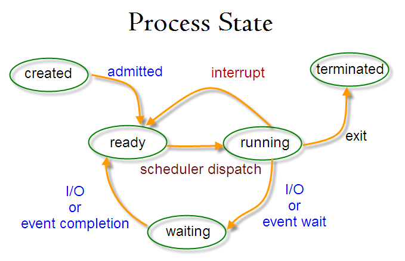
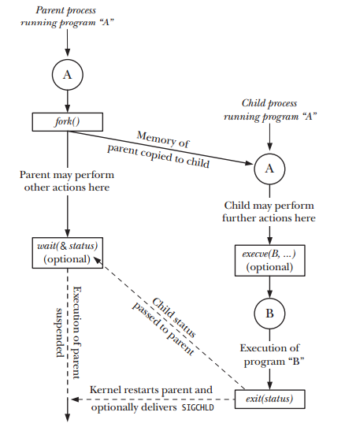

# Shell Scripting

> The minimum knowledge of your Linux and Unix systems should be LPIC 1 to understand shell scripting.

> This note is for SysAdmins or DevOps Engineers, so most of the commands of this course run on Redhat-based distributions such as Redhat, Centos, etc.

> I used bash as a default shell for these commands. You may have some different outputs based on your default shell.

## Part 01 (Linux Review)

Shell Scripting is an interpreter and cross-platform programming language.

- Find all available shells in your system:
  ```bash
  cat /etc/shells
  ```
- Default shell after login:
  ```bash
  echo $SHELL
  ```
- See all user's default shell:
  ```bash
  cat /etc/passwd
  ```
- Change shell permanently:
  ```bash
  chsh -s SHELL_PATH
  chsh -s /bin/bash
  ```
- Predefined Variables:
  ```bash
  echo $# # Tell you number of command line arguments supplied
  echo $0 # Tell you shell name
  echo $1 # First argument to the script
  echo $2 # Second argument to the script, and so on...
  echo $$ # PID of our shell
  echo $! # PID of the last background process
  echo $- # Current shell status
  echo $? # Exit status of last command:
          # 0: Successful exit
          # 1-255: Error on exit
          # 126: Not executable
          # 127: Command not found
          # 130: Command terminated with ^C or Ctrl+C
          # Exit code more than 255 returns an exit code modulo 256
          # exit 3809 = exit 225
  ```
- See list of processes from other users:
  - Unix-Style:
    ```bash
    ps -ef
    ```
  - BSD-Style:
    ```bash
    ps -aux
    ```
  - Process State:<br>
  

- You can compile shell script to C using `shc` command.
- Revert your shell to the previous shell using `exit`.
- Shell level:
  ```bash
  echo $SHLVL
  ```
- Set execute permission to script:
  ```bash
  chmod PERMISSION SCRIPT_NAME
  chmod u+rx SCRIPT
  chmod 700 SCRIPT
  ```
- Execute a script:
  ```bash
  /PATH/.../SCRIPT # Full path
  ./SCRIPT         # Relative path
  bash SCRIPT      # Shell tells OS to fork me and run the program on that.
  . SCRIPT         # Shell tells OS to don't fork me! And doesn't need permission to run!
  source SCRIPT

  (cat /etc/passwd; sleep 500)   # Current shell execute it
  (cat /etc/passwd; sleep 500) & # This command runs in background
  {cat /etc/passwd; sleep 500; } # This command runs in subshell
  ```
- You can bypass aliased command with these methods:
  - The full path of the command: `/bin/ls`
  - Command substitution: `$(which ls)`
  - The command builtin: `command ls`
  - Using Double quotation: `"ls"`
  - Using single quotation: `'ls'`
  - Using backslash character: `\ls`
- Understand internal (built-in) or external command using `type COMMAND`.
  - If the command is builtin, you see an output like this: `COMMAND is a shell builtin.`
  - If the command isn't builtin, you can see 2 different output based on what you did:
    1. If you run `type COMMAND` before executing COMMAND, you see an output like this: `COMMAND is COMMAND_PATH`
    2. If you run `type COMMAND` after executing COMMAND, you see an output like this: `COMMAND is hashed (COMMAND_PATH)`
  - **Hash** means you just execute an external command, and you can see them by simply run `hash` command.
  - When an external command is executed, shell tells OS to make a fork from the shell and then run your external command in it and then exits. You can see Virtual Memory Statistics using this command: `vmstat -s`
  - Fork Diagram:<br>
    
  - Execute `ls` command diagram:<br>
    

- You can see the Magic Number of a file here: `less /usr/share/magic`
  - Windows executable file's magic number starts with **MZ**
  - Other OS executable file's magic number starts with **ELF**
  - ELF: Executable Library Format
  - You can see magic number of a file using this command: `od -c FILE | less` or `file FILE`
- A script must have at least Read permission and Execute permission. Something like this:
  ```bash
  chmod u+rx SCRIPT
  ```
- It's recommended to put comment(s) at the beginning of the script.
  ```bash
  # Script name: SAMPLE
  # Author: FIRST_NAME LAST_NAME
  # Date of Creation: YYYY-MM-DD
  # Version: MAJOR.MINOR.BUG
  # Last Modified on: YYYY-MM-DD
  # Description: THIS IS A SAMPLE DOCUMENTATION
  echo THIS IS A SAMPLE SCRIPT
  ```
- Shell startup file: (Executed for login shell)
  - `/etc/profile` : System-wide default environment settings.
  - `~/.bash_profile` : User-specific bash environment default settings.
- Initialization Files: (Executed for login and interactive shell)
  - `/etc/bashrc` : System-wide functions and aliases for bash
  - `~/.bashrc` : User-specific initialization files
- **Standard File Descriptor**
  - The Linux system handles every object as a file. This includes the input and output process, which are identified by an object named file descriptor. The file descriptor is a non-negative integer, which uniquely identifies open files in a session. The bash shell reserves the first three file descriptors (0, 1, and 2) for particular purposes shown below:
    - Standard input = STDIN = 0
    - Standard output = STDOUT = 1
    - Standard error = STDERR = 2
  - If you want to generate error messages in your script purposely, you can redirect an individual output line to STDERR. All you need to do is use the output redirection symbol to redirect the output to the STDERR file descriptor. When you redirect to a file descriptor, you must precede the file descriptor number with an ampersand sign or `$`:
    ```bash
    #!/bin/bash
    echo "This is an error message" >&2
    ```
  - This line displays the text wherever the STDERR file descriptor for the script is pointing, instead of the STDOUT. `$ ./script.sh 2>log/error.txt`
- **Create File Descriptor**
  - You assign a file descriptor for output by using the `exec` command. Just as with the standard file descriptors, once you assign an alternative file descriptor to a file location, that redirection stays permanent until you reassign it. Here’s a simple example of using an alternative file descriptor in a script:
    ```bash
    #!/bin/bash
    # using an alternative file descriptor
    exec 3> OUTPUT.txt
    echo "This should display on the monitor"
    echo "and this should be stored in the file" >&3
    echo "Then this should be back on the monitor"
    ```
- **Closing File Descriptor**
  - If you create new input or output file descriptors, the shell automatically closes them when the script exits. There are situations though when you need to manually close a file descriptor before the end of the script. To close a file descriptor, redirect it to the special symbol `&-`
    ```bash
    #!/bin/bash
    exec 3> OUTPUT.txt
    echo "This is a test line of data" >&3
    exec 3>&-
    echo "This won't work" >&3
    # Output: line 5: 3: Bad file descriptor
    # Because we closed file descriptor number 3
    # OUTPUT.txt exists containing the first echo command
    ```
- **Listing Open File Descriptor**
  - The `lsof` command lists all of the open file descriptors on the entire Linux system. This is somewhat of a controversial feature, as it can provide information about the Linux system to non-system-administrators. Because of this, many Linux systems hide this command so that users don’t accidentally stumble across it. It is normally placed under `/usr/sbin` directory: `$ lsof`
  - This includes all of the processes running on background, as well as any user accounts logged in to the system.
  - There are plenty of command line parameters and options available to help filter out the `lsof` output. The most commonly used are `-p`, which allows you to specify a process ID (PID), and `-d` allows you to specify the file descriptor numbers to display.
  - To easily determine the current PID of the process, you can use the special environment variable `$$`, which the shell sets to the current PID. The `-a` option is used to **AND** the results of the other two options, to produce the following:</br>
  `$ lsof -a -p $$ -d 0,1,2`
  - Default `lsof` output:
    |Column|Description|
    |------|-----------|
    |COMMAND|The first 9 characters of the name of the command in the process|
    |PID|The process ID of the process|
    |USER|The login name of the user who owns the process|
    |FD|The file descriptor number and access type (r=read, w=write, u=read/write)|
    |TYPE|The type of file (CHR=Character, BLK=Block, DIR=Directory, REG=Regular File)|
    |DEVICE|The device numbers (major and minor) of the device|
    |SIZE|If available, the size of the file|
    |NODE|The inode number of the local file|
    |NAME|The name of the file|
  - Run this script to understand the chart:
    ```bash
    #!/bin/bash
    touch TESTFILE7
    exec 3> TESTFILE3
    exec 6> TESTFILE6
    exec 7< TESTFILE7
    /usr/sbin/lsof -a -p $$ -d 0,1,2,3,6,7
    ```
  - The file descriptor of STDIN, STDOUT, and STDERR in `lsof` is read/write and shown as `<>`
  - You can see list of your file descriptors with this command:
    ```bash
    PROCESS=`echo $$`
    ls -la /proc/$PROCESS/fd/
    # OR
    ls -la /proc/`echo $$`/fd/
    ```
- For more information on **File Descriptor**, check out [Part 7 (Redirection)](#part-07-redirection).
- Suppressing Command Output
  - There are times when you don’t want to display any output from your script. This often occurs if you’re running a script as a background process.
  - The standard location for the null file on Linux systems is `/dev/null`. Any data you redirect to that location is thrown away and doesn’t appear.
- Shell variables can contain different sizes based on your system. You can see your system's limitations with `xargs --show-limits` command.
- Primary Shells:
  1. Primary Shell 1 (`echo $PS1`): The first prompt you see when you open a shell/terminal.
  2. Primary Shell 2 (`echo $PS2`): The prompt when you use inline input redirection.
  3. Primary Shell 3 (`echo $PS3`): The prompt when you use select to create a text menu.
- Signals:
  - Signal is a notification, a message sent by either operating system or some application to our program. Signals are a mechanism for one-way asynchronous notifications. A signal may be sent from the kernel to a process, from a process to another process, or from a process to itself. Signal typically alert a process to some event, such as a segmentation fault, or the user pressing Ctrl-C. Linux kernel implements about 30 signals. Each signal identified by a number, from 1 to 31. Signals don't carry any argument and their names are mostly self explanatory.
  - Signals are raised by error conditions, and they are generated by the shell and terminal handlers to cause interrupts and can also be sent from one process to another to pass information or to modify the behavior.
  - Signals can be:
    1. Raised
    2. Caught
    3. Acted Upon
    4. Ignored
  - If a process receives signals such as `SIGFPE`, `SIGKILL`, etc., the process will be terminated immediately, and a core dump file is created. The core file is an image of the process, and we can use it to debug.
  - List of all signals:
    |Signal|Name|Description|
    |------|----|-----------|
    |SIGHUP|1|Hangup (POSIX)|
    |SIGINT|2|Terminal interrupt (ANSI)|
    |SIGQUIT|3|Terminal quit (POSIX)|
    |SIGILL|4|Illegal instruction (ANSI)|
    |SIGTRAP|5|Trace trap (POSIX)|
    |SIGIOT|6|IOT Trap (4.2 BSD)|
    |SIGBUS|7|BUS error (4.2 BSD)|
    |SIGFPE|8|Floating point exception (ANSI) |
    |SIGKILL|9|Kill (can't be caught or ignored) (POSIX)|
    |SIGUSR1|10|User defined signal 1 (POSIX)|
    |SIGSEGV|11|Invalid memory segment access (ANSI)|
    |SIGUSR2|12|User defined signal 2 (POSIX)|
    |SIGPIPE|13|Write on a pipe with no reader, Broken pipe (POSIX)|
    |SIGALRM|14|Alarm clock (POSIX)|
    |SIGTERM|15|Termination (ANSI)|
    |SIGSTKFLT|16|Stack fault|
    |SIGCHLD|17|Child process has stopped or exited, changed (POSIX)|
    |SIGCONTv|18|Continue executing, if stopped (POSIX)|
    |SIGSTOP|19|Stop executing (can't be caught or ignored) (POSIX)|
    |SIGTSTP|20|Terminal stop signal (POSIX)|
    |SIGTTIN|21|Background process trying to read, from TTY (POSIX)|
    |SIGTTOU|22|Background process trying to write, to TTY (POSIX)|
    |SIGURG|23|Urgent condition on socket (4.2 BSD)|
    |SIGXCPU|24|CPU limit exceeded (4.2 BSD)|
    |SIGXFSZ|25|File size limit exceeded (4.2 BSD)|
    |SIGVTALRM|26|Virtual alarm clock (4.2 BSD)|
    |SIGPROF|27|Profiling alarm clock (4.2 BSD)|
    |SIGWINCH|28|Window size change (4.3 BSD, Sun)|
    |SIGIO|29|I/O now possible (4.2 BSD)|
    |SIGPWR|30|Power failure restart (System V)|

## Part 02 (Linux Commands)

- `grep` : Searches for PATTERN in each FILE (Highly recommended that you read all manual page of this command)
  - `-E` or `--extended-regexp` or `egrep`
  - `-F` or `--fixed-strings` or `fgrep`
  - `-i` or `--ignore-case`
  - `-l` or `--files-with-matches`
  - `-r` or `--recursive` or `rgrep`
  - `-v` or `--invert-case`
- `tee` : Read from STDIN and write to STDOUT and files
    ```bash
    echo hello | tee file1.txt file2.txt
    ```
  - Useful options:
    - `-a`, `--append` : Append to the given FILEs, do not overwrite
    - `-i`, `--ignore-interrupts` : Ignore interrupt signals
    - `--output-error=MODE` : Set behavior on write error. See MODE below:
      - warn: Diagnose errors writing to any output
      - warn-nopipe: Diagnose errors writing to any output not a pipe
      - exit: Exit on error writing to any output
      - exit-nopipe: Exit on error writing to any output not a pipe
- `nl` : Write each FILE to standard output, with line numbers added
    ```bash
    nl /etc/passwd
    ```
- `find` : Search for files in a directory hierarchy (Highly recommended that you read all manual page of this command or at least see examples of manual page)
    ```bash
    find LOCATION_OF_START ARGUMENT(S)
    find /test -name "*.txt"
    ```
  - Useful options:
    - You can only use one of these; otherwise, each overrides the others. The last one appearing on the command line takes effect. Since `-P` is the default, the `-P` option should be considered to be in effect unless either `-H` or `-L` is specified.
      - `-P` : Never follow symbolic links
      - `-L` : Follow symbolic links.
      - `-H` : Do not follow symbolic links, except while processing the command line arguments.
    - `-empty` : File is empty and is either a regular file or a directory.
    - `-executable` : Matches files which are executable and directories which are searchable (in a file name resolution sense).
    - `-gid N` : File's numeric group ID is N.
    - `-name` : Base of the file name (the path with the leading directories removed) matches shell pattern.
    - `-iname` : Like -name, but the match is case insensitive.
    - `-iregex` : Like -regex, but the match is case insensitive.
    - `-regex` : File name matches the regular expression pattern.
    - `-size N` : File uses N units of space, rounding up. The following suffixes can be used:
      - `b` : for 512-byte blocks (this is the default if no suffix is used)
      - `c` : for bytes
      - `w` : for two-byte words
      - `k` : for Kibibytes (KiB, units of 1024 bytes)
      - `M` : for Mebibytes (MiB, units of 1024 * 1024 = 1048576 bytes)
      - `G` : for Gibibytes (GiB, units of 1024 * 1024 * 1024 = 1073741824 bytes)
      - The + and - prefixes signify greater than and less than, as usual; i.e., the exact size of N units does not match.  Bear in mind that the size is rounded up to the next unit. Therefore -size -1M is  not  equivalent to -size -1048576c. The former only matches empty files, the latter matches files from 0 to 1,048,575 bytes.
    - `-type C` : File is of type C (To search for more than one type at once, you can supply the combined list of type letters separated by a comma)
      - `b` : block (buffered) special
      - `c` : character (unbuffered) special
      - `d` : directory
      - `p` : named pipe (FIFO)
      - `f` : regular file
      - `l` : symbolic link; this is never true if the `-L` option or the `-follow` option is in effect, unless the symbolic link is broken.  If you want to search for symbolic links when `-L` is in effect, use `-xtype`.
      - `s` : socket
      - `D` : door (Solaris)
      - To search for more than one type at once, you can supply the combined list of type letters separated by a comma or `,`
    - `-uid N` : File's numeric user ID is N.
    - `-user uname` : File is owned by user uname (numeric user ID allowed).
- `locate` : Find files by name
  - `-b` or `--basename` : Match only the base name against the specified patterns.  This is the opposite of `--wholename`.
  - `-c` or `--count` : Instead of writing file names on standard output, write the number of matching entries only.
  - `-i` or `--ignore-case` : Ignore case distinctions when matching patterns.
  - `-p` or `--ignore-spaces` : Ignore punctuation and spaces when matching patterns.
  - `-q` or `--quiet` : Write no messages about errors encountered while reading and processing databases.
  - `--regex` : Interpret all PATTERNs as extended regexps.
  - `-w` or `--wholename` : Match only the whole path name against the specified patterns. This is the default behavior. The opposite can be specified using `--basename`.
- `pushd` and `popd` : The `pushd` command saves the current working directory in memory so it can be returned to at any time, optionally changing to a new directory. The `popd` command returns to the path at the top of the directory stack.
  ```bash
  cd /tmp
  pushd /var/log
  # Output: /var/log /tmp
  cd ..
  pwd
  # Output: /var
  popd
  # Output: /tmp
  ```
- `script` :
  - Script command can be used to make a record of everything that appears on the terminal.
  - Once started, all terminal outputs will also be copied into the *scriptfile* until a `^D` or `exit` is received.
    - `exit` : Exit command tells shell that I'm leaving/closing this connection.
    - `^D` : Control+D from keyboard device driver tells OS to break/close the connection.
      - You can see a list of them using `stty -a`.
      - Stty (Set TeleTYpe) is a command that changes keyboard and monitor commands. For example, it can change rows and columns of monitor, speed of keyboard, etc.
  - Where filename is optional and if not specified it is assumed to be **typescript**.

## Part 03 (Shell Script Basics)

- If you want to run multiple commands in one line, you must separate commands with semicolon or `;`
  ```bash
  date ; whoami ; echo Hello World!
  ```
- You can comment a line with `#` which has different names. (Sharp, Number, Pound, Hash or Hashtag)
- When creating a shell script file, you must specify the shell you are using only in the **first line** of file. It tells the OS what is the correct interpreter. The `#!` before shell path called **Shebang** and the format for this is:
  ```bash
  #!SHELL_PATH
  #!/bin/bash
  #!/bin/sh
  ```
- It's recommended that you put `.sh` extension at the end of your script file.
- Values are assigned to user variables using an equal sign. **No
spaces** can appear between the variable, the equal sign, and the
value.
- The shell script automatically determines the data type used for
the variable value.
- **`mktemp`**
  - Using Temporary Files
    - The Linux system contains a special directory location reserved for temporary files. Linux uses the `/tmp/` directory for files that don’t need to be kept indefinitely or you can create a local temporary file with `mktemp` command which create a file in the current directory by default.
    - `mktemp` command creates an empty file without your `umask` default permissions/values and with these features:
      1. Your user as owner of the file
      2. Your group as group owner of the file
      3. Gives file read and write permission only for you = chmod 600
    - The `mktemp` command replaces the X’s with a random characters code to ensure the filename is unique in the directory. You may need to delete temporary file ay the end of script.
    - Example
      ```bash
      #!/bin/bash
      tempfile=`mktemp test.XXXX`
      # Some commands
      rm -rf $tempfile
      ```
    - The `-t` option forces `mktemp` to create the file in the temporary directory of the system. When you use this feature, the `mktemp` command returns the full pathname used to create the temporary file, not just the filename.
      ```bash
      #!/bin/bash
      mktemp -t test.XXXX
      # Output: /tmp/test.59a1
      ```
  - Using Temporary Directory
    - The `-d` option tells the `mktemp` command to create a temporary directory instead of a file. You can then use that directory for whatever purposes you need, such as creating additional temporary files.
      ```bash
      #!/bin/bash
      mktemp -d DIR.XXXX
      # Output: DIR.i69
      mktemp -t -d DIR.XXXX
      # Output: /tmp/DIR.v58n
      ```
  - You can also use `mktemp` command without any suffix or prefix.
    ```bash
    #!/bin/bash
    mktemp
    # Output: tmp.VWJhMEtNlE
    mktemp -t
    # Output: /tmp/tmp.lj6uMPORkz
    mktemp -d
    # Output: tmp.B5ofuVYK9w
    mktemp -d -t
    # Output: /tmp/tmp.82OoFbxwCt
    ```

## Part 04 (Variables)

- Rules of variables:
  - Variables are **case-sensitive**.
  - Variables cannot contain spaces.
  - Variables cannot start with a number.
  - Variables cannot contain special characters.
  - No spaces should be on either side of `=`
  - It's recommended that you set your variables in **UPPERCASE** letters.
  - If you want to create a variable and variable was already defined, the old value is overwritten with the new value.
- Using variable value preceded by a dollar sign or `$`
  ```bash
  VAR1=27
  VAR2=$VAR1
  ```
- You can create an empty variable in two ways:
  ```bash
  #!/bin/bash
  VAR=
  VAR=""
  ```
- The backtick or **\`** allows you to assign the output of a shell command
to a variable. You must surround the entire command line command with
backtick characters:
  ```bash
  TODAY=`date`
  echo $TODAY
  # or
  echo `date`
  ```
- There are two types of environment variables in the bash shell:
  - **Global/Environmental Variable**: Global variables, which are called environment variables, are visible from the shell session, and any child processes that the shell spawns.
  - **Local Variable**: Local variables are only available in the shell that creates them. This makes global environment variables useful in applications that spawn child processes that require information from the parent process.
- Environmental variables are defined in `/etc/profile`, `/etc/profile.d`, and `~/.bash_profile`. These files are the initialization files, and they are read by the shell when the bash shell invokes. When a login shell exits, bash reads `~/.bash_logout`.
- After login into the system, a copy of the shell is given to the user.
- The environment is maintained all the time until the user logs off.
- You can see all variables (Global + Local) with `set` command, and other options of it with `help set` command.
- You can see Global variables with `env` or `printenv` command.
- The method used to create a global environment variable is to create a local environment variable, then export it to the global environment. This is done by using the `export` command:
  ```bash
  VAR1=test
  export VAR1
  # Export command in some shells is different.
  # BSD & TCSH: setenv
  ```
- Exported variables and their values are copied into a subshell's environment, where they may be accessed and changed. However, such changes have no effect on the variables in the parent shell.
- A subshell is a new shell that is executed by the login shell to run the desired program.
- A subshell does not know local variables that were assigned values by the parent shell.
- The subshell cannot change the value of a variable in the parent shell.
- You can remove variables by using `unset` command.
  ```bash
  VAR1=testing
  unset VAR1
  echo VAR1   # No output
  ```
  - When referencing the environment variable in the unset command, remember **not to use the dollar sign or `$` before variable name**.
  - If you’re in a child process and unset a global environment variable, it only applies to the child process. The global environment variable is still available in the parent process.
- Single Quote vs Double Quote:
  - Using double quotes to show a string of characters allow any variables in the quotes to be resolved.
  ```bash
  VAR1=test
  echo "The value of var1 is $VAR1"
  # OUTPUT: The value of var1 is test
  echo 'The value of var1 is $VAR1'
  # OUTPUT: The value of var1 is $VAR1
  ```
- `readonly` : Use the readonly command to make variables and functions readonly. You cannot change the value of variables.
  ```bash
  readonly VAR
  readonly VAR=value

  VAR=new_value
  # Output: -bash: unset: VAR: cannot unset: readonly variable
  unset VAR
  # Output: -bash: unset: VAR: cannot unset: readonly variable
  ```

## Part 05 (Special Characters)

There is a character called backslash or `\` or escape character that won't let shell to interpret that special character. For example:

```bash
#!/bin/bash
echo $HOME
# Output: /home/hirad
echo \$HOME
# Output: $HOME
echo "Hello World"
# Output: Hello World
echo \"Hello World\"
# Output: "Hello World"
```

Wildcards:
- `*` : Matches any string or group of characters
- `?` : Matches any single character
- `[]` : Matches any one of the enclosed characters
- `!` or `^` : Not
  ```bash
  ls a*
  ls u*.c
  ls a*b*c

  ls a?b
  ls ????
  ls x??y

  ls [abc]*
  ls [0-9]?[k-z]

  ls /bin/[!a-o]
  ls /bin/[^p-z]
  ls /bin/[!c-e]??
  ```

## Part 06 (Strings)

- **Length** of a string
  ```bash
  #!/bin/bash
  STRING=ABCdef
  echo ${#STRING}
  # The result of a empty variable or an unassigned variable is 0
  ```
- **Add** to variable's value
  ```bash
  #!/bin/bash
  STRING=ABCdef
  echo ${STRING}GHI
  # Output: ABCdefGHI
  ```
- **Remove** a part of variable's value
  ```bash
  #!/bin/bash
  STRING=ABCdef
  echo ${STRING/ABC/}
  # Output: def
  echo ${STRING#AB}
  # Output: Cdef -> Remove only from the beginning of the value
- **Search and Remove** a part of variable's value
  ```bash
  #!/bin/bash
  STRING=ABCdef
  echo ${STRING%C*}
  # Output: AB
  STR=abcABC123ABCab1c
  echo ${STR%b*c}
  # Output: abcABC123ABCa -> Strip out the shortest match between 'b' and 'c', from the end of the STR
  echo ${STR%%b*c}
  # Output: a -> Strip out the longest match between 'b' and 'c', from the end of the STR
  ```
- **Substitute/Replace** a part of variable's value with another value
  ```bash
  #!/bin/bash
  STRING=ABCdef
  echo ${STRING/ABC/123}
  ```
- Assign/Set a value
  ```bash
  #!/bin/bash
  VAR=""
  echo ${VAR:=STRING}
  echo $STRING
  unset var
  # If the VAR variable doesn't have a value or not set, then assign/set it to STRING variable.
  ```
- Not assign/Set a value
  ```bash
  #!/bin/bash
  VAR=""
  echo ${VAR:-STRING}
  echo $STRING
  unset var
  # If the VAR variable doesn't have a value, then show STRING variable and don't change the value of VAR.
  ```
- Check value
  ```bash
  #!/bin/bash
  VAR=""
  echo ${VAR:?}
  # If the VAR variable doesn't have a value, show an error message, otherwise, show the content of VAR.
  echo ${VAR:?DOES NOT HAVE A VALUE}
  # Output: bash: VAR: DOES NOT HAVE A VALUE
  ```
- Positions
  ```bash
  #!/bin/bash
  STR=university
  echo ${STR:3}
  # Prints STR from position 3. Starting position is zero
  # Output: versity
  echo ${STR:1:3}
  # Output: niv
  ```

## Part 07 (Redirection)

- Output
  - `>` : Creating a new file or **overwriting** the existing file
    ```bash
    COMMAND > OUTPUT_FILE
    date > output.txt
    ```
  - `>>` : Creating a new file or **appending** to the existing file
    ```bash
    COMMAND >> OUTPUT_FILE
    who >> output.txt
    ```
- Input
  - `<` : Input redirection takes the content of a file and redirects it to a command.
    ```bash
    COMMAND < INPUT_FILE
    wc -l < /etc/passwd
    cat < /etc/services
    ```
  - `<<` : The inline input redirection method allows you to specify the data for input redirection on the command line instead of in a file. Besides this symbol, you must specify a text marker that delineates the beginning and end of the data used for input.
    ```bash
    COMMAND << MARKER
    DATA
    MARKER

    wc << EOF
    Hello
    line 2
    good-bye
    EOF
    ```
- Example (Write a script which uses inline input redirection to append some lines a an existing file in your home directory):
  ```bash
  #!/bin/bash
  cat >> TESTFILE << EOF
  Hello $USER
  We're learning shell scripting
  let's get some advance stuff
  see you later
  EOF
  ```
- Redirection with STDIN, STDOUT, and STDERR:
  - `<` : Redirects STDIN (0) from file
  - `>` : Redirects STDOUT (1) to file
  - `>>` : Append STDOUT to file
  - `<<` : Here-Document
  - `&>` : Redirects STDERR (2)
- Error Redirection:
  ```bash
  COMMAND 2> FILE
  date alex 2> output.txt
  # output.txt : date: invalid date 'alex'

  touch a
  date < a
  # Output: NORMAL DATE OUTPUT

  date < bob
  # Output: -bash : bob: No such file or directory

  # STDOUT goes where STDERR goes
  ls AA BB &> CC
  ```
- You can use `printf` to write something by using redirects. This command write/overwrite **NOTHING** to FILENAME. `printf "" > FILENAME`
- You can also use `> FILENAME` command to redirect **NOTHING** to the FILENAME. (This command doesn't always apply in some shells.)
- You can redirect STDOUT and STDERR in two different places with a command like this:
  ```bash
  COMMAND 2> ERROR_FILE.txt
  # Errors are going to write in a file.

  COMMAND > OUTPUT.txt 2> ERROR_FILE.txt
  # We don't have any output on the screen, because we write it in a file.
  ```
- It's a wise move to redirect your unessential outputs/errors to `/dev/null`
- Pipe or `|`
  - Redirect one program's output into another program's input.
  - A pipe (Unnamed pipe) is a way to connect the output of one program to the input of
another program **without any temporary file**.
  - Examples:
    ```bash
    #!/bin/bash
    who | less
    who | sort > user_list.txt
    who | wc -l
    ls -l | wc -l
    who | grep PATTERN
    ```
- **Permanent Redirection**
  - STDOUT and STDERR
    - If you have lots of data that you’re redirecting in your script, it can get tedious having to redirect every echo statement. Instead, you can tell the shell to redirect a specific file descriptor for the duration of the script by using the exec command:
      ```bash
      #!/bin/bash
      exec 1> /var/log/output-script.txt
      echo "This is a test of redirecting all output."
      echo "from a script to another file."
      echo "without having to redirect every individual line"
      ```
    - The `exec` command replaces current shell with a new shell, and redirects the STDOUT file descriptor to a file. All output in the script that goes to STDOUT is instead redirected to the file.
  - STDIN
    - You can use the same technique used to redirect STDOUT and STDERR in your scripts to redirect STDIN from the keyboard. The `exec` command allows you to redirect STDIN to a file on the Linux system:
      ```bash
      #!/bin/bash
      exec 0< TESTFILE
      COUNTER=1
      while read line
      do
        echo "Line #$COUNTER: $line"
        COUNTER=$[ $COUNTER + 1 ]
      done
      ```
    - This command informs the shell that it should retrieve input from the file TESTFILE instead of STDIN. This redirection applies anytime the script requests input.
- **Redirecting File Descriptors**
  - There is a common way to temporarily redirect output in script files then set the output back to the normal settings. Here is an example:
    ```bash
    #!/bin/bash
    exec 3>&1
    exec 1> TESTFILE
    echo "This should store in the output file"
    echo "along with this line."
    exec 1>&3
    echo "Now things should be back to normal"
    # Only the last line shows on the monitor.
    ```

## Part 08 (Mathematics)

There are three different ways to perform mathematical operations in your shell scripts:

1. `expr` (NOT RECOMMENDED)
   - Pay attention to the space between operands and operator.
    ```bash
    expr 1 + 4
    # Output: 5
    expr 2+3
    # Output: 2+3
    ```
   - Operands for this command: `+  -  *  /  %  <  <=  =  !=  >=  >`
   - `expr` command only supports integer numbers. It doesn't support float numbers.
    ```bash
    expr 5 / 2
    # Output: 2
    ```
   - When you use these operands, you should escape these characters.
    ```bash
    expr 5 * 2
    # Output: expr: syntax error
    expr 5 \* 2
    # Output: 10
    ```
   - Example:
    ```bash
    #!/bin/bash
    VAR1=10
    VAR2=20
    VAR3=`expr $VAR2 / $VAR1`
    echo The result is $VAR3
    # Output: The result is 2
    ```
2. Brackets [ ]
   - In bash, when assigning a mathematical value to a variable, you can enclose the mathematical equation using a dollar sign and square brackets `$[operation]`
    ```bash
    VAR1=$[1+5]
    echo $VAR1
    # Output: 6
    VAR2=$[$VAR1*2]
    echo $VAR2
    # Output: 12
    ```
   - You can't calculate floating numbers in this solution, either.
- We don't usually need a floating number in shell scripting, because system administrators and DevOps Engineers don't need it for managing system.
3. Bash Calculator or `bc`
   - There's another way to calculate floating numbers. By using `bc` command. You can exit the program with `quit`. `bc` can recognize:
     - Numbers (integer and floating numbers)
     - Variables (simple variables and arrays)
     - Comments (Single line comment starts with `#`, or multiline comments start with `/*` and ends with `*/`)
     - Expressions
     - Programming statements (such as if-then statements)
     - Functions
   - The floating-point arithmetic is controlled by a built-in variable called **scale**. You must set this value to the desired number of decimal places you want in your answers; otherwise, the default value of scale is zero, and `bc` calculates only integer numbers.
   - Using `bc` in scripts:
    ```bash
    VARIABLE=`echo "OPTIONS; EXPRESSION" | bc`
    VAR1=20
    VAR2=`echo "scale=4;$VAR1/3" | bc`
    echo $VAR2
    # Output: 6.6666
    ```
   - If you have more than just a couple of calculations, you can use input redirection, allowing you to redirect a file to the bc command for processing. You just need to make a list of command and then `bc < COMMAND_FILE` or `cat COMMAND_FILE | bc`
   - Instead of using a file for redirection, you can use the inline input redirection method, which allows you to redirect data directly from the command line. In the shell script, you can assign the output to a variable. This looks like this:
    ```bash
    variable=`bc << EOF
    options
    statements
    expressions
    EOF
    `
    ```
   - Remember that the backtick characters are still needed to assign the output of the `bc` command to the variable.

## Part 09 (Conditional Tasks)

- **if/then**
  - If the exit code of our command is zero (0), the command and command(s) under *then* will execute; otherwise, command(s) under *then* will ignore.
  - Structure:
    ```bash
    #!/bin/bash
    if COMMAND
    then
      COMMAND(S)
    fi
    ```
  - By putting a semicolon at the end of the command to evaluate, you can include the then statement on the same line.
    ```bash
    #!/bin/bash
    if COMMAND; then
      COMMAND(S)
    fi
    ```
- **if/then/else**
  - If the command in the if statement line returns with an exit status code of zero, the command(s) listed in the *then* section are executed, just as in a normal if-then statement. If the command in the if statement line returns a non-zero exit status code, the bash shell executes the commands in the else section.
    ```bash
    #!/bin/bash
    if COMMAND
    then
      COMMAND(S)
    else
      COMMAND(S)
    fi
    ```
- **Nested if**
  - Sometimes you must check for several situations in your script code. Instead of having to write separate if-then statements, you can use an alternative version of the else section, called *elif*. The *elif* continues an else section with another if-then statement.
    ```bash
    #!/bin/bash
    if COMMAND1
    then
      COMMAND(S)
    elif COMMAND2
    then
      MORE_COMMAND(S)
    fi
    ```
- **test**
  - To evaluate any condition other than the exit status code of a command, we need to use test command. The test command provides a way to test different conditions in an if-then statement. If the condition listed in the test command evaluates to true, the test command exits with a zero exit status code.
    ```bash
    #!/bin/bash
    if test CONDITION
    then
      COMMAND(S)
    fi
    ```
  - Test command has special structure to follow. There have to be a blank between operands and operator.
    ```bash
    #!/bin/bash
    if test "A" = "A"
    then
      echo "Good job!"
    fi
    # Output: Good job!

    if test "A"="B"
    then
      echo "Good job!"
    fi
    # Output: Good job!
    ```
- **Brackets or [ ]**
  - The bash shell provides an alternative way of declaring the test command in an if-then statement.
    ```bash
    #!/bin/bash
    if [ CONDITION ]
    then
      COMMAND(S)
    fi
    ```
  - Be careful, you must have space after the first bracket, and a space before the last bracket or you’ll get an error message.
- There are three classes of conditions the test command can evaluate:
  - Numeric Comparison
      |Comparison|Description|
      |----------|-----------|
      |n1 -eq n2|Check if n1 is equal to n2|
      |n1 -ne n2|Check if n1 is not equal to n2|
      |n1 -ge n2|Check if n1 is greater than or equal to n2|
      |n1 -gt n2|Check if n1 is greater than to n2|
      |n1 -le n2|Check if n1 is less than or equal to n2|
      |n1 -lt n2|Check if n1 is less than to n2|
  - String Comparison
      |Comparison|Description|
      |----------|-----------|
      |str1 = str2|Check if str1 is the same as str2|
      |str1 != str2|Check if str1 is not the same as str2|
      |str1 < str2|Check if str1 is less than str2|
      |str1 > str2|Check if str1 is greater than str2|
      |-n str1|Check if str1 has a length greater than zero or str1 isn't null|
      |-z str1|Check if str1 has a length of zero or str1 is null|
  - File Comparison
      |Comparison|Description|
      |----------|-----------|
      |-d file|Check if file exists and is a directory|
      |-e file|Check if file exists|
      |-f file|Check if file exists and is a file|
      |-s file|Check if file exists and is not empty|
      |-r file|Check if file exists and is readable|
      |-w file|Check if file exists and is writable|
      |-x file|Check if file exists and is executable|
      |-O file|Check if file exists and is owned by the current user|
      |-G file|Check if file exists and the default group is the same as the current user|
      |file1 -nt file2|Check if file1 is newer than file2|
      |file1 -ot file2|Check if file1 is older than file2|
- Compound Condition Testing
  - **AND** or **&&** : Both conditions must be true for the then section to execute. `[ condition1 ] && [ condition2 ]` or `[ condition1 -a condition2 ]`
  - **OR** or **||** : At least one condition must be true that then section is executed. `[ condition1 ] || [ condition2 ]` or `[ condition1 -o condition2 ]`
  - **NOT** or **!**
    - `! expression`
    - `[ ! expression ]`
    - `if test ! expression`
    - `if [ ! condition ]`
- **Case**
  - The case statement is good alternative to Multilevel if-then-else-fi statement. It enable you to match several values against one variable. Its easier to read and write.
    ```bash
    #!/bin/bash
    case $VARIABLE in
      pattern1)
        # Commands to be executed if pattern1 matches
        COMMAND(s)
        ;;
      pattern2)
        # Commands to be executed if pattern2 matches
        COMMAND(s)
        ;;
      patternN)
        # Commands to be executed if patternN matches
        COMMAND(s)
        ;;
      *)
        # Default condition to be executed
        COMMAND(s)
    esac
    ```

## Part 10 (Repetitive Tasks)

- **For**
  - The bash shell provides the for command to allow you to create a loop that iterates through a series of values.
    ```bash
    #!/bin/bash
    for VAR in LIST
    do
      COMMAND(s)
    done
    ```
  - Examples:
    ```bash
    #!/bin/bash
    for color in Red Green Blue
    do
      echo The next color is $color
    done

    for i in {1..10}
    do
      echo $i
    done
    ```
  - Note that, shell doesn't interpret inside curly brackets.
    ```bash
    #!/bin/bash
    VAR=10
    echo {1..$VAR}
    # Output: {1..10}
    ```
  - You use the backtick characters to execute any command that produces output, then use the output of the command in the for command.
    ```bash
    #!/bin/bash
    counter=1
    for line in `cat /etc/passwd | grep nologin`
    do
      echo "Line $counter:"
      echo $line
      counter=$[ $counter + 1 ]
    done
    ```
  - If bash sees any field separator (Space, Tab, Newline) it assumes that you are starting a new field. To solve this problem you can change temporarily the IFS (Internal Field Separator) environment variable.
    ```bash
    #!/bin/bash
    IFS=$'\n'
    for line in `head /etc/services`
    do
      echo $line
    done
    ```
    - This syntax `IFS=$'\n'` is necessary in order not to use character "n" as a separator in addition to the new line. So we have to use `IFS=$'\n'` instead of `IFS='\n'`.
  - You can use the for command to automatically iterate through a directory of files. To do this, you must use a wildcard character in the file or pathname.
    ```bash
    #!/bin/bash
    for file in /usr/lib/*
    do
      if [ -d "$file" ]
      then
        echo "$file is a directory"
      elif [ ! -r "$file" ]
      then
        echo "$file is not readable"
      fi
    done
    ```
- **While**
  - The while command allows you to define a command to test, then loop through a set of commands for as long as the defined test command returns a zero exit status. It tests the test command at the start of each iteration. When the test command returns a non-zero exit status, the while command stops executing the set of commands.
    ```bash
    #!/bin/bash
    while test COMMAND
    do
      COMMAND(s)
    done
    # OR
    while [ CONDITION ]
    do
      COMMAND(s)
    done
    ```
- **Continue**
  - The continue command is a way to prematurely stop processing commands inside of a loop but not terminate the loop entirely. This allows you to set conditions within a loop where the shell won’t execute commands. Let's look at an example:
    ```bash
    #!/bin/bash
    for VAR1 in {1..10}
    do
      if [ $VAR1 -gt 3 ] && [ $VAR1 -lt 7]
      then
        continue
      fi
      echo $VAR1
    done
    # Output: 1 2 3 7 8 9 10
    ```
- **Break**
  - The break command is a simple way to escape out of a loop in progress. You can use the break command to exit out of any type of loop, including for and while. Let's look at an example:
    ```bash
    #!/bin/bash
    for VAR1 in {1..10}
    do
      if [ $VAR1 -eq 5 ]
      then
        break
      fi
      echo $VAR1
    done
    # Output: 1 2 3 4 6 7 8 9 10
    ```
  - There may be times when you’re in an inner loop but need to stop the outer loop. The break command includes a single command line parameter value `break n` where *n* indicates the level of the loop to break out. By default, *n* is one, indicating to break out of the current loop. If you set *n* to a value of two, the break command stops the next level of the outer loop.
    ```bash
    #!/bin/bash
    for VAR1 in {1..10}
    do
      for VAR2 in {1..10}
      do
        echo -n "$[ $VAR1 * $VAR2 ]"
        if [ $VAR2 -eq 5 ]
        then
          break 2
        fi
      done
      echo ""
    done
    # Output: 12345
    ```
- **C-Style for**
  - The bash shell also supports a version of the for loop that looks similar to the C-style for loop, although it does have some subtle differences, including a couple of things that'll confuse shell script programmers. Here's the basic format of the C-style bash for loop:
    ```bash
    #!/bin/bash
    for (( VARIABLE_ASSIGNMENT ; CONDITION ; ITERATION_PROCESS ))
    do
      COMMAND(s)
    done

    for (( a=1 ; a < 10 ; a++ ))
    do
      echo $a
    done
    ```

## Part 11 (Interactive Scripts)

- **Handling User Input**
  - **Read**
    - The read command allows you to prompt for input and store value in a variable.
    - `-d DELIM` : Continue until the first character of DELIM is read, rather than newline
    - `-nNUM` : Accepts only NUM character(s) of input
    - `-p "MESSAGE"` : Prompts message
    - `-r` : Do not allow backslashes to escape any characters
    - `-s` : Doesn't echo input
    - `-tT` : Accepts input for T seconds
      ```bash
      read -s -n10 -p "What is your name?" -t5 VARIABLE
      ```
  - **Command Line Parameters**
    - The most basic method of passing data to your shell script is by using command line parameters.
      ```bash
      ./SCRIPT FIRST_PARAMETER SECOND_PARAMETER
      ./add 2 3
      ```
    - The bash shell assigns special variables, called **positional parameters**, to all of the parameters entered in a command line. This even includes the name of the program the shell executes. The positional parameter variables are standard numbers, with `$0` being the name of the program, `$1` being the first parameter, `$2` being the second parameter, and so on, up to `$9` for the ninth parameter.
      ```bash
      #!/bin/bash
      echo "The first parameter is $1"
      ```
    - Remember, each of the parameters is separated by a space, so the shell interpreted the space as just separating the two values. To include a space as a parameter value, you must use quotation marks (either single or double quotation marks).
    - `basename $0` : Program name
    - `dirname $0` : Program full path = `pwd` of program
  - **Testing Parameters**
    - You need to be careful when using command line parameters in your shell scripts. If the script runs without the parameters, bad things can happen.
    - Based on your need for parameters, you can use `-n` or `-z` from [string comparison](#part-08-conditional-tasks) on `$1`
      ```bash
      #!/bin/bash
      if [ -n "$1" ]
      then
        echo "The first parameter is $1"
      else
        echo "First parameter is not entered, exiting..."
        exit 1
      fi

      # OR

      if [ -z "$1" ]
      then
        echo "First parameter is not entered, exiting..."
        exit 1
      else
        echo "The first parameter is $1"
      fi
      ```
  - **Counting Parameters**
    - The special `$#` variable contains the number of command line parameters included when the script was run. You can use this special variable anywhere in the script, just as a normal variable.
      ```bash
      #!/bin/bash
      echo There were $# parameters supplied.
      ```
    - So you have the ability to test the number of parameters present before trying to use them.
      ```bash
      #!/bin/bash
      if [ $# -ne 2 ]
      then
        echo "Script Usage: ./SCRIPT_NAME A B"
        exit 0
      else
        .....
      fi
      ```
  - **Grabbing All the Data**
    - There are situations where you’ll want to just grab all of the parameters provided on the command line and iterate through all of them for processing, etc.
    - Both of `$*` and `$@` variables include all of the command line parameters within a single variable.
      - `$*` : The `$*` variable takes all of the parameters supplied on the command line as a single word.
      - `$@` : The `$@` variable on the other hand, takes all of the parameters supplied on the command line as separate words in the same string. It allows you to iterate through the value, separating out each parameter supplied. This is most often accomplished using the for command.
      ```bash
      #!/bin/bash
      COUNTER=1
      for PARAMETER in "$*"
      do
        echo "\$* Parameter #$COUNTER = $PARAMETER"
        COUNTER=$[ $COUNTER + 1 ]
      done
      echo "==========="
      COUNTER=1
      for PARAMETER in "$@"
      do
        echo "\$@ Parameter #$COUNTER = $PARAMETER"
        COUNTER=$[ $COUNTER + 1 ]
      done
      ```
  - **Shifting Parameters**
    - The shift command shifts the command line parameters in their relative positions.
    - When you use the shift command, it downgrades each parameter variable one position by default. Thus, the value for variable `$3` is moved to `$2`, the value for variable `$2` is moved to `$1`, and the value for variable `$1` is discarded.
    - Note that the value for variable `$0`, the program name, remains unchanged.
      ```bash
      #!/bin/bash
      COUNTER=1
      while [ -n "$1" ]
      do
        echo "Parameter #$COUNTER = $1"
        COUNTER=$[ $COUNTER + 1 ]
        shift
      done
      ```
    - You can perform a multiple location shift by providing a parameter to the shift command. Just provide the number of places you want to shift. Example: `shift 2`
    - Example for a command that only needs an option (No need for parameters):
      ```bash
      #!/bin/bash
      COUNTER=1
      while [ -n "$1" ]
      do
        case "$1" in
          -a) echo "Found the -a option" ;;
          -b) echo "Found the -b option" ;;
          -c) echo "Found the -c option" ;;
          *) echo "$1 is not an option" ;;
        esac
        shift
      done
      ```
  - **Getopts**
    - Processing options with values
    - It processes the parameters it detects in the command line one at a time each time it’s called. When it runs out of parameters, it exits with an exit status greater than zero. This makes it great for using in loops to parse all of the parameters on the command line.
    - The format of the getopts command is: `getopts OPTSTRING VARIABLE`
    - The optstring defines the valid option letters used in the command line. It also defines which option letters require a parameter value.
    - The order or arrangement of options doesn't matter.
    - The `$OPTARG` environment variable contains the value to be used if an option requires a parameter value.
      ```bash
      #!/bin/bash
      while getopts ab:c OPT
      do
        case "$OPT" in
          a) echo "Found the -a option" ;;
          b) echo "Found the -b option, with value $OPTARG" ;;
          c) echo "Found the -c option" ;;
          *) echo "Unknown option: $OPT" ;;
        esac
      done
      ```
  - **Standardizing Options**
    - When you create your shell script, obviously you’re in control of what happens. It’s completely up to you as to which letter options you select to use, and how you select to use them. However, there are a few letter options that have achieved somewhat of a standard meaning in the Linux world. If you leverage these options in your shell script, it’ll make your scripts more user-friendly.
      |Options|Description|
      |-------|-----------|
      |-a|Show all options/objects|
      |-f|Specify a file to read data from|
      |-h|Display a help message for the command|
      |-n|Do nothing, just display what will happen|
      |-o|Specify an output file to redirect all output to|
      |-q|Run in quiet mode|
      |-r|Process directories and files recursively|
      |-s|Run in silent mode|
      |-v|Produce verbose output|
      |-y|Answer yes to all questions|
- **Creating Text Menu**
  - The most common way to create an interactive shell script is to utilize a menu. Offering your customers a choice of various options helps guide them through exactly what the script can and can’t do. Menu scripts usually clear the display area, then show a list of options available.
  - The select command allows you to create a menu from a single command line, then retrieve the entered answer and automatically process it. The format of the select command is:
    ```bash
    #!/bin/bash
    select VARIABLE in LIST
    do
      COMMAND(s)
    done
    ```
  - The list parameter is a space-separated list of text items that build the menu. The select command displays each item in the list as a numbered option and then displays a special prompt, defined by the `PS3` environment variable, for the selection.
  - Examples:
    ```bash
    #!/bin/bash
    PS3="Enter option > "
    select OPTION in "Option1" "Option2" "Exit"
    do
      case $OPTION in
        "Exit") break ;;
        "Option1") echo "A is selected" ;;
        "Option2") echo "B is selected" ;;
        *)
          clear
          echo "Wrong choice."
          ;;
      esac
    done
    ```
